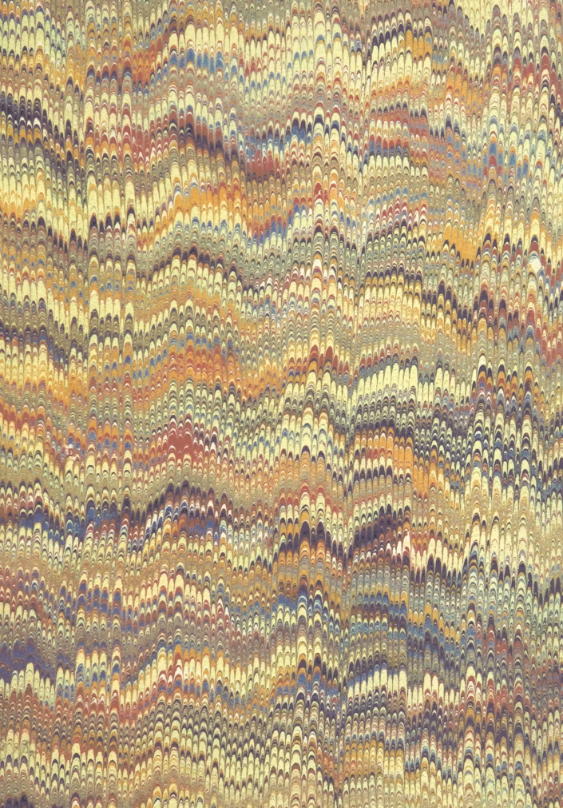
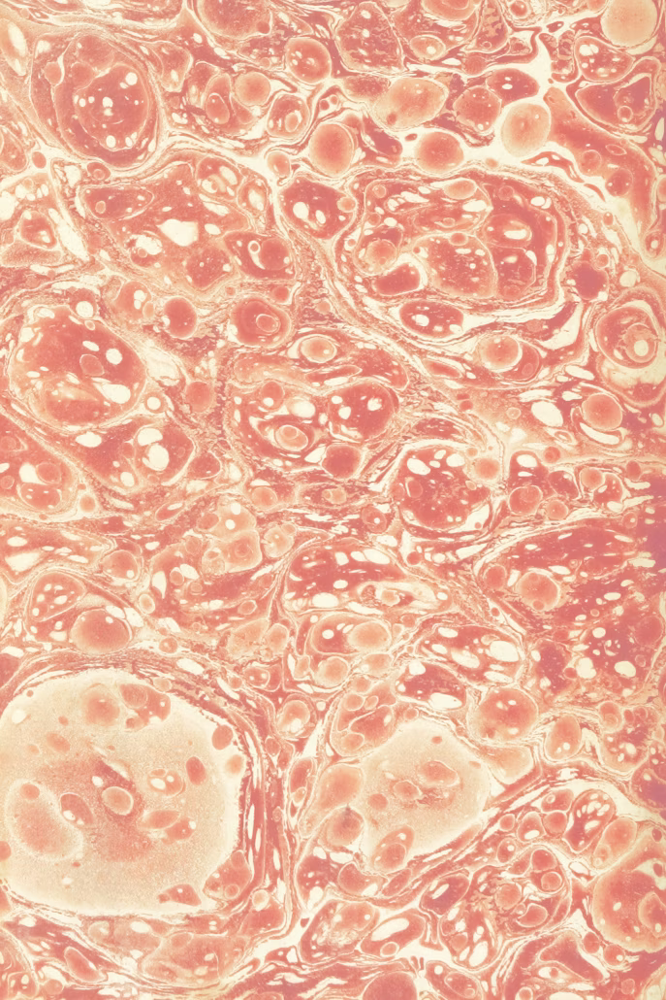
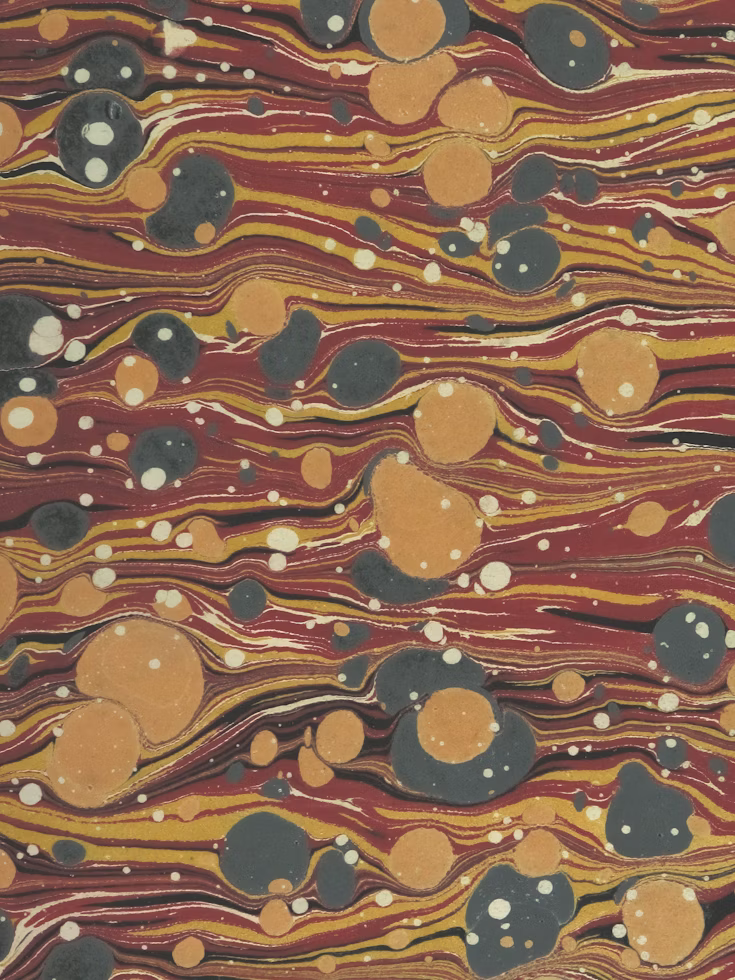
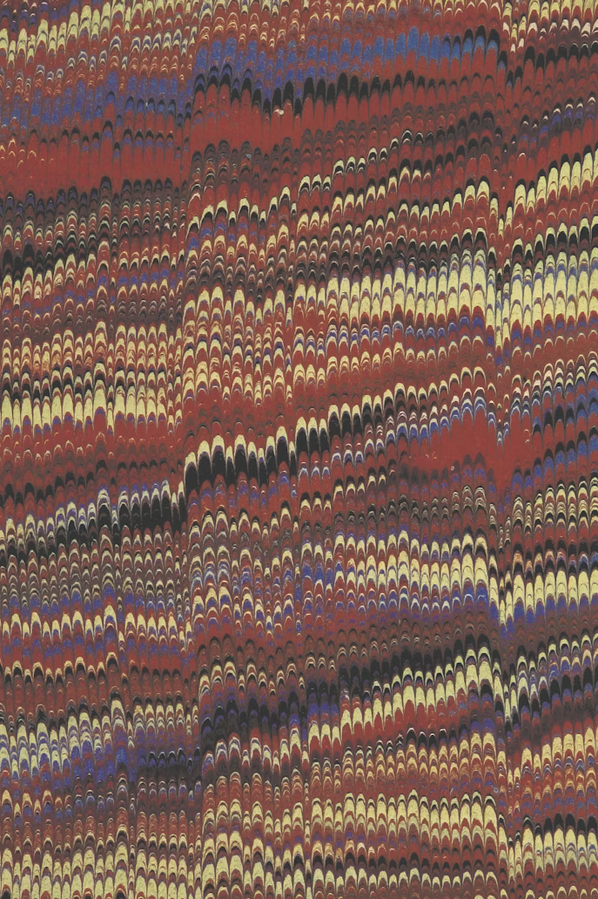

<!-- footer: "" -->

# Abilità Informatiche (2025/2026)

## 00. Il corso

➡️ Mail: [sebastian.barzaghi2@unibo.it](mailto:sebastian.barzaghi2@unibo.it)
➡️ ORCID: [0000-0002-0799-1527](https://orcid.org/0000-0002-0799-1527)
➡️ Sito: [sebastian.barzaghi2](https://www.unibo.it/sitoweb/sebastian.barzaghi2/)

---

<!-- footer: "" -->

### Il corso

- 12 lezioni
- 2 o 3 ore per lezione
- 1 o 2 pause per lezione
- 5 minuti per pausa

Comunicazioni e informazioni sulla pagina del corso e su Virtuale (se e quando le attiveranno...).

Come alternativa useremo (anche) [GitHub](https://github.com/ab-inf/ab-inf-2025-2026).

Troverete il link in questa slide e nella sezione [_Contenuti utili_ della mia pagina di UNIBO](https://www.unibo.it/sitoweb/sebastian.barzaghi2/contenuti-utili/).

---

<!-- footer: "" -->

### I contenuti

- Digital Humanities
- Pensiero Computazionale
- Internet e World Wide Web
- Digital Literacy
- Intelligenza Artificiale

---

<!-- footer: Spesso in una slide troverete un riquadro di questo tipo, contenente la fonte bibliografica (liberamente accessibile) da cui ho tratto il contenuto della slide. Consideratela parte facoltativa del materiale integrativo, da leggere secondo il vostro interesse. -->

### I materiali

Frequentanti:
- Slide
- Lezioni
- Bibliografia

Non frequentanti:
- Slide
- Lezioni
- Bibliografia estesa

---

<!-- footer: "" -->

### L'esame

- Test al computer a risposta multipla (30 domande teoriche e di ragionamento)
- Vi darò le istruzioni subito prima dell'esame
- Durata di 60 minuti
- Vi comunicherò le date più avanti
- Regole sul punteggio:
    - 1 punto per risposta corretta
    - 0 punti per risposta sbagliata o nulla
    - Idoneità a partire da 18 punti
- I risultati li sapete subito dopo aver concluso

---

<!-- footer: "" -->

# Abilità Informatiche (2025/2026)

## 00. Il corso

➡️ Mail: [sebastian.barzaghi2@unibo.it](mailto:sebastian.barzaghi2@unibo.it)
➡️ ORCID: [0000-0002-0799-1527](https://orcid.org/0000-0002-0799-1527)
➡️ Sito: [sebastian.barzaghi2](https://www.unibo.it/sitoweb/sebastian.barzaghi2/)