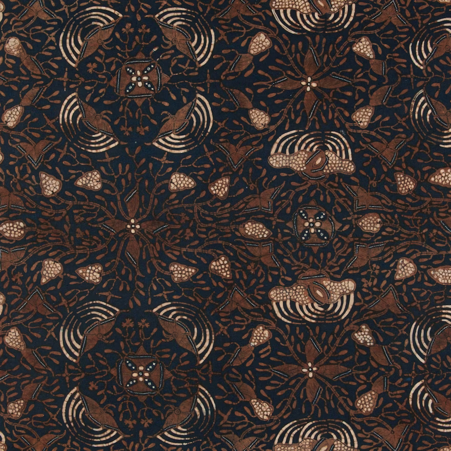
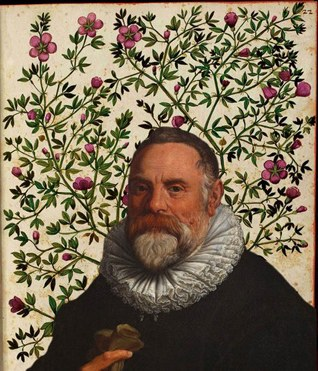
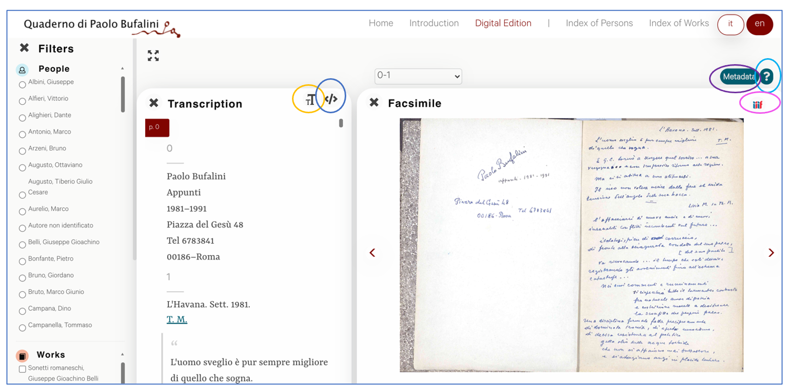
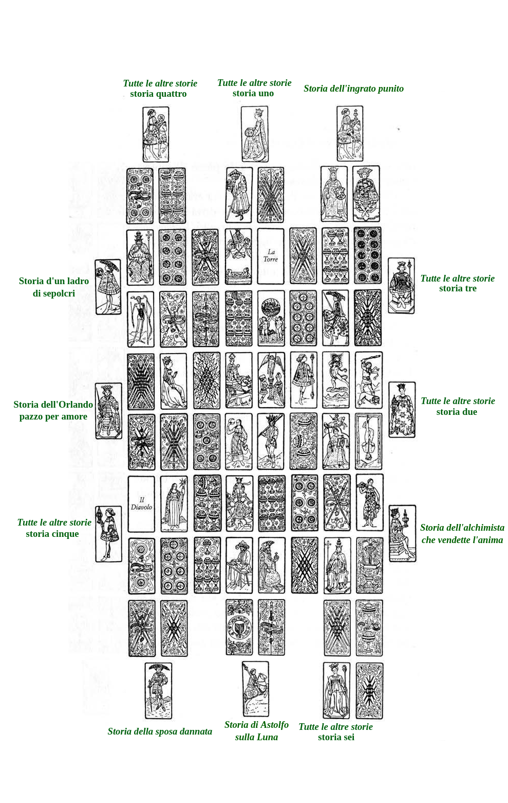

<!-- footer: "" -->
<!-- paginate: False -->

# Abilità Informatiche (2025/2026)

## 01. Digital Humanities

➡️ Mail: [sebastian.barzaghi2@unibo.it](mailto:sebastian.barzaghi2@unibo.it)
➡️ ORCID: [0000-0002-0799-1527](https://orcid.org/0000-0002-0799-1527)
➡️ Sito: [sebastian.barzaghi2](https://www.unibo.it/sitoweb/sebastian.barzaghi2/)

---

<!-- footer: "" -->
<!-- paginate: False -->

### Partiamo dai dati

---

<!-- footer: "" -->
<!-- paginate: False -->

---

<!-- footer: Drucker, J. (2011). Humanities Approaches to Graphical Display. Digital Humanities Quarterly, 5(1). <a href="https://www.proquest.com/scholarly-journals/humanities-approaches-graphical-display/docview/2555208513/se-2">https://www.proquest.com/scholarly-journals/humanities-approaches-graphical-display/docview/2555208513/se-2</a> -->
<!-- paginate: True -->

### C'era una volta un'epidemia di colera...

1854, quartiere di Soho, Londra.

Un’epidemia di colera causa decine di morti in pochi giorni. 

John Snow, un medico, decide di mappare i casi, identificando ogni evento di contagio e segnalandolo su una mappa del quartiere.

Ciò permette di rintracciare la fonte dell'epidemia fino a una pompa dell'acqua.

---

<!-- footer: Drucker, J. (2011). Humanities Approaches to Graphical Display. Digital Humanities Quarterly, 5(1). <a href="https://www.proquest.com/scholarly-journals/humanities-approaches-graphical-display/docview/2555208513/se-2">https://www.proquest.com/scholarly-journals/humanities-approaches-graphical-display/docview/2555208513/se-2</a> -->

### Cosa intendiamo con _dati_?

Nell’immaginario comune i dati sono legati al numerico e al digitale, ma da sempre rappresentano qualcosa che usiamo per "provare", "misurare", "fattualizzare" qualcosa.

* Numeri e statistiche?
* Fonti primarie / secondarie?
* Fatti?
* Eventi storici?
* Interpretazioni?
* Testi / immagini / video / ...?

---

<!-- footer: Balzani, R., Barzaghi, S., Bitelli, G., Bonifazi, F., Bordignon, A., Cipriani, L., ... & Vittuari, L. (2024). Saving temporary exhibitions in virtual environments: The Digital Renaissance of Ulisse Aldrovandi–Acquisition and digitisation of cultural heritage objects. Digital Applications in Archaeology and Cultural Heritage, 32, e00309. https://doi.org/10.1016/j.daach.2023.e00309 -->

### Un esempio: _L'Altro Rinascimento_

Digitalizzazione della mostra temporanea _L'altro Rinascimento: Ulisse Aldrovandi e le meraviglie del mondo_, composta da 258 oggetti di diverse dimensioni, materiali e forme. 

Obiettivi: conservare e rendere accessibili le mostre temporanee; valorizzare e diffondere il patrimonio culturale; costruire una metodologia e un flusso di dati replicabili in altri contesti.

https://projects.vidilab.unibo.it/a/aldrovandi/

---

<!-- footer: Drucker, J. (2011). Humanities Approaches to Graphical Display. Digital Humanities Quarterly, 5(1). <a href="https://www.proquest.com/scholarly-journals/humanities-approaches-graphical-display/docview/2555208513/se-2">https://www.proquest.com/scholarly-journals/humanities-approaches-graphical-display/docview/2555208513/se-2</a> -->

### Qualcosa che viene "dato"?

Il numero di nuovi romanzi pubblicati da un singolo editore tra il 1855 e il 1862.

Si tratta di un **dato** (_datum_, participio passato di _dare_): _qualcosa che viene dato_ dalla natura all'osservatore.

Si tratta di un approccio _realista_: secondo questa visione, i dati sono indipendenti dall'osservatore. 

⚠️ I dati sono neutrali, oggettivi, ed estranei a processi di intervento umano?

---

<!-- footer: Leonelli, S. (2016). Data-Centric Biology: A Philosophical Study. University of Chicago Press. <a href="https://doi.org/10.7208/chicago/9780226416502.001.0001">https://doi.org/10.7208/chicago/9780226416502.001.0001</a> -->

### Non è così semplice...

La comparsa nel 1855 di quattordici romanzi dipende da molteplici eventi che si sovrappongono e si influenzano a vicenda: stesura, acquisizione, revisione, pre-stampa e pubblicazione.

⚠️ Un dato non esiste di per sé, ma _esiste nel momento in cui viene generato, raccolto e/o interpretato_ attraverso strumenti e sforzi umani.

💡 Ciò che è considerabile _dato_ dipende da chi lo usa, da come lo usa, e per quale scopo.

---

<!-- footer: Andersson, L., Huvila, I., & Sköld, O. (2024). An Introduction to Paradata. In "Perspectives on Paradata: Research and Practice of Documenting Process Knowledge" (pp. 1-14). Cham: Springer International Publishing. https://doi.org/10.1007/978-3-031-53946-6_1 -->

### Un dato è "qualcosa che viene preso"

➡️ I **dati** sono _rappresentazioni di entità usate come prova di fenomeni per scopi di ricerca, studio, o altre pratiche di creazione della conoscenza_.

Queste entità possono essere intersoggettive o soggettive; fisiche o concettuali; persistenti o effimere; personali o pubbliche; esplicite o implicite.

L'importante è la loro natura di _evidenza_ per spiegare, dimostrare, usare qualcosa.

---

<!-- footer: Ciston, S., & Mike Ananny, K. C. (2023). A critical field guide for working with machine learning datasets. Knowing Machines project. <a href="https://knowingmachines.org/critical-field-guide">https://knowingmachines.org/critical-field-guide</a> -->

### I dati sono raccolti in _dataset_

➡️ Un **dataset** è _una raccolta di dati organizzati secondo criteri precisi per sostanziare una particolare analisi, interpretazione o argomento_.

Quando parliamo di dati, in realtà stiamo parlando di dataset!

⚠️ Riflette le circostanze che hanno portato alla sua creazione e gestione (strumenti, limiti, bias, responsabilità…).

🔎 Quanto sono importanti i dataset? [[1]](https://news.ucsc.edu/2023/08/t2iat.html), [[2]](https://www.reuters.com/article/world/insight-amazon-scraps-secret-ai-recruiting-tool-that-showed-bias-against-women-idUSKCN1MK0AG/), [[3]](https://www.abc.net.au/news/2023-04-26/hidden-dangers-of-artificial-intelligence/102264038), [[4]](https://www.esquire.com/news-politics/politics/a33994802/pasco-county-sheriff-pre-crime-harassment/)

---

<!-- footer: Gualandi, B., Pareschi, L., & Peroni, S. (2023). What do we mean by “data”? A proposed classification of data types in the arts and humanities. Journal of Documentation, 79(7), 51-71. https://doi.org/10.1108/JD-07-2022-0146 -->

### Possiamo parlare di _dati_ nelle discipline umanistiche?

Non c'è consenso su che cosa siano i _dati_ nelle discipline umanistiche.

Ogni tipo di attività basata sulla conoscenza comporta la produzione e/o il riutilizzo di dati, anche se il termine _dato_ non viene utilizzato in ogni contesto.

🔎 Esempio: uno studente che utilizza delle fonti per la propria tesi di laurea produce _almeno_ una bibliografia, ovvero un insieme di dati bibliografici.

---

<!-- footer: Tóth-Czifra, E. (2019). DARIAH Pathfinder to Data Management Best Practices in the Humanities. Version 1.0.0. DARIAH-Campus. [Pathfinder]. <a href="https://campus.dariah.eu/id/yR8mHfs3eW-ibu58LerCt">https://campus.dariah.eu/id/yR8mHfs3eW-ibu58LerCt</a> -->

### Le discipline umanistiche sono dominate da paradigmi tradizionali

⚠️ Il modo in cui il linguaggio viene usato nelle discipline umanistiche tende ad essere ermetico, individualista, ambiguo.

⚠️ I dati umanistici sono spesso non accessibili a causa di licenze troppo stringenti.

⚠️ I dati umanistici sono complessi e raramente documentati nell'ottica di una loro gestione adeguata.

---

<!-- footer: "" -->
<!-- paginate: False -->

---

<!-- footer: Borgman, C. L. (2010). The digital future is now: A call to action for the humanities. Digital humanities quarterly, 3(4). https://escholarship.org/uc/item/0fp9n05s -->
<!-- paginate: True -->

### La tradizione si (in/s)contra con il digitale

Le tecnologie digitali mettono in discussione paradigmi esistenti e permettono di sviluppare nuovi metodi di indagine, produzione e disseminazione scientifica dei dati umanistici.

Un paio di esempi:
* [Quaderno di Paolo Bufalini](http://projects.dharc.unibo.it/bufalini-notebook/)
* [mythLOD](https://dharc-org.github.io/mythlod/)
* [Are Pop Lyrics Getting More Repetitive?](https://pudding.cool/2017/05/song-repetition/)

---

<!-- footer: Fitzpatrick, K. (2012). The humanities, done digitally. Debates in the digital humanities, 12-15. https://doi.org/10.5749/minnesota/9780816677948.003.0002 -->

### Un nuovo paradigma

➡️ Col termine **Digital Humanities** (DH) ci si riferisce ad _un insieme di discipline in rapida espansione che esplora, sviluppa e applica metodi e strumenti digitali alle scienze umanistiche_.

Spesso vengono utilizzate tecnologie digitali per esplorare domande di ricerca in ambito umanistico.

In altri casi, vengono formulare domande di ricerca di natura umanistica su questioni riguardanti tecnologie digitali e il loro impatto sulla società.

---

<!-- footer: "" -->

---

<!-- footer: "" -->

### Le diverse prospettive delle DH

1️⃣ Le DH nascono da una prospettiva _testuale_, focalizzata sulla digitalizzazione di fonti fisiche e sull'utilizzo di strumenti computazionali per organizzare ed analizzare materiali digitalizzati.

2️⃣ In seguito, le tipologie di fonti si moltiplicano (immagini, audio, video, ecc.), entrano in gioco anche i materiali nativamente digitali, e cresce un maggiore interesse verso l'epistemiologia (il _come_).

3️⃣ Ora, sta aumentando l'interesse verso l'impatto che la _digitalizzazione_, la _dataficazione_, l'_algoritmizzazione_ e l'_AI_ stanno avendo sulla società e sulla cultura.

---

<!-- footer: "" -->

---

<!-- footer: Börner, K. (2011). Plug-and-play macroscopes. Communications of the ACM, 54(3), 60-69. https://doi.org/10.1145/1897852.1897871 -->

### Nelle DH facciamo _macroscopi_

➡️ Un **macroscopio** è _un dispositivo (fisico, digitale, concettuale) che fornisce una visione d'insieme su qualcosa_, sintetizzando elementi in relazione l'uno con l'altro e individuando pattern, tendenze, casi particolari, eccezioni, dettagli. 

Ci permette di osservare ciò che è troppo grande, lento, o complesso per essere compreso dal solo occhio umano.

Può essere un dataset, un servizio, un software, una metodologia...

---

<!-- footer: "" -->

### Alcuni esempi (tutti UNIBO!)

- https://projects.vidilab.unibo.it/a/aldrovandi/
- https://dharc-org.github.io/mythlod/
- https://aldomorodigitale.unibo.it/
- https://projects.dharc.unibo.it/vespasiano/
- https://icdp-digital-library.github.io/KNOT/
- http://projects.dharc.unibo.it/bufalini-notebook/
- https://projects.dharc.unibo.it/odi/
- https://raguproject.github.io/
- https://projects.dharc.unibo.it/leggomanzoni/
- https://projects.dharc.unibo.it/melody/
- http://projects.dharc.unibo.it/philoeditor/

---

<!-- footer: Betik, B. & Cors, A. (2023). 5 Reasons Why All Graduate Education Should Include the Digital Humanities. Edinburgh University Press. https://euppublishingblog.com/2023/10/20/graduate-education-digital-humanities/ -->

### Le DH sono _Digital Literacy_

Opportunità per gli umanisti di esplorare, sperimentare, e sviluppare abilità trasversali e desiderabili come:
* Pensiero computazionale;
* Gestione dei dati;
* Programmazione;
* Cooperazione interdisciplinare;
* Conoscenza su privacy dei dati, licenze, interazione con l'ecosistema Web e con le AI...

---

<!-- footer: "" -->

# Abilità Informatiche (2025/2026)

## 01. Digital Humanities

➡️ Mail: [sebastian.barzaghi2@unibo.it](mailto:sebastian.barzaghi2@unibo.it)
➡️ ORCID: [0000-0002-0799-1527](https://orcid.org/0000-0002-0799-1527)
➡️ Sito: [sebastian.barzaghi2](https://www.unibo.it/sitoweb/sebastian.barzaghi2/)

