<!-- footer: "" -->
<!-- paginate: False -->

# Abilità Informatiche (2025/2026)

## 02. Pensiero Computazionale

➡️ Mail: [sebastian.barzaghi2@unibo.it](mailto:sebastian.barzaghi2@unibo.it)
➡️ ORCID: [0000-0002-0799-1527](https://orcid.org/0000-0002-0799-1527)
➡️ Sito: [sebastian.barzaghi2](https://www.unibo.it/sitoweb/sebastian.barzaghi2/)

---

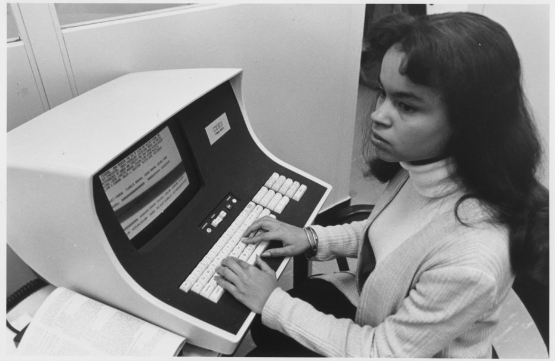

<!-- footer: "" -->
<!-- paginate: False -->

### Cos'è un computer?

---

<!-- footer: Copeland, B. Jack, "The Modern History of Computing", The Stanford Encyclopedia of Philosophy (Winter 2020 Edition), Edward N. Zalta (ed.), URL: <a href="https://plato.stanford.edu/archives/win2020/entries/computing-history/">https://plato.stanford.edu/archives/win2020/entries/computing-history/</a> -->
<!-- paginate: True -->

### The kilo-girls

For hundreds of years, the term “computer” was a job title for a human before machines took over the job, and in the late 19th century, computers weren’t just human, they were mostly women. An English Countess and Victorian mathematician, Ada Lovelace, is regarded as the first computer programmer and by World War II, American industrialists were measuring the power of early computer devices in “kilo-girl” hours, not in megahertz or teraflops. It was Grace Hopper who developed the first compiler, Hollywood actress Hedy Lamarr invented the basis for modern Wi-Fi, and African-American female mathematicians like Katharine Johnson were the hidden force behind sending the first man to the moon

Prima degli anni ‘40: il _computer_ è una persona che effettua calcoli numerici a mano (es. posizioni dei pianeti, conversioni al sistema metrico).

---

<!-- footer: Copeland, B. Jack, "The Modern History of Computing", The Stanford Encyclopedia of Philosophy (Winter 2020 Edition), Edward N. Zalta (ed.), URL: <a href="https://plato.stanford.edu/archives/win2020/entries/computing-history/">https://plato.stanford.edu/archives/win2020/entries/computing-history/</a> -->

### Machine of the year

TIME magazine alters its annual tradition of naming a "Man of the Year," choosing instead to name the personal computer its "Machine of the Year." In introducing the theme, TIME publisher John A. Meyers wrote, "Several human candidates might have represented 1982, but none symbolized the past year more richly, or will be viewed by history as more significant, than a machine: the computer." His magazine, he explained, has chronicled the change in public opinion with regard to computers. A senior writer contributed: "computers were once regarded as distant, ominous abstractions, like Big Brother. In 1982, they truly became personalized, brought down to scale, so that people could hold, prod and play with them." At TIME, the main writer on the project completed his work on a typewriter, but Meyers noted that the magazine's newsroom would upgrade to word processors within a year.

Dopo gli anni '40: sistema elettronico (programmabile o non programmabile) di elaborazione delle informazioni.

---

<!-- footer: Copeland, B. Jack, "The Modern History of Computing", The Stanford Encyclopedia of Philosophy (Winter 2020 Edition), Edward N. Zalta (ed.), URL: <a href="https://plato.stanford.edu/archives/win2020/entries/computing-history/">https://plato.stanford.edu/archives/win2020/entries/computing-history/</a> -->

### Una definizione generale

Un agente che, se istruito correttamente, esegue calcoli a partire da qualche informazione iniziale (detta input) per produrre una risposta (detta output).

---

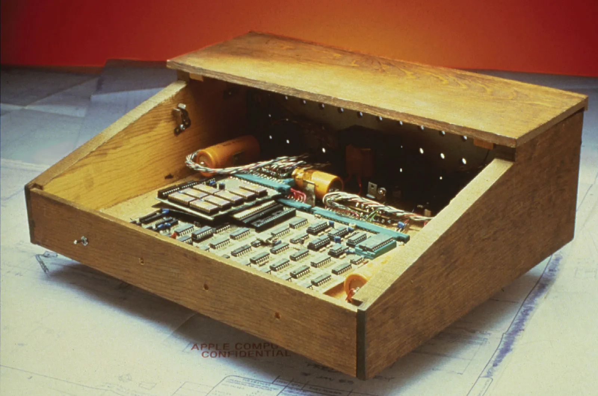

<!-- footer: Hemmendinger, D. , Pottenger, . William Morton , Freiberger, . Paul A. and Swaine, . Michael R. (2023, December 28). computer. Encyclopedia Britannica. <a href="https://www.britannica.com/technology/computer">https://www.britannica.com/technology/computer</a>. -->

### Componente _hardware_

L'insieme delle componenti fisiche (alimentatori, elementi circuitali fissi, unità di memoria, ecc.), di un computer.

Piccoli chip di silicio che contengono innumerevoli transistor che funzionano come interruttori elettrici:
* Central Processing Unit (CPU): componente che coordina tutte le operazioni da eseguire;
* Random Access Memory (RAM): memoria volatile per registrare temporaneamente i dati;
* Read-Only Memory (ROM): memoria di sola lettura che contiene informazioni fisse e immodificabili;
* Memoria di massa (hard disk): memoria dove vengono conservati i dati in modo permanente;
* Scheda madre: connettore di tutti gli altri componenti interni.

Periferiche (Input/Output): tastiera, monitor, mouse...

---

<!-- footer: Hemmendinger, D. , Pottenger, . William Morton , Freiberger, . Paul A. and Swaine, . Michael R. (2023, December 28). computer. Encyclopedia Britannica. <a href="https://www.britannica.com/technology/computer">https://www.britannica.com/technology/computer</a>
-->

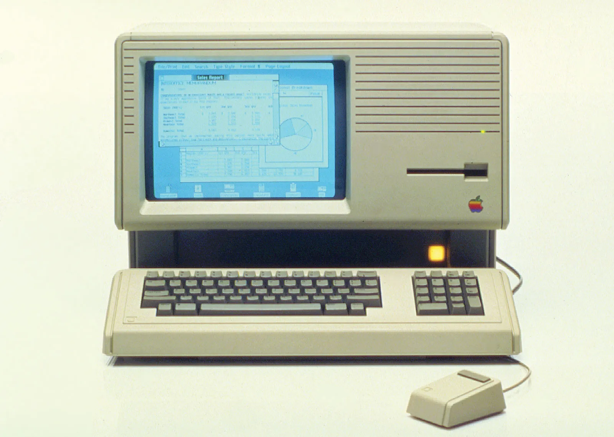

### Componente _software_

L’insieme delle componenti digitali (es. programmi, procedure, applicativi) assiociate alle operazioni effettuate da un computer.

Software di sistema: controlla il funzionamento interno del computer (es. sistema operativo) e gestisce anche dispositivi esterni

Software applicativo: fa eseguire ai computer i comandi dell'utente e include programmi che elaborano dati.

---

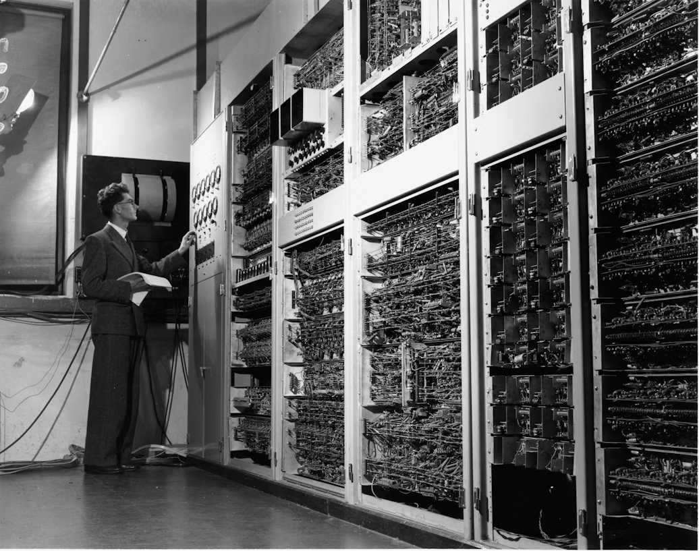

<!-- footer: "" -->

---

<!-- footer: "" -->

### I computer servono a risolvere problemi

Tuttavia, prima che un problema possa essere affrontato, è necessario comprendere il problema stesso e i modi in cui potrebbe essere risolto.

Il pensiero computazionale ci permette di prendere un problema complesso, capire di che si tratta e sviluppare possibili soluzioni. 

Possiamo poi presentare queste soluzioni in un modo che un computer, un essere umano, o entrambi, possano comprendere.

---

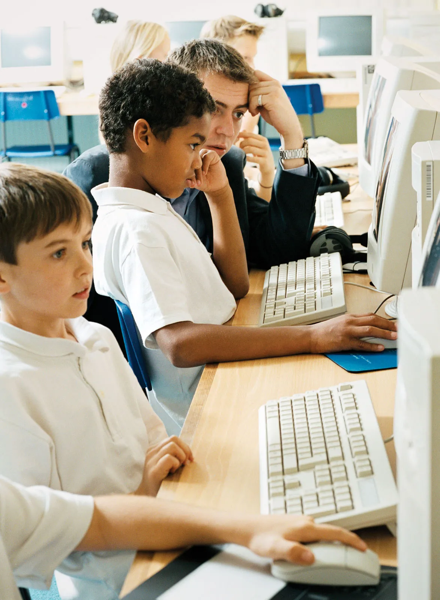

<!-- footer: Lodi, M., & Martini, S. (2021). Computational thinking, between Papert and Wing. Science & education, 30(4), 883-908. <a href="https://doi.org/10.1007/s11191-021-00202-5">https://doi.org/10.1007/s11191-021-00202-5</a> -->

### Mindstorms (Papert, 1980)

Impariamo costruendo iterativamente conoscenza.

Le _rappresentazioni potenti_ consentono un apprendimento efficace.

Il computer come _meta-strumento_ per “rendere l’astratto concreto” tramite un apprendimento per tentativi, sbagli, e correzioni.

Il pensiero computazionale come strumento di apprendimento basato sulla costruzione socialmente ed emotivamente partecipata di un artefatto.

---

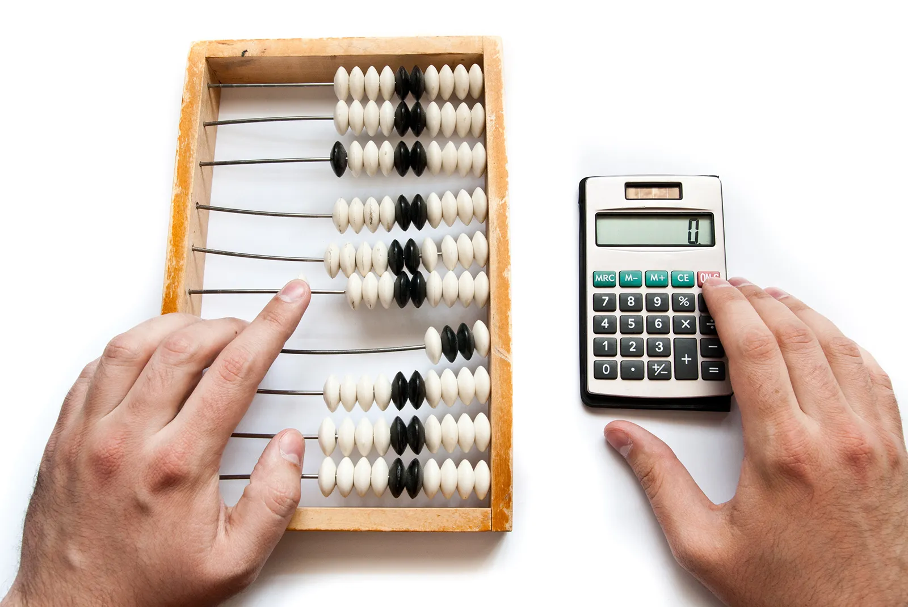

<!-- footer: Lodi, M., & Martini, S. (2021). Computational thinking, between Papert and Wing. Science & education, 30(4), 883-908. <a href="https://doi.org/10.1007/s11191-021-00202-5">https://doi.org/10.1007/s11191-021-00202-5</a> -->

### Computational Thinking (Wing, 2006)

Esiste una disponibilità enorme di strumenti digitali, soprattutto sul World Wide Web.

La maggior parte delle discipline diventano “computazionali”.

Diventa quindi necessario assumere un approccio basato sulla computazione che aiuta a risolvere problemi e progettare soluzioni.

---

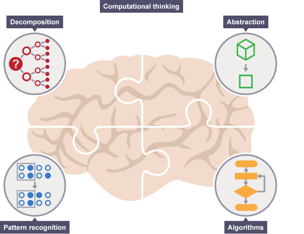

<!-- footer: "" -->
<!-- paginate: False -->

---

<!-- footer: "" -->
<!-- paginate: True -->

### I principi della computazione

Decomposizione: dividere un problema in parti più piccole e gestibili

Riconoscimento di pattern: cercare somiglianze e tendenze nei componenti del problema

Astrazione: focalizzarsi solo sulle informazioni rilevanti, rimuovendo dettagli non necessari

Algoritmi: sviluppare una soluzione sequenziale al problema

---

<!-- footer: Lodi, M., & Martini, S. (2021). Computational thinking, between Papert and Wing. Science & education, 30(4), 883-908. a href="https://doi.org/10.1007/s11191-021-00202-5">https://doi.org/10.1007/s11191-021-00202-5</a> -->

### Un approccio di risoluzione dei problemi basato sui principi della computazione

Il pensiero computazionale consiste nel prendere un problema complesso e suddividerlo in una serie di problemi più piccoli e gestibili (decomposizione). 

Ognuno di questi problemi più piccoli può essere esaminato singolarmente, considerando come problemi simili sono stati risolti in passato (riconoscimento di pattern) e concentrandosi solo sui dettagli importanti, ignorando le informazioni irrilevanti (astrazione). 

Successivamente, si possono progettare passi o regole semplici per risolvere ciascuno di questi problemi più piccoli (algoritmi).

Infine, questi semplici passi o regole vengono utilizzati per programmare un computer che aiuti a risolvere il problema complesso nel miglior modo possibile.

---

<!-- footer: "" -->
<!-- paginate: True -->

### Esempio: giocare ad un videogioco

Immaginiamo di voler giocare ad un videogioco _old-school_, senza averci mai interagito prima. 

Domanda: _come possiamo affrontare questo problema usando il pensiero computazionale?_

Another example might occur when playing a videogame. Depending on the game, in order to complete a level you would need to know:

    what items you need to collect, how you can collect them, and how long you have in which to collect them
    where the exit is and the best route to reach it in the quickest time possible
    what kinds of enemies there are and their weak points

From these details you can work out a strategy for completing the level in the most efficient way.

If you were to create your own computer game, these are exactly the types of questions you would need to think about and answer before you were able to program your game.

---

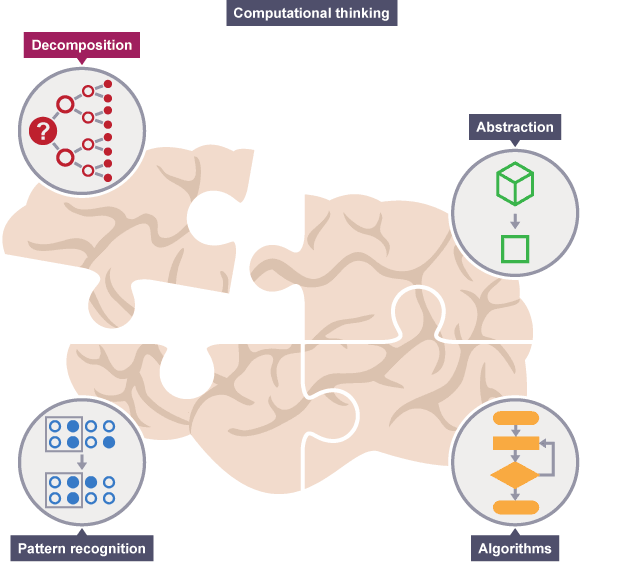

<!-- footer: "" -->

---

<!-- footer: "" -->

### Decomposizione

Affrontare più fasi diverse contemporaneamente è molto più complicato che suddividere il problema in parti più piccole e risolverle una alla volta.

La decomposizione è la suddivisione di  un problema complesso o di un sistema in parti più piccole, che sono più gestibili e facili da comprendere.

---

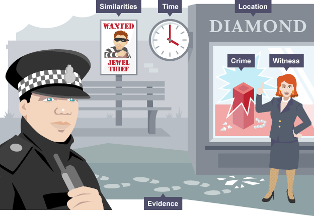

<!-- footer: "" -->

### Decomporre il problema

It is only normally when we are asked to do a new or more complex task that we start to think about it in detail – to
decompose

the task.

Imagine that a crime has been committed. Solving a crime can be a very complex problem as there are many things to consider.

For example, a police officer would need to know the answer to a series of smaller problems:

    what crime was committed
    when the crime was committed
    where the crime was committed
    what evidence there is
    if there were any witnesses
    if there have recently been any similar crimes

The complex problem of the committed crime has now been broken down into simpler problems that can be examined individually, in detail.

---

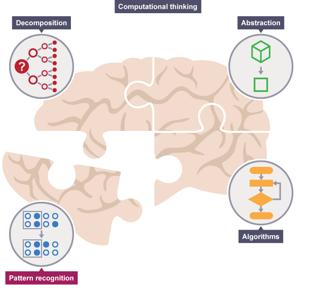

<!-- footer: "" -->

---

<!-- footer: "" -->

### Riconoscimento di pattern

Quando decomponiamo un problema complesso, spesso troviamo pattern tra i sotto-problemi. I pattern sono somiglianze o caratteristiche condivise che si ripetono.

Trovare somiglianze tra i problemi decomposti ci permette di risolverli in modo più efficiente.

Trovare pattern è fondamentale perché semplifica la risoluzione dei problemi, potendo applicare la stessa soluzione ovunque si presenti lo stesso pattern.

---

<!-- footer: "" -->

### What are patterns?

Imagine that we want to draw a series of cats.

All cats share common characteristics. Among other things they all have eyes, tails and fur. They also like to eat fish and make meowing sounds.

Because we know that all cats have eyes, tails and fur, we can make a good attempt at drawing a cat, simply by including these common characteristics.

In
computational thinking

, these characteristics are known as patterns. Once we know how to describe one cat we can describe others, simply by following this pattern. The only things that are different are the specifics:

    one cat may have green eyes, a long tail and black fur
    another cat may have yellow eyes, a short tail and striped fur

---

<!-- footer: "" -->

### Why do we need to look for patterns?

Finding patterns is extremely important. Patterns make our task simpler. Problems are easier to solve when they share patterns, because we can use the same problem-solving solution wherever the pattern exists.

The more patterns we can find, the easier and quicker our overall task of problem solving will be.

If we want to draw a number of cats, finding a pattern to describe cats in general, eg they all have eyes, tails and fur, makes this task quicker and easier.

We know that all cats follow this pattern, so we don’t have to stop each time we start to draw a new cat to work this out. From the patterns we know cats follow, we can quickly draw several cats.

---

<!-- footer: "" -->

### Pattern tra problemi diversi

Preparare una torta implica risolvere vari problemi, come scegliere gli ingredienti e il tempo di cottura. Una volta che conosciamo il processo per una torta, possiamo applicarlo anche ad altre, poiché esistono schemi comuni, come le quantità precise di ingredienti e i tempi di cottura.

Identificando questi pattern, possiamo trovare soluzioni comuni per problemi simili.

Durante la preparazione di una torta, possiamo trovare pattern anche nei problemi più piccoli. 

Ad esempio, sapendo che "ogni torta avrà bisogno di una quantità precisa di ingredienti specifici", ogni ingrediente deve:

* essere identificato con un nome;
* avere una misura specifica.

Una volta che sappiamo come identificare ogni ingrediente e la sua quantità, possiamo applicare questo pattern a tutti gli ingredienti. 

Di nuovo, ciò che cambia sono i dettagli specifici.

---

<!-- footer: "" -->

---

<!-- footer: "" -->

### Astrazione

Quando decomponiamo i problemi, cerchiamo pattern tra e all'interno dei problemi più piccoli che compongono il problema complesso.

L'astrazione è il processo di eliminare le caratteristiche dei pattern che non ci servono, per concentrarci su quelle che ci sono utili e creare così una rappresentazione di ciò che stiamo cercando di risolvere.

L'astrazione ci permette di concentrarci solo sulle caratteristiche essenziali, creando così un'idea di base di cosa sia un gatto, che ci aiuta a disegnarlo.

---

<!-- footer: "" -->

### Creare un modello

Un modello è un'idea generale, un'astrazione. Ad esempio, un modello di gatto rappresenta tutti i gatti, un modello di torta rappresenta tutte le torte, e così via.

I modelli ci permettono di comprendere gli schemi comuni tra gli oggetti o situazioni e di applicarli per risolvere il problema.

Una volta creato un modello, possiamo progettare un algoritmo per risolverlo.

---

<!-- footer: "" -->

---

<!-- footer: "" -->

### Sviluppo di algoritmi

Una sequenza finita di procedure precise per produrre un risultato (output) a partire da uno stato iniziale (input).

Gli algoritmi sono spesso usati come base per sviluppare software. Possono essere espressi come diagrammi di flusso oppure come pseudocodice.

* Sequenziali;
* Finiti;
* Generali;
* Non ambigui;
* Corretti;
* Efficienti.

Gli algoritmi possono essere usati per descrivere praticamente qualsiasi tipo di processo.

---

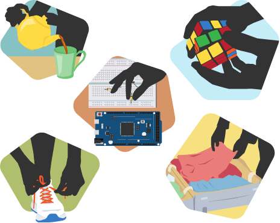

<!-- footer: "" -->

### Garbage in, garbage out

Se vogliamo dire a un computer di fare qualcosa, dobbiamo scrivere un programma che indichi, passo dopo passo, esattamente cosa vogliamo che faccia e come vogliamo che lo faccia. 

Questo programma necessita di pianificazione, e per farlo utilizziamo un algoritmo.

I computer sono tanto bravi quanto gli algoritmi che vengono loro forniti: un algoritmo scadente porta ad un risultato scadente.

Possiamo suddividere il problema in parti più piccole e poi pianificare come queste si combinano di nuovo in un ordine appropriato per risolvere il problema.

Questo ordine può essere rappresentato come un algoritmo. 

Deve avere un punto di partenza, un punto di arrivo e un insieme di istruzioni chiare nel mezzo.

---

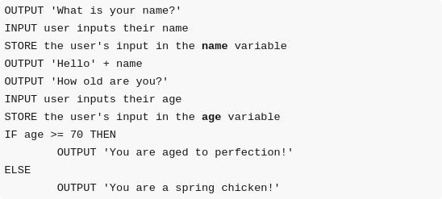

<!-- footer: "" -->

### Come rappresentare un algoritmo: Pseudocodice

La maggior parte dei programmi viene sviluppata utilizzando linguaggi di programmazione. 

Questi linguaggi hanno una sintassi specifica che deve essere utilizzata affinché il programma funzioni correttamente. 

Lo pseudocodice è un modo semplice di descrivere un insieme di istruzioni che non deve seguire una sintassi specifica.

---

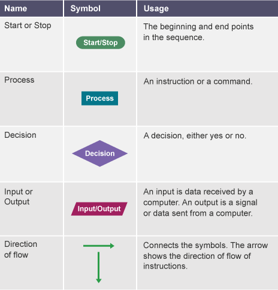

<!-- footer: "" -->

### Come rappresentare un algoritmo: Diagramma di flusso

La rappresentazione grafica di un algoritmo.

Non ci sono molte regole precise riguardo al livello di dettaglio necessario in un diagramma di flusso. A volte vengono suddivisi in molti passaggi per fornire più dettagli, altre volte vengono semplificati per essere più comprensibili.

---

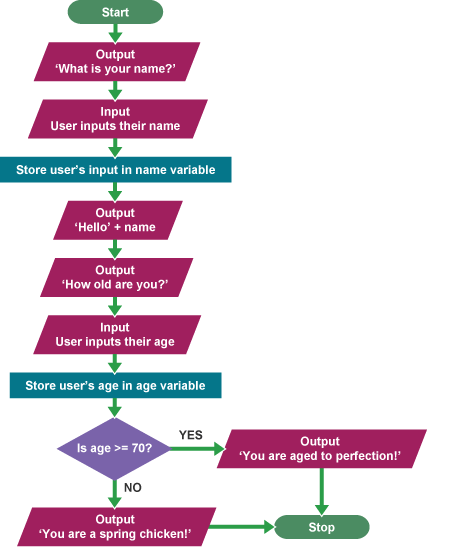

<!-- footer: "" -->

---

<!-- footer: "" -->

---

<!-- footer: "" -->

# Abilità Informatiche (2025/2026)

## 02. Pensiero Computazionale

➡️ Mail: [sebastian.barzaghi2@unibo.it](mailto:sebastian.barzaghi2@unibo.it)
➡️ ORCID: [0000-0002-0799-1527](https://orcid.org/0000-0002-0799-1527)
➡️ Sito: [sebastian.barzaghi2](https://www.unibo.it/sitoweb/sebastian.barzaghi2/)

