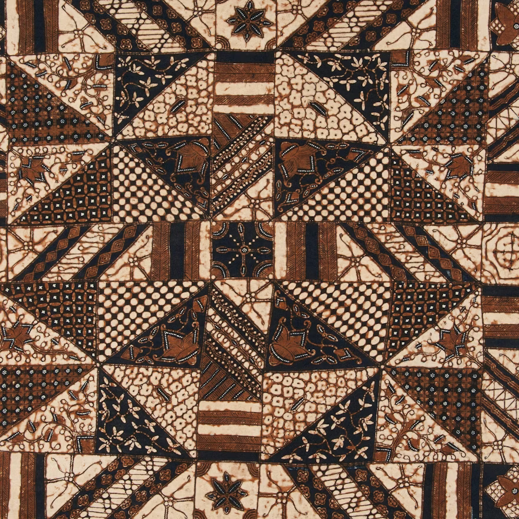

<!-- footer: "" -->
<!-- paginate: False -->

# Abilità Informatiche (2025/2026)

## 03. Rappresentare Informazioni

➡️ Mail: [sebastian.barzaghi2@unibo.it](mailto:sebastian.barzaghi2@unibo.it)
➡️ ORCID: [0000-0002-0799-1527](https://orcid.org/0000-0002-0799-1527)
➡️ Sito: [sebastian.barzaghi2](https://www.unibo.it/sitoweb/sebastian.barzaghi2/)

---

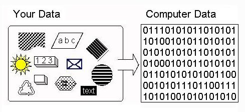

<!-- footer:  -->
<!-- paginate: False -->

---

<!-- footer:  -->
<!-- paginate: True -->

### Il primo messaggio allo spazio

Mezzo secolo fa, gli esseri umani hanno trasmesso per la prima volta un messaggio interstellare intenzionalmente.

Trasmesso il 16 novembre 1974 dall'_Osservatorio di Arecibo_ (vicino a Puerto Rico) in direzione dell'_Ammasso Globulare di Ercole_ (25000 anni luce), il cosiddetto _messaggio di Arecibo_ rappresentò una celebrazione del nostro avanzamento tecnologico.

Venne utilizzato il radiotelescopio più sensibile dell'epoca: una gigantesca parabola radio sospesa su una piattaforma di accaio di 900 tonnellate.

---

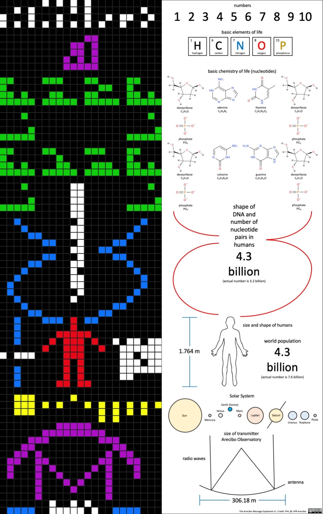

<!-- footer:  -->

### Il messaggio

Il messaggio era composto da 1679 cifre binarie, numero scelto in quanto prodotto di due numeri primi (23 e 73). 

In questo modo, se lo si ordina in un rettangolo, lo si può fare soltanto ordinandolo in 23 righe e 73 colonne o 73 righe e 23 colonne. 

L'informazione così sistemata nella prima disposizione (23 righe, 73 colonne) produce un disegno senza senso, ma nel secondo modo (73 righe, 23 colonne) forma un'immagine nella quale si possono riconoscere delle informazioni.

---

<!-- footer:  -->

### Il significato

* i numeri da 1 a 10;
* i numeri atomici degli elementi idrogeno, carbonio, azoto, ossigeno e fosforo;
* la formula degli zuccheri e basi dei nucleotidi del DNA;
* il numero dei nucleotidi nel DNA;
* la doppia elica del DNA;
* una rappresentazione grafica di un uomo e delle sue dimensioni;
* la popolazione della Terra;
* il sistema solare;
* il radiotelescopio di Arecibo e le dimensioni dell'antenna.

---

---

### Il linguaggio

Un **linguaggio** è _un codice, cioé un insieme di segni e di regole che rendono possibile la comunicazione tra coloro che lo usano_.

Un **segno** è _un mezzo attraverso il quale si trasmette un certo messaggio_, composto da:
* **Significante**: _l'elemento formale percepito dai sensi_
* **Significato**: _il concetto collegato ad un certo significante_

Es. "Cavallo"

---

<!-- footer: Formal and Natural Languages. In How To Think Like A Computer Scientist: Interactive Edition. <a href="https://runestone.academy/ns/books/published/thinkcspy/GeneralIntro/FormalandNaturalLanguages.html">https://runestone.academy/ns/books/published/thinkcspy/GeneralIntro/FormalandNaturalLanguages.html</a> -->

### Un _linguaggio naturale_ è quello utilizzato da noi per comunicare

Un **linguaggio naturale** è _un linguaggio caratterizzato da ricchezza espressiva, ambiguità e ridondanza, per cui un costrutto formulato è potenzialmente polisemico_.

I segni sono le _parole_. Il loro significante varia a seconda dell'utilizzo del linguaggio orale (fonemi) oppure di quello scritto (lettere). Il loro significato è attribuito per convenzione.

Esempio: "Sposto il cavallo".

---

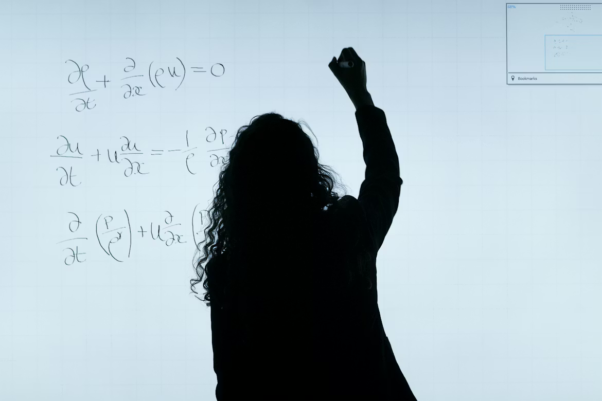

<!-- footer: ""
-->
<!-- paginate: False -->

---

<!-- footer: Formal and Natural Languages. In How To Think Like A Computer Scientist: Interactive Edition. <a href="https://runestone.academy/ns/books/published/thinkcspy/GeneralIntro/FormalandNaturalLanguages.html">https://runestone.academy/ns/books/published/thinkcspy/GeneralIntro/FormalandNaturalLanguages.html</a>
-->
<!-- paginate: True -->

### Un _linguaggio formale_ è quello usato per ridurre al minimo l'incertezza

Un **linguaggio formale** è _un linguaggio per formulare costrutti dotati di significato preciso e non ambiguo, sviluppato per uno scopo preciso_.

Per comunicare con un computer, l'ambiguità del linguaggio naturale è un problema (servono altre informazioni relative al contesto e alla pragmatica che un computer, di base, non recepisce), quindi vengono usati linguaggi formali.

---

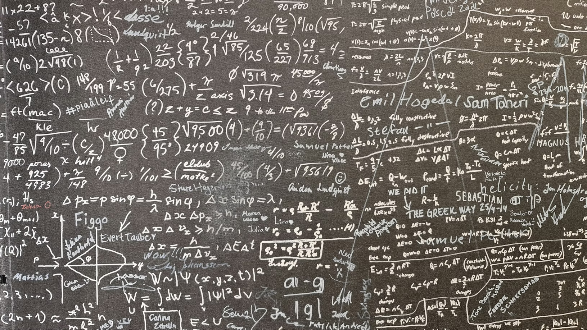

<!-- footer: "" -->

### Semplificando, un linguaggio è costituito da quattro elementi

* **Alfabeto**: _un insieme finito di simboli_
  * Esempio: `{🔴, 🟠, 🟢, 🔵}`;
* **Lessico**: _l'insieme di sequenze di simboli valide_
  * Esempio: `{🔴, 🟠, 🟢}`
* **Grammatica**: _un insieme di regole sintattiche che specificano combinazioni valide di simboli_
  * Esempio: `🔴 → 🟠 → 🟢 → 🔴`
* **Semantica**: _un insieme di significati attribuiti ai simboli e alle loro combinazioni_
  * Esempio: `🔴: "fermati", 🟠: "rallenta", 🟢: "procedi"`.

---

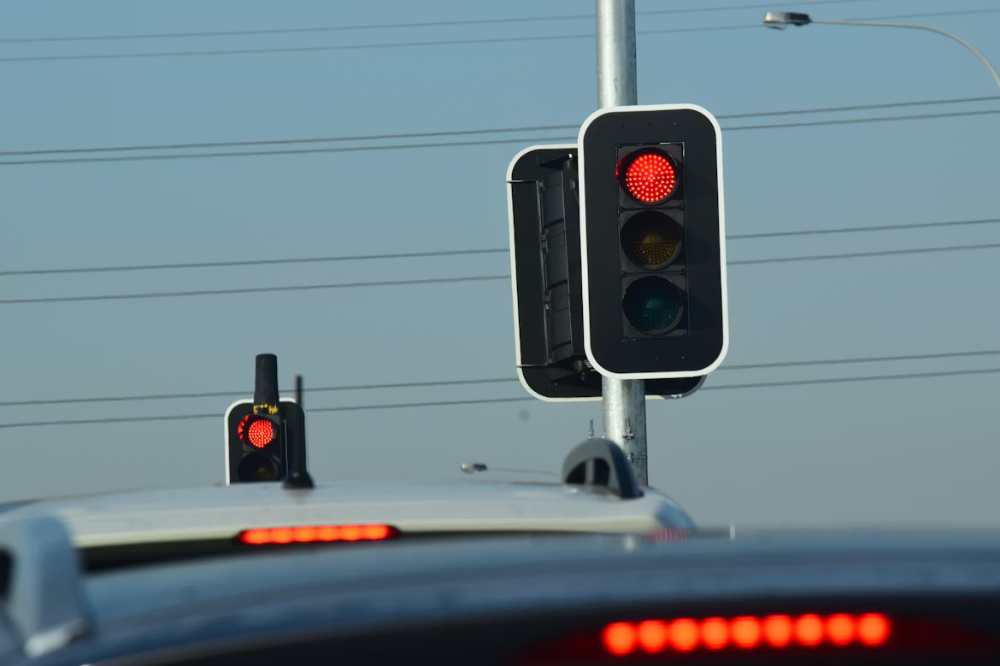

<!-- footer:  -->
<!-- paginate: False -->

---

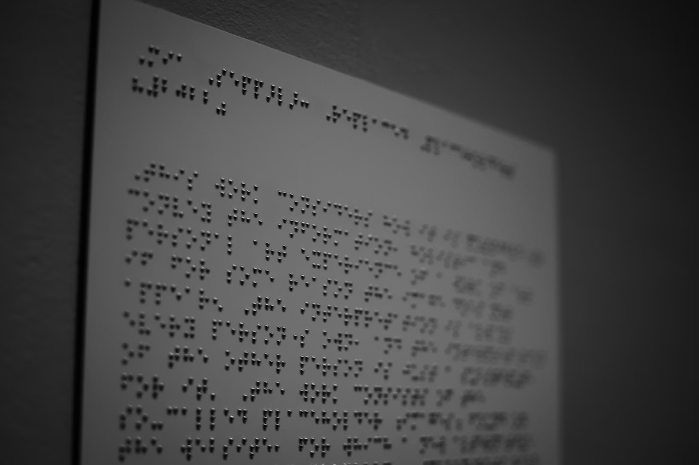

<!-- footer:  -->
<!-- paginate: True -->

### La codifica

Una **codifica** è _il processo di trasformazione di una sequenza di simboli da un alfabeto ad un altro_.

Affinché la codifica funzioni, deve esserci una **corrispondenza biunivoca**: ad ogni informazione originale deve corrispondere una (e una sola) sequenza di simboli, in modo da poter decodificare il messaggio senza ambiguità.

Esempi: 
* Braille (`love` $\to$ `⠇⠕⠧⠑` $\to$ `love`)
* Morse (`S` $\to$ `●●●` $\to$ `S`) 

---

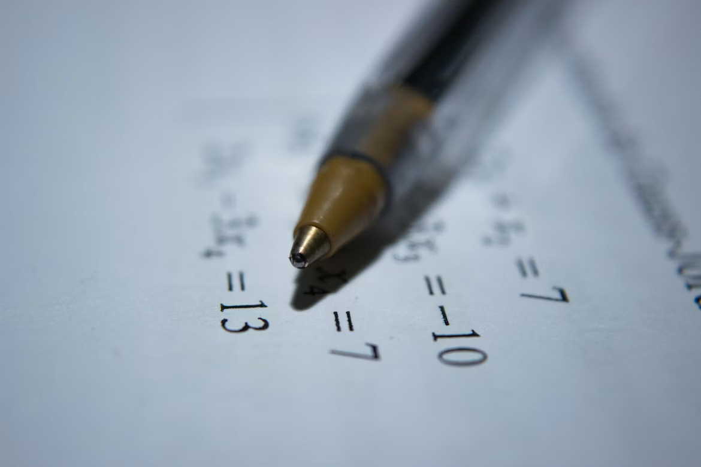

<!-- footer: "" -->
<!-- paginate: False -->

---

<!-- footer: Rappresentazione posizionale degli interi. <a href="http://www-dft.ts.infn.it/~pastore/DIDA/MNF/posizionale.html">http://www-dft.ts.infn.it/~pastore/DIDA/MNF/posizionale.html</a> -->
<!-- paginate: True -->

### Notazione decimale posizionale

La codifica più comunemente adottata oggi per la rappresentazione dei numeri interi.

Il termine **decimale** indica il numero di simboli utilizzati: `{0, 1, 2, 3, 4, 5, 6, 7, 8, 9}`.

Il termine **posizionale** indica che il significato dei simboli cambia in base alla loro posizione. Il numero rappresentato da ogni simbolo è moltiplicato per una potenza di **10** (il numero di simboli che cotituiscono l'alfabeto, la **base**).

---

<!-- footer: Rappresentazione posizionale degli interi. <a href="http://www-dft.ts.infn.it/~pastore/DIDA/MNF/posizionale.html">http://www-dft.ts.infn.it/~pastore/DIDA/MNF/posizionale.html</a> -->

### Esempio: il numero 2465

Con `n` cifre è possibile rappresentare 10n numeri naturali: da 0 a 10n-1.

Il significato di ogni simbolo dipende dalla posizione di questo all'interno della sequenza di simboli creata in base alla loro combinazione. 

<code>2 X 103 + 4 X 102 + 6 X 101 + 5 X 100</code>

Che equivale a 2 _migliaia_ + 4 _centinaia_ + 6 _decine_ + 5 _unità_.

---

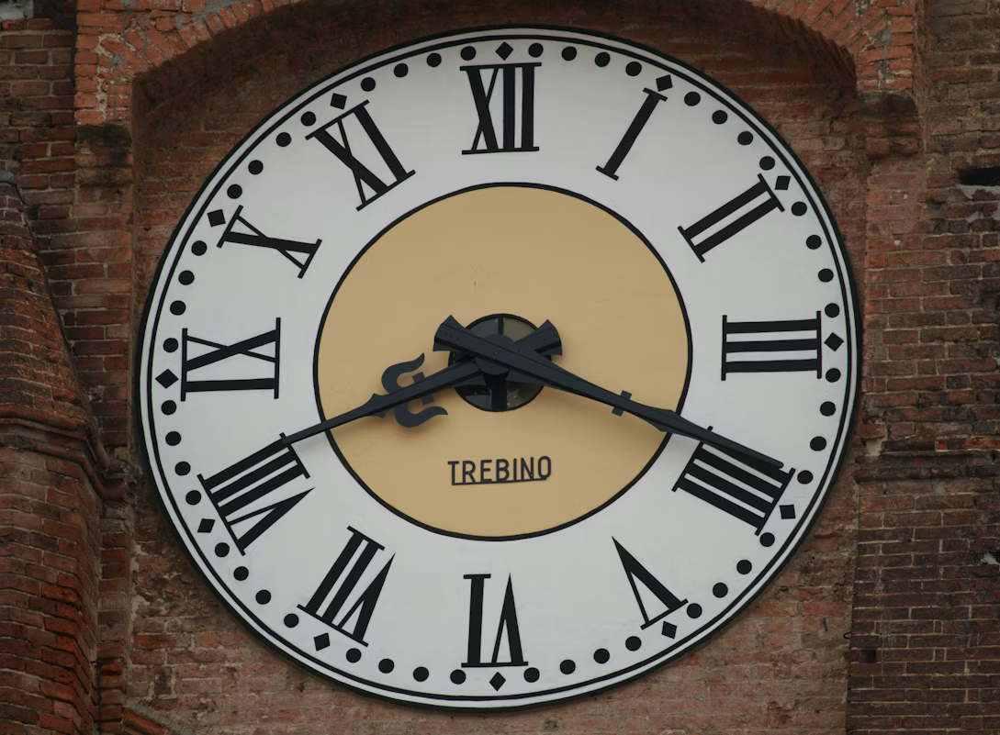

<!-- footer: "" -->
<!-- paginate: True -->

### Sistema di numerazione romano

Un **sistema additivo** basato su:

* Un alfabeto di simboli letterari a ciascuno dei quali viene assegnato un valore numerico;
* Un numero è rappresentato da una sequenza di tali simboli;
* Il valore di un numero è dato dalla somma dei valori corrispondenti ai simboli ottenuti, se in ordine decrescente; altrimenti, li si sottrae.

Esempi:
* `VIII = 5 + 1 + 1 + 1 = 8`
* `IV = 5 - 1 = 4`

---

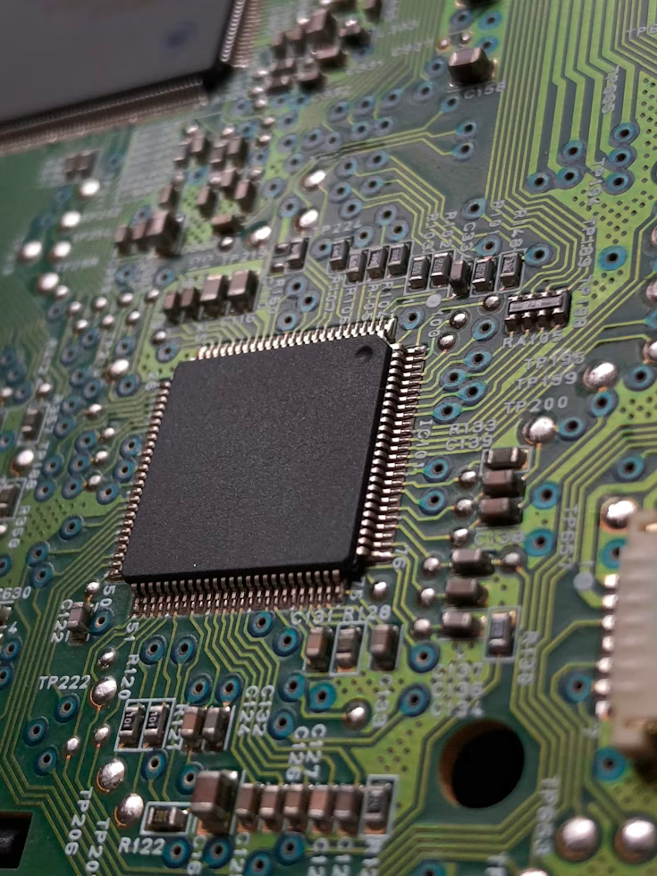

<!-- footer: "" -->
<!-- paginate: False -->

---

<!-- footer: "" -->
<!-- paginate: True -->

### L'informazione va codificata per il computer

Il computer memorizza ed elabora vari tipi di informazioni (numeri, testi, immagini, suoni, ecc.).

Occorre rappresentare tale informazione in un formato facilmente manipolabile dal computer.

I sistemi elettronici sono però in grado di distinguere solo **due diversi stati fisici**: acceso o spento, tensione alta o tensione bassa, passaggio di corrente o assenza di corrente.

---

<!-- footer: "" -->

### Di fatto, un computer è una grande collezione di dispositivi _bistabili_

_**Bistabile**_ indica qualcosa che può assumere nel tempo solo **due stati stabili** (come un classico interruttore). Nel caso del computer, si tratta della presenza / assenza di corrente elettrica.

Per ogni tipo di informazione (numerica, testuale, grafica, sonora, ecc.) che vogliamo trattare con un computer, dobbiamo individuare una codifica che si avvalga esclusivamente di questa caratteristica.

---

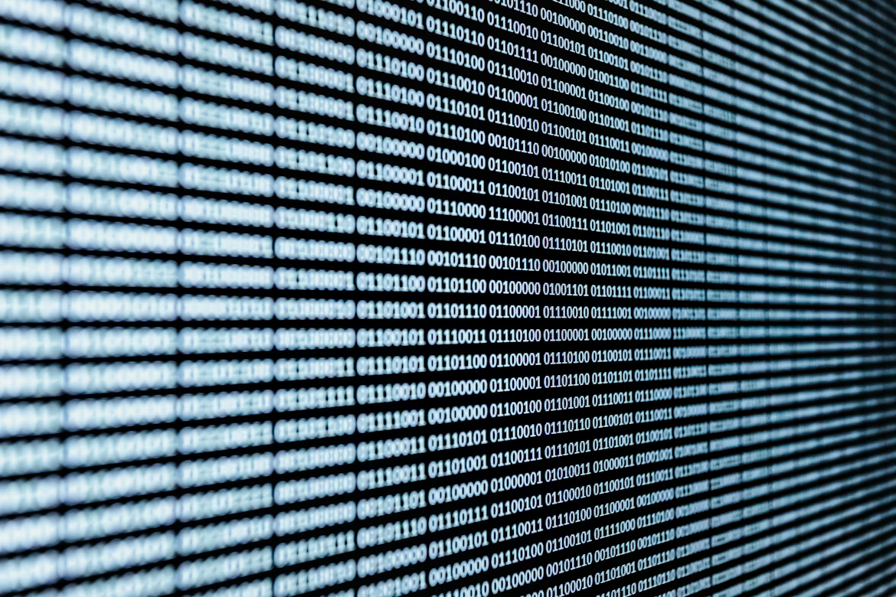

<!-- footer: History of the Binary System. In Cut The Knot. <a href="https://www.cut-the-knot.org/do_you_know/BinaryHistory.shtml">https://www.cut-the-knot.org/do_you_know/BinaryHistory.shtml</a>. -->

### Consideriamo un alfabeto binario

Alfabeto: `{0, 1}`.

Un **bit** è _uno dei due simboli del sistema numerico binario_, classicamente chiamati **_zero_** (0) e **_uno_** (1). Funge da unità elementare di memorizzazione per i computer.

Allo _zero_ sono spesso associate le idee di "chiuso", "spento", "assente", "falso".

All'_uno_ sono spesso associate le idee di "aperto", "acceso", "presente", "vero".

---

<!-- footer: "" -->

### Rappresentare tramite _bit_

Con 1 bit rappresentiamo poco: solo 2 diverse informazioni:

* 0 → No / Falso / Off;
* 1 → Si / Vero / On.

Ma se usassimo più bit? Proviamo a rappresentare i colori di un semaforo con una codifica binaria. I colori sono 3, quindi ci servono 2 bit (22 sequenze possibili).

* 00 → 🔴
* 10 → 🟠
* 01 → 🟢
* 11 → nulla (e va bene così)

---

<!-- footer: "" -->

### La binarietà è conveniente

**2 bit**: 4 (22) sequenze possibili (00, 01, 10, 11).

**3 bit**: 8 (23) sequenze possibili (000, 001, 010, 100, 011, 101, 110, 111).

**4 bit**: 16 (23) sequenze possibili (0000, 0001, 0010, 0100, 1000, 0011, 0110, 1100, 0111, 1110, 0101, 1010, 1011, 1001, 1101, 1111).

Con `n bit` possiamo rappresentare 2n sequenze: da 0 a 2n-1.

_Un gruppo di 8 bit_ viene detto **_byte_** e consente di codificare **256** (28) simboli.

---

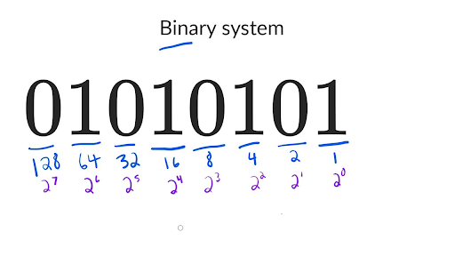

<!-- footer: "" -->

### Codifica numerica da base 2 a base 10

Moltiplicare ogni bit per il suo peso (attenzione a partire da 2n-1!) e sommare le potenze.

**1010101**  

1 X 26 + 0 X 25 + 1 X 24 + 0 X 23 + 1 X 22 + 0 X 21 + 1 X 20 

= 1 X 64 + 0 X 32 + 1 X 16 + 0 X 8 + 1 X 4 + 0 X 2 + 1 X 1

= 64 + 0 + 16 + 0 + 4 + 0 + 1 

= **85**

---

<!-- footer: "" -->

### Codifica numerica da base 10 a base 2

Dividere il numero per 2 ripetutamente fino ad arrivare a zero e disporre i resti in ordine inverso, riempiendo gli eventuali spazi vuoti con 0:

**85** / 2 → resto **1**
= 42 / 2 → resto **0**
= 21 / 2 → resto **1**
= 10 / 2 → resto **0**
= 5 / 2 → resto **1**
= 2 / 2 → resto **0**
= 1 / 2 → resto **1**

I resti, dal basso verso l'alto: **1010101** 

---

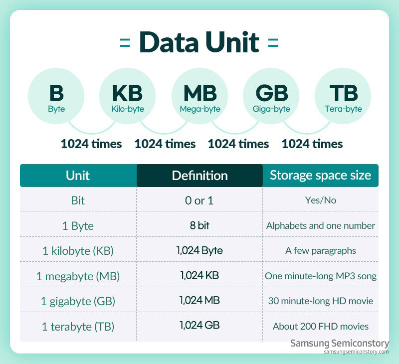

<!-- footer: "" -->

### Multipli utilizzati

La memoria utilizzata per codificare una pagina di testo è di qualche migliaio di byte, quella usata per una immagine può raggiungere il milione di byte, mentre un lungo filmato può richiedere miliardi di byte per essere memorizzato.

Nel corso del tempo, si è avvertita la necessità di utilizzare dei simboli per rappresentare i multipli delle grandezze elementari: **_kilo_** (k), **_mega_** (M), **_giga_** (G), **_tera_** (T), ...

Se per salvare un documento sono necessari 100 kB, significa che occupa circa 100000 byte.

---

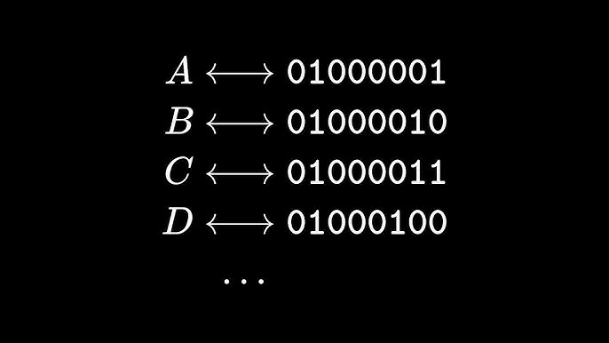

<!-- footer: "" -->

### I caratteri corrispondono a codici binari

I moderni calcolatori sono in grado di manipolare, con la stessa facilità con cui operano sui numeri, anche altri elementi, come **caratteri** o **sequenze di caratteri** (parole, frasi, paragrafi, ecc.).

Ovviamente i circuiti fisici che attuano effettivamente i comandi eseguono sempre e solo calcoli su numeri binari, ma con un'opportuna codifica e poi un software di visualizzazione del testo, possiamo effettivamente lavorare con il testo.

---

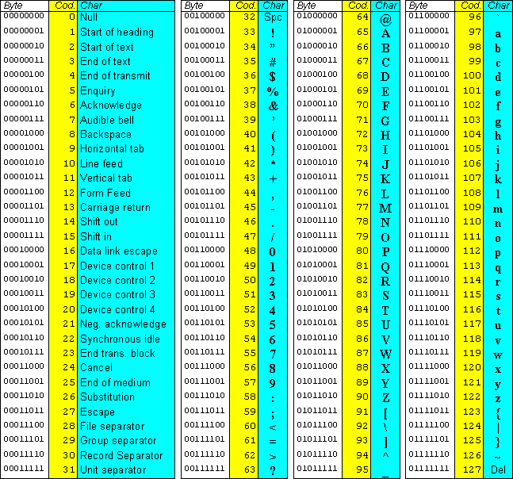

<!-- footer: "" -->

### Codice ASCII

L'alfabeto latino ha ~120 caratteri (caratteri di controllo, maiuscole, minuscole, numeri, interpunzione).

Con quanti bit deve essere rappresentato ogni carattere per far sì che ci stiano tutti?

Bastano **7 bit** = 27 = **128 sequenze**. _La codifica del testo che utilizza 7 bit_ si chiama **ASCII**.

In seguito, sono nati i **codici ASCII estesi** strutturando il bit residuo per arrivare ad **un byte** e memorizzare così altri 128 simboli (es. per includere lettere accentate).

---

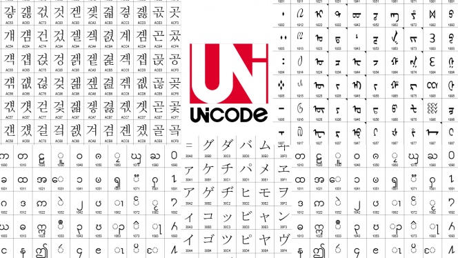

<!-- footer: "" -->

### UNICODE

256 combinazioni non bastano per codificare anche i linguaggi che non usano l'alfabeto latino.

Per fare ciò, è stato elaborato un altro codice chiamato **UNICODE**, che usava in origine 16 bit per la codifica di ogni carattere (216 = 65.536 caratteri diversi). Ora usa fino a **21 bit** (circa **un milione di caratteri**). 

Per via della sua complessità, prevede varie serializzazioni, tra cui **UTF-8** una codifica che usa **da 1 a 4 byte per carattere**. È lo standard prevalente sul Web.

---

<!-- footer: "" -->

### Codifica e decodifica

Anche per il testo, si passa in continuazione da binario alla forma della parol scritta e viceversa.

Codifica $\to$ ad ogni carattere del testo si sostituisce la sequenza di bit corrispondente.

Decodifica $\to$ ad ogni sequenza di bit si sostituisce il carattere corrispondente.

Se la codifica e la decodifica vengono fatti usando codici diversi, _il testo decodificato non e' identico al testo originale_.

---

<!-- footer: "" -->

### Tra analogico e digitale

Quando guardiamo un orologio, stiamo leggendo una rappresentazione del tempo. Ma c'è una differenza fondamentale nel modo in cui il tempo scorre.

Gli orologi **analogici** ci danno una **codifica continua** del tempo. Le lancette si muovono in un flusso continuo. Tra le 12:00 e le 12:01, la lancetta percorre infiniti punti intermedi.

Gli orologi **digitali** ci danno una **codifica discreta** del tempo. I numeri cambiano a scatti. Passiamo da 12:00 a 12:01 istantaneamente, ignorando tutto ciò che accade nel mezzo.

---

<!-- footer: "" -->

### Codifica analogica e digitale

La **codifica analogica** si basa su una grandezza fisica che varia in modo continuo, esattamente come l'informazione che rappresenta.

La **codifica digitale** si basa sull'utilizzo di un insieme finito di simboli e un insieme di regole di codifica che ne specificano l'utilizzo.

Quindi, **digitalizzare** vuol dire trasformare una grandezza continua in una grandezza discreta, misurarla a intervalli regolari, e trasformarla in numeri.

---

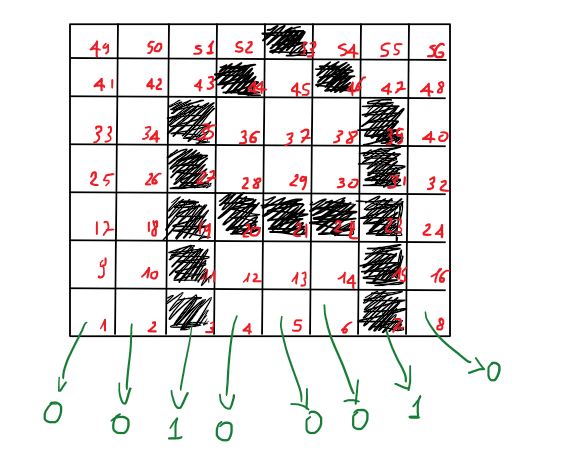

<!-- footer: "" -->

### Codifica di immagini

Per codificare digitalmente un'immagine analogica, si effettua una scomposizione dello spazio visivo sovrapponendo una griglia di punti elementari chiamati **pixel** (_picture element_).

Esistono due tipologie principali di immagini:

* **_bitmap_** o **_raster_**: l'immagine è memorizzata come una matrice statica di pixel.
* **_vector_**: l'immagine è descritta tramite primitive geometriche basate su formule matematiche.

---

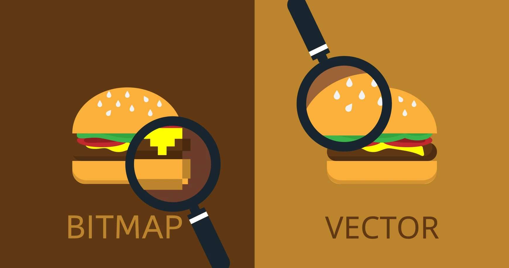

<!-- footer: "" -->

### Immagini _bitmap_ o _raster_

La qualità dell'immagine dipende da:

* **risoluzione**: _il numero di pixel che compongono l'immagine_.
* **profondità di colore**: _il numero di bit che viene usato per codificare il colore di ogni singolo pixel_.

Le immagini bitmap vengono quindi memorizzate come una lunga sequenza di bit il cui significato è determinato dalla codifica cromatica adottata.

Esistono diversi formati standard di file
per l'interpretazione e la compressione dei dati.

---

<!-- footer: "" -->

### Immagini _vector_

L'immagine è descritta tramite primitive geometriche (punti, linee, curve, poligoni) basate su formule matematiche, anziché su una griglia fissa. 

È indipendente dalla risoluzione: può essere ridimensionata all'infinito senza alcuna perdita di qualità, poiché viene ricalcolata (rasterizzata) in tempo reale.

La dimensione del file dipende dalla complessità geometrica, non dalle dimensioni fisiche in pixel.

Ogni elemento rimane un'entità separata e modificabile singolarmente.

---

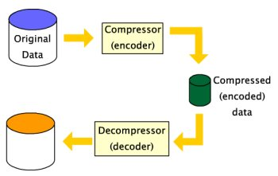

<!-- footer: "" -->

### Compressione dei dati

I dati, soprattutto se sono multimediali, richiedono a volte elevati spazi di memoria per poter essere registrati e canali trasmissivi ad alta velocità per essere trasferiti ad altri sistemi.

Nasce l'esigenza di limitare, quindi, la dimensione di tali dati attraverso delle tecniche di **compressione**.

La compressione è basata sull'idea che non tutti i dati hanno la stessa frequenza statistica oppure sulla presenza di dati ripetuti.

---

<!-- footer: "" -->

### Perché comprimere i dati

La compressione è un modo di cambiare la codifica dei dati in modo da utilizzare meno bit per la loro memorizzazione e trasmissione.

Esistono, in generale, due tipologie di compressione:

* **Lossless**: la nuova codifica non provoca perdita d'informazione.

* **Lossy**: la nuova codifica provoca perdita d'informazione, ma garantisce comunque l'intelligibilita' delle informazioni nel file compresso.

---

<!-- footer: "" -->

# Abilità Informatiche (2025/2026)

## 03. Rappresentare l'informazione

➡️ Mail: [sebastian.barzaghi2@unibo.it](mailto:sebastian.barzaghi2@unibo.it)
➡️ ORCID: [0000-0002-0799-1527](https://orcid.org/0000-0002-0799-1527)
➡️ Sito: [sebastian.barzaghi2](https://www.unibo.it/sitoweb/sebastian.barzaghi2/)

