<!-- footer: "" -->
<!-- paginate: False -->

# Abilità Informatiche (2025/2026)

## 04. Internet e World Wide Web

➡️ Mail: [sebastian.barzaghi2@unibo.it](mailto:sebastian.barzaghi2@unibo.it)
➡️ ORCID: [0000-0002-0799-1527](https://orcid.org/0000-0002-0799-1527)
➡️ Sito: [sebastian.barzaghi2](https://www.unibo.it/sitoweb/sebastian.barzaghi2/)

---

<!-- footer:  -->
<!-- paginate: False -->

---

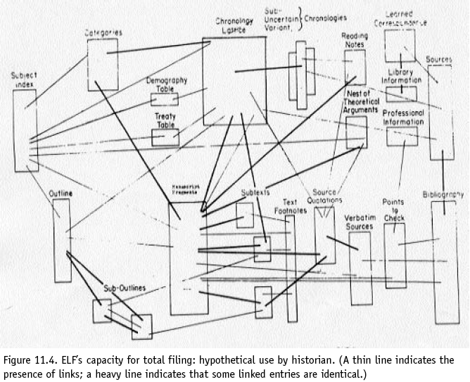

<!-- footer: Ridi, Riccardo. 2018. “Hypertext”. Knowledge Organization 45, no. 5: 393-424. Also available in ISKO Encyclopedia of Knowledge Organization, ed. Birger Hjørland, coed. Claudio Gnoli, <a href="https://www.isko.org/cyclo/hypertext">https://www.isko.org/cyclo/hypertext</a> -->
<!-- paginate: True -->

### Cos'è un ipertesto?

Il termine **ipertesto** è stato coniato dal sociologo **Ted Nelson** nel 1965, unendo il prefisso _hyper_, che significa "oltre", e _text_, cioè "testo".

Nelson immaginava un sistema dove si potessero memorizzare documenti e costruire percorsi di lettura liberi, navigando tra informazioni interconnesse. 

Un’idea visionaria, che ha anticipato il modo in cui oggi usiamo il Web.

---

![bg right contain "Di <a href="//commons.wikimedia.org/w/index.php?title=User:RobertCailliau&amp;action=edit&amp;redlink=1" class="new" title="User:RobertCailliau (page does not exist)">Robert Cailliau</a> - <a rel="nofollow" class="external free" href="https://www.cailliau.org/IMG_20231124_230228.jpg">https://www.cailliau.org/IMG_20231124_230228.jpg</a>, <a href="https://creativecommons.org/licenses/by-sa/3.0" title="Creative Commons Attribution-Share Alike 3.0">CC BY-SA 3.0</a>, <a href="https://commons.wikimedia.org/w/index.php?curid=26140236">Link</a>"](img/0402.png)

<!-- footer:  -->

### Cos'è un ipertesto?

Un **ipertesto** è _un modo non lineare di presentazione dell’informazione_.

La sua non-linearità è determinata dagli elementi fondamentali che lo caratterizzano, ovvero:
* **Nodo**: _un’unità minima di informazione_ (es., un documento);
* **Ancora**: _un punto specifico all’interno di un nodo da cui parte o a cui arriva un link_;
* **Link**: _una connessione tra due ancore_.

---

![bg right contain "Di <a href="//commons.wikimedia.org/w/index.php?title=User:RobertCailliau&amp;action=edit&amp;redlink=1" class="new" title="User:RobertCailliau (page does not exist)">Robert Cailliau</a> - <a rel="nofollow" class="external free" href="https://www.cailliau.org/IMG_20231124_230228.jpg">https://www.cailliau.org/IMG_20231124_230228.jpg</a>, <a href="https://creativecommons.org/licenses/by-sa/3.0" title="Creative Commons Attribution-Share Alike 3.0">CC BY-SA 3.0</a>, <a href="https://commons.wikimedia.org/w/index.php?curid=26140236">Link</a>"](img/0402.png)

<!-- footer:  -->

### Cos'è un ipertesto?

Quindi, in un ipertesto, l’informazione è suddivisa in nodi, collegati tra loro da link. Ogni nodo è autonomo, ma allo stesso tempo connesso agli altri. In sostanza, è un grafo, che chiameremo orientato, poiché i link hanno una direzione: dal nodo A si passa al nodo B (ma non necessariamente viceversa).

Ha diversi percorsi logici, ciascuno dotato di autonomia di significato, spesso scelti a priori dal creatore e a posteriori dall’utilizzatore.

---

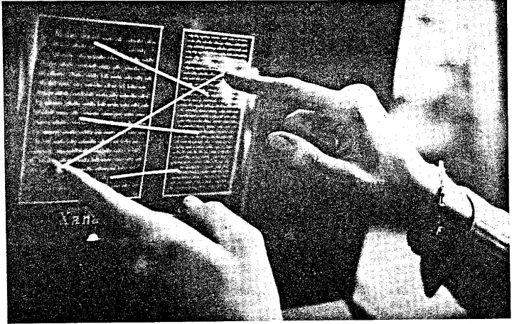

### Caratteristiche dell'ipertesto

**Granularità**: decomponibile in parti più piccole e autosufficienti, dotate di senso, e utilizzabili;

**Interattività**: dà la possibilità al lettore di rapportarsi non-linearmente con esso;

**Integrabilità**: estendibile in maniera potenzialmente infinita;

**Multimedialità**: compresenza di molteplici mezzi di comunicazione differenti.

---

<!-- footer:  -->

### L'ipertesto ha una lunga storia alle spalle

L’utente assume un ruolo attivo nella lettura dell’ipertesto: sceglie dove andare, cosa approfondire, in base a interessi e necessità.

Se ci pensiamo bene, l’ipertesto esiste da ben prima del digitale: basti pensare alle note a piè di pagina, alle glosse dei manoscritti antichi, ai riferimenti bibliografici, alle sperimentazioni letterarie e ai libri-game… 

---

<!-- footer: 
-->

### Il Memory Extender di Vannevar Bush

Per quanto riguarda le origini dell’ipertesto più propriamente digitale, dobbiamo tornare indietro di quasi un secolo.

Durante la Seconda Guerra Mondiale, l’ingegnere, tecnologo e inventore **Vannevar Bush**, coordina le attività di ricerca scientifica degli Stati Uniti, gestendo progetti di enorme portata che includono lo sviluppo del radar e, in ultima analisi, il _Progetto Manhattan_.

---

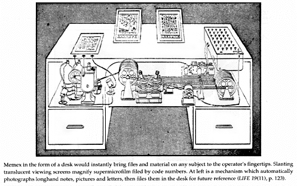

<!-- footer: 
-->

### Il Memory extender di Vannevar Bush

Nel 1945, Bush scrive e pubblica un articolo intitolato _As We May Think_ in cui immagina il **_Memory Extender_** (o _**Memex**_), una scrivania intelligente basata su microfilm per archiviare e collegare documenti e rendere più efficiente il reperimento della conoscenza scientifica. 

Si tratta di un precursore concettuale del personal computer - una macchina per elaborare le informazioni - e una previsione della rete ipertestuale del Web.

---

<!-- footer: 
-->

### Il progetto Xanadu

Più avanti, negli anni ‘60, **Ted Nelson** conia il termine “ipertesto” per definire la testualità non sequenziale basata su collegamenti associativi.

Negli anni successivi Nelson dà vita a **Xanadu**, un progetto concepito come il primo vero sistema ipertestuale elettronico. Il suo obiettivo è quello di creare un sistema informativo globale, un “docuverso” o universo di documenti in grado di collegare l’intera letteratura mondiale in una rete di testi interconnessi.

---

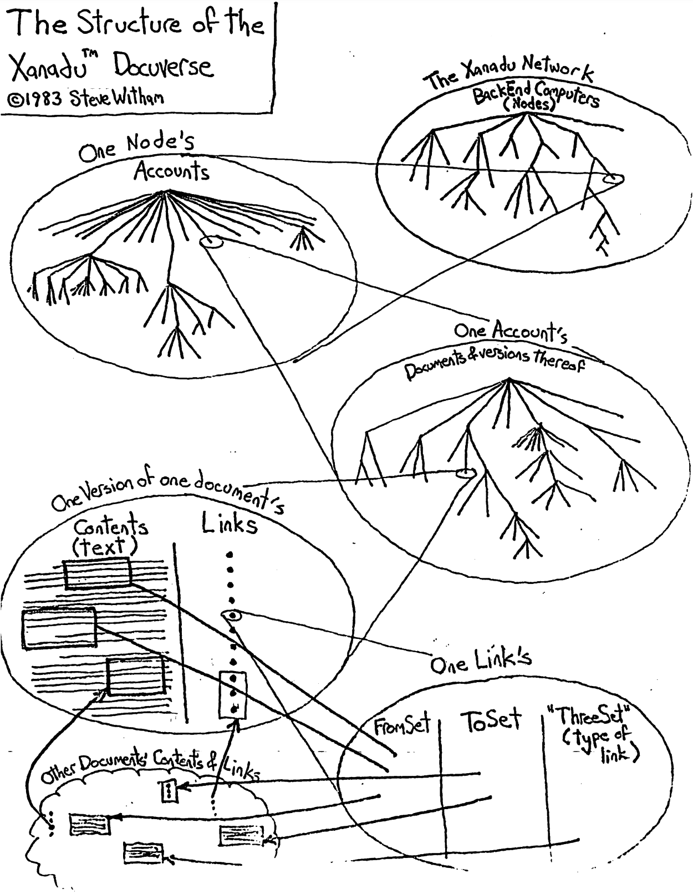

<!-- footer: 
-->

### Il progetto Xanadu

L’idea alla base di Xanadu è il concetto di _documenti paralleli_, ovvero blocchi informativi organizzati in colonne e visualizzabili side-by-side. 

Un blocco si può relazionare con il resto del sistema tramite semplici collegamenti con altri blocchi, o tramite legami di _transclusione_ (una trasposizione fedele del blocco in un’altra colonna che mantiene l’integrità del suo contenuto).

Non verrà mai completato.

---

<!-- footer:  -->

### La madre di tutte le demo

Dagli anni ‘60, l’interesse nei confronti dell’ipertesto inizia ad emergere con sempre più convinzione.

L’ingegnere e inventore **Douglas Engelbart** lavora al sistema **NLS** presso lo Stanford Research Institute e nel 1968 mostra un’interfaccia ipertestuale al pubblico nella celeberrima [_Madre di tutte le demo_](https://www.youtube.com/watch?v=yJDv-zdhzMY).

Vengono presentati, tra le altre cose, anche il _mouse_ e l'ipertesto.

---

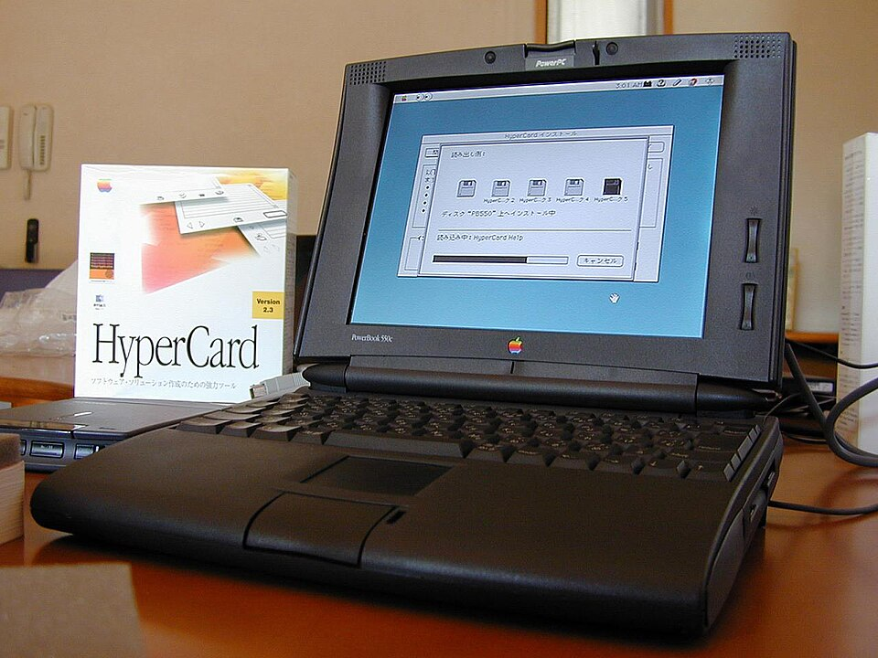

<!-- footer:  -->
<!-- paginate: True -->

### L'ipertesto entra nel mondo

Nei decenni successivi, nascono i primi sistemi ipertestuali come **ZOG**, **KMS**, **ENQUIRE**,  **NoteCards**, fino ad arrivare a programmi più evoluti come **HyperCard**, uno dei  sistemi software per sviluppare ipertesti più di successo, e **Storyspace**, un programma per produrre narrativa ipertestuale. 

Nel 1987, nella Carolina del Nord, si tiene addirittura la prima conferenza internazionale sul tema: la _Hypertext ‘87_.

---

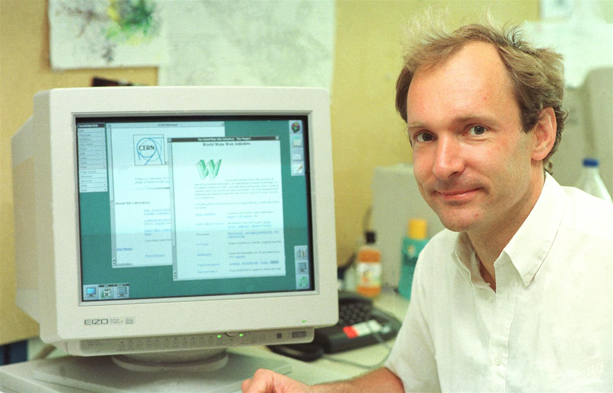

<!-- footer:  -->
<!-- paginate: True -->

### Il vero salto

Alla fine degli anni ’80, al CERN di Ginevra, un giovane fisico, **Tim Berners-Lee**, si scontra con un problema pratico: la crescente difficoltà di condividere, organizzare e accedere alle informazioni sui progetti in corso, distribuite su sistemi informatici eterogenei e non comunicanti.

Berners-Lee presenta nel 1989 _Information Management: A Proposal_, in cui progetta un sistema ipertestuale di documenti digitali collegati tra loro tramite link. 

---

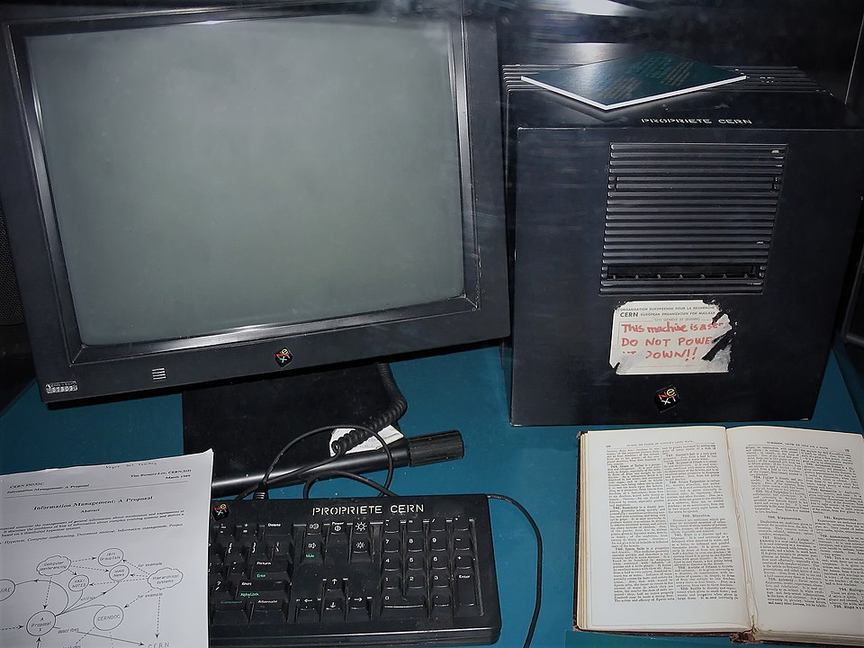

<!-- footer:  -->
<!-- paginate: True -->

### Il vero salto

Tra il 1990 e il 1991, Berners-Lee trasforma questa idea in realtà, sviluppando le tecnologie che costituiscono tuttora le basi del Web (**HTML**, **HTTP**, **URL**, il primo **browser** e il primo **server** Web).

Berners-Lee rende la sua invenzione **_open_**, scegliendo di non brevettarla e di non richiedere _royalty_ sul suo utilizzo. Questa decisione, presa nel 1993, permette al Web di diffondersi rapidamente e irreversibilmente per tutto il mondo.

---

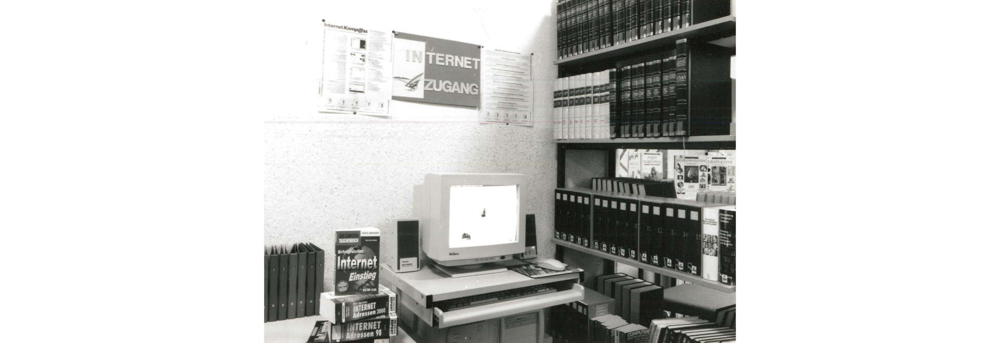

<!-- footer: "" -->
<!-- paginate: False -->

---

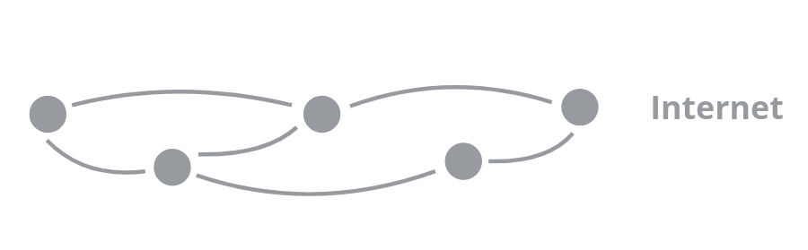

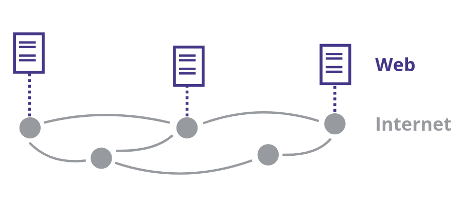

<!-- footer: How the web works. In MDN Web Docs. <a href="https://developer.mozilla.org/en-US/docs/Learn/Getting_started_with_the_web/How_the_Web_works">https://developer.mozilla.org/en-US/docs/Learn/Getting_started_with_the_web/How_the_Web_works</a> -->

<!-- paginate: True -->

### Internet? World Wide Web?

**Internet** è _una rete di comunicazione tra dispositivi distribuiti a livello globale_.

Tecnologie su cui si basa: **TCP**, **IP**, **DNS**, ecc...

Il **World Wide Web** è _un sistema documentale ipertestuale distribuito su Internet_.

Tecnologie su cui si basa: **HTTP**, **HTML**, **URL**, ecc...

Il Web è quindi un servizio su Internet.

---

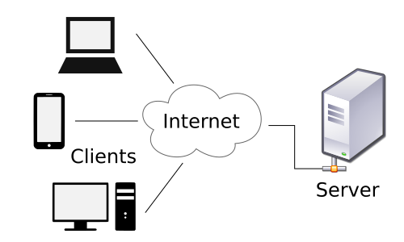

<!-- footer: How the web works. In MDN Web Docs. <a href="https://developer.mozilla.org/en-US/docs/Learn/Getting_started_with_the_web/How_the_Web_works">https://developer.mozilla.org/en-US/docs/Learn/Getting_started_with_the_web/How_the_Web_works</a> -->

### Uno sguardo più da vicino

Il Web è costituito da un insieme di documenti ipertestuali (**pagine web**), ciascuno dei quali può essere collegato ad altri tramite link unidirezionali.

Le pagine sono ospitate da nodi specializzati di Internet detti **server web**.

Un utente può navigare nella struttura ipertestuale accedendo da un nodo, detto **client**, usando un apposito tipo di programma, detto **browser**.

---

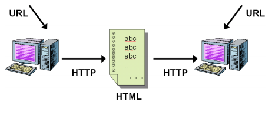

<!-- footer: How the web works. In MDN Web. https://developer.mozilla.org/en-US/docs/Learn_web_development/Getting_started/Web_standards/How_the_web_works" -->

### La terminologia del Web

**_Uniform Resource Locator_** (**URL**): schema di identificazione dei contenuti del Web e la singola stringa che agisce da identificatore univoco di una risorsa Web;

**_Hypertext Transfer Protocol_** (**HTTP**): protocollo usato dai server e dai client per comunicare gli uni con gli altri e per il recupero della rappresentazione di una risorsa Web tramite il suo URL;

**_Hypertext Markup Language_** (**HTML**): linguaggio di marcatura che permette la rappresentazione di una risorsa Web.

---

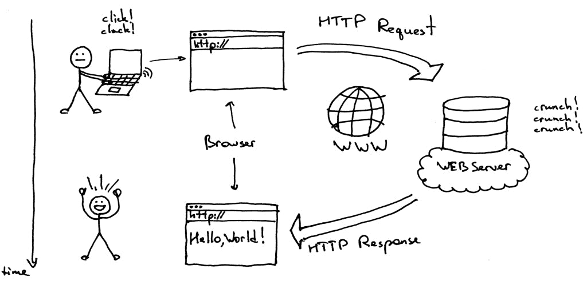

<!-- footer: How the web works. In MDN Web Docs. <a href="https://developer.mozilla.org/en-US/docs/Learn/Getting_started_with_the_web/How_the_Web_works">https://developer.mozilla.org/en-US/docs/Learn/Getting_started_with_the_web/How_the_Web_works</a> -->

### Quindi, cosa permette di fare l'interazione tra Internet e Web?

* Rappresentare risorse tramite documenti ipertestuali (attraverso **HTML**);
* Mettere a disposizione i suddetti documenti ipertestuali (attraverso **server Web**);
* Identificarli mediante l’utilizzo di un opportuno identificativo (**URL**);
* Richiederli mediante l’utilizzo di uno specifico protocollo (**HTTP**);
* Visualizzarli  (attraverso un **client**).

---

<!-- footer: "" -->
<!-- paginate: False -->

---

<!-- footer: How the web works. In MDN Web Docs. <a href="https://developer.mozilla.org/en-US/docs/Learn/Getting_started_with_the_web/How_the_Web_works">https://developer.mozilla.org/en-US/docs/Learn/Getting_started_with_the_web/How_the_Web_works</a> -->
<!-- paginate: True -->

### Il modello client-server

Il **modello client-server** è _un' architettura di rete in cui un agente - computer o software - (il **client**) accede ai servizi o alle risorse di un altro agente - computer o software - (il **server**) attraverso una rete_.

* **Client**: un agente che effettua la richiesta ad una risorsa o ad un sevrizio ospitati su un server;
* **Server**: un agente che dovrebbe fornire una risorsa o un servizio e che in qualche modo risponde alla richiesta del client.

---

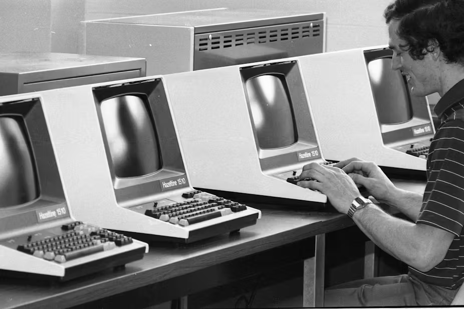

<!-- footer: How the web works. In MDN Web Docs. <a href="https://developer.mozilla.org/en-US/docs/Learn/Getting_started_with_the_web/How_the_Web_works">https://developer.mozilla.org/en-US/docs/Learn/Getting_started_with_the_web/How_the_Web_works</a> -->

### Nel dettaglio: il client

Un **client** è _un computer o un software che accede a un servizio fornito da un server_.

Consente agli utenti di interagire facilmente con un servizio o una risorsa remota (es. sito Web, un server di posta elettronica o un sistema di archiviazione cloud).

Es. il computer che state usando; un browser (Firefox, Chrome, Edge, Safari, ecc.); applicazioni (Netflix, Dropbox, Gmail, Canva, ecc.)

---

<!-- footer: How the web works. In MDN Web Docs. <a href="https://developer.mozilla.org/en-US/docs/Learn/Getting_started_with_the_web/How_the_Web_works">https://developer.mozilla.org/en-US/docs/Learn/Getting_started_with_the_web/How_the_Web_works</a> -->

### Nel dettaglio: il server

Un **server** è _un computer o software che fornisce servizi o risorse ai client attraverso una rete_.

In genere, un server è progettato per eseguire specifiche funzioni di elaborazione e gestione delle risorse, per essere resistente ai guasti, e per fornire una continuità di servizio.

Quindi, un server Web ospita un sito Web e lo "serve" ai client che richiedono di accedere e visualizzare il sito.

---

<!-- footer: How the web works. In MDN Web Docs. <a href="https://developer.mozilla.org/en-US/docs/Learn/Getting_started_with_the_web/How_the_Web_works">https://developer.mozilla.org/en-US/docs/Learn/Getting_started_with_the_web/How_the_Web_works</a> -->

### I messaggi

**Richiesta**: il messaggio mandato dal client al server in cui vengono chieste informazioni riguardo una specifica risorsa indicata da un URL;

**Risposta**: il messaggio che il server restituisce al client, che può essere positivo oppure negativo.

L'interazione viene avviata tipicamente da una richiesta dell’utente, tramite digitazione nella barra degli indirizzi del browser o per attivazione di un link.

---

<!-- footer: How the web works. In MDN Web Docs. <a href="https://developer.mozilla.org/en-US/docs/Learn/Getting_started_with_the_web/How_the_Web_works">https://developer.mozilla.org/en-US/docs/Learn/Getting_started_with_the_web/How_the_Web_works</a> -->

### Interazione Client - Server: esempio del browser

L'utente esprime un comando per ricercare una certa informazione (es. cliccaree su un link).

Il browser (client) interpreta il comando come la richiesta da parte dell’utente della pagina web corrispondente all’indirizzo specificato.

Il client codifica la richiesta della pagina secondo determinate specifiche e inoltra la richiesta al server, sfruttando  l’infrastruttura di rete e i relativi servizi.

---

<!-- footer: How the web works. In MDN Web Docs.   
 <a href="https://developer.mozilla.org/en-US/docs/Learn/Getting_started_with_the_web/How_the_Web_works">https://developer.mozilla.org/en-US/docs/Learn/Getting_started_with_the_web/How_the_Web_works</a> -->

### Interazione Client - Server: esempio del browser

La richiesta viene instradata e raggiunge il server, che la decodifica, la interpreta e cerca di soddisfarla.

Se il server approva la richiesta del client, manda al client una risposta “200 OK”, genera una copia del file corrispondente alla richiesta e la spedisce al client.

Arrivata a destinazione, il client interpreta la copia e la visualizza per l’utente.

---

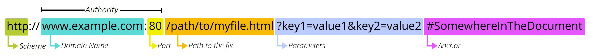

<!-- footer: "" -->
<!-- paginate:  -->

---

<!-- footer: What is a URL? In MDN Web Docs. <a href="https://developer.mozilla.org/en-US/docs/Learn/Common_questions/Web_mechanics/What_is_a_URL">https://developer.mozilla.org/en-US/docs/Learn/Common_questions/Web_mechanics/What_is_a_URL</a> -->

### Cos’è un Uniform Resource Locator?

Un _**Uniform Resource Locator**_ è definito in due modi diversi, a seconda dell modo in cui il termine è utilizzato. 

Esso può riferirsi al _meccanismo usato dai browser per recuperare risorse pubblicate sul Web_.

Ma può essere utilizzato anche per indicare _una stringa di testo che identifica (come un codice fiscale) e localizza (come un indirizzo di casa) una risorsa Web_.

---

<!-- footer: What is a URL? In MDN Web Docs.   
 <a href="https://developer.mozilla.org/en-US/docs/Learn/Common_questions/Web_mechanics/What_is_a_URL">https://developer.mozilla.org/en-US/docs/Learn/Common_questions/Web_mechanics/What_is_a_URL</a> -->

### Cos’è un Uniform Resource Locator?

Ogni volta che, da un proprio dispositivo (un computer, uno smartphone, etc.), si clicca su un link, il dispositivo stesso recupera una copia della risorsa a cui l’URL si riferisce, per poi visualizzarla sullo schermo del dispositivo.

In teoria, un URL valido punta ad un’unica risorsa, la quale può essere una pagina HTML, un documento CSS, un’immagine, ecc.; in pratica, esistono delle eccezioni, come un URL che punta ad una risorsa che non esiste più o che è stata spostata.

---

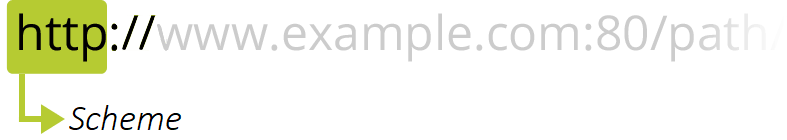

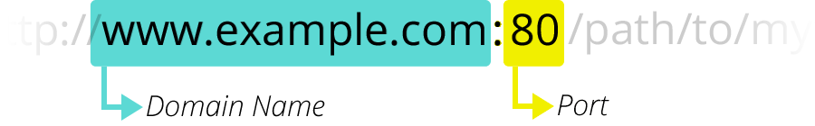

<!-- footer: What is a URL? In MDN Web Docs. <a href="https://developer.mozilla.org/en-US/docs/Learn/Common_questions/Web_mechanics/What_is_a_URL">https://developer.mozilla.org/en-US/docs/Learn/Common_questions/Web_mechanics/What_is_a_URL</a> -->

### URL: schema e dominio

Lo **schema** (_scheme_) rappresenta il protocollo (l’insieme di regole) per accedere alla risorsa.

~ Servizio postale da utilizzare.

Il **dominio** (_domain name_) identifica il tipo di entità che possiede il sito web, il servizio o la risorsa specifica a cui si accede.

~ La città dove risiede l’indirizzo a cui inviare il pacco.

---

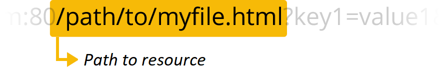

<!-- footer: What is a URL? In MDN Web Docs. <a href="https://developer.mozilla.org/en-US/docs/Learn/Common_questions/Web_mechanics/What_is_a_URL">https://developer.mozilla.org/en-US/docs/Learn/Common_questions/Web_mechanics/What_is_a_URL</a> -->

### URL: la porta e il percorso

La **porta** (_port_) è il numero del punto di contatto virtuale del server.

~ Codice di avviamento postale.

Il **percorso** (_path_) rappresenta il percorso della risorsa nel server.

~ L’edificio dove il pacco deve essere inviato.

---

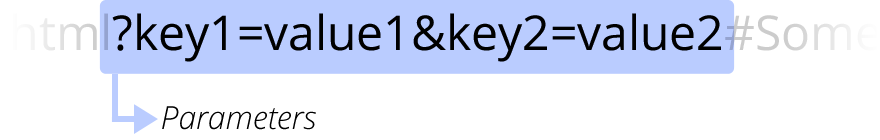

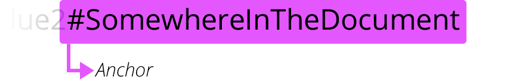

<!-- footer: What is a URL? In MDN Web Docs.   
 <a href="https://developer.mozilla.org/en-US/docs/Learn/Common_questions/Web_mechanics/What_is_a_URL">https://developer.mozilla.org/en-US/docs/Learn/Common_questions/Web_mechanics/What_is_a_URL</a> -->

### URL: i parametri e l'ancora

I **parametri** (_parameters_) rappresentano informazioni operative sulla risorsa (es. filtri in una ricerca a faccette).

~ Informazioni aggiuntive, come il numero dell’appartamento nell’edificio.

L’**ancora** (_anchor_) è l’identificativo di una sezione specifica nella risorsa.

~ La persona a cui è intestato il pacco.

---

<!-- footer: "" -->

# Abilità Informatiche (2025/2026)

## 04. Internet e World Wide Web

➡️ Mail: [sebastian.barzaghi2@unibo.it](mailto:sebastian.barzaghi2@unibo.it)
➡️ ORCID: [0000-0002-0799-1527](https://orcid.org/0000-0002-0799-1527)
➡️ Sito: [sebastian.barzaghi2](https://www.unibo.it/sitoweb/sebastian.barzaghi2/)

