<!-- footer: "" -->
<!-- paginate: False -->

# Abilità Informatiche (2025/2026)

## 05. Internet e World Wide Web

➡️ Mail: [sebastian.barzaghi2@unibo.it](mailto:sebastian.barzaghi2@unibo.it)
➡️ ORCID: [0000-0002-0799-1527](https://orcid.org/0000-0002-0799-1527)
➡️ Sito: [sebastian.barzaghi2](https://www.unibo.it/sitoweb/sebastian.barzaghi2/)

---

<!-- footer:  -->
<!-- paginate: False -->

---

<!-- footer: An Overview of HTTP. In MDN Web Docs. <a href="https://developer.mozilla.org/en-US/docs/Web/HTTP/Overview">https://developer.mozilla.org/en-US/docs/Web/HTTP/Overview</a> -->
<!-- paginate: True -->

### Cos'è un protocollo?

Per comunicare, gli elementi all’interno di un sistema devono seguire regole comuni.

Un protocollo è un insieme di regole e di messaggi che governano la comunicazione tra due entità.

La definizione di ogni protocollo consiste nel fornire un insieme di regole non ambigue, definendo i messaggi che possono essere scambiati tra entità, il loro significato e le azioni da intraprendere in ogni situazione (es. semaforo).

---

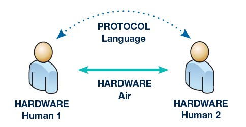

<!-- footer: An Overview of HTTP. In MDN Web Docs. <a href="https://developer.mozilla.org/en-US/docs/Web/HTTP/Overview">https://developer.mozilla.org/en-US/docs/Web/HTTP/Overview</a> -->

### Cos'è un protocollo?

Un protocollo deve essere espresso in un linguaggio comprensibile alle entità per favorire la comunicazione, con:

* Una **sintassi** da seguire per costruire i messaggi;
* Delle regole interpretative del messaggio, per definire la **semantica** dei messaggi;
* Dei **meccanismi per sincronizzare** la comunicazione;
* Dei **meccanismi per correggere e/o gestire** eventuali errori.

---

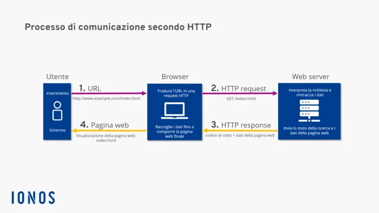

<!-- footer:  -->

### Il protocollo HTTP

Protocollo di comunicazione utilizzato per il trasferimento di dati tra un client e un server su una rete.

HTTP standardizza come client e server comunicano tramite il metodo richiesta-risposta, in cui il client invia una richiesta al server e il server risponde con una risposta contenente i dati richiesti.

Tra il client e il server ci sono numerosi intermediari, collettivamente chiamati <strong>proxy</strong>, che eseguono diverse operazioni per migliorare le prestazioni e la sicurezza (gateway, cache, ecc.).

---

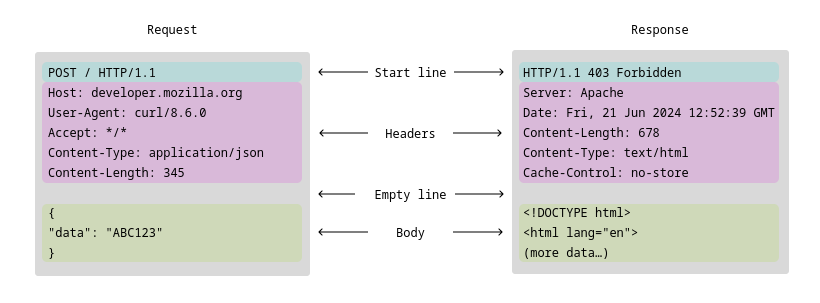

<!-- footer: "" -->

---

<!-- footer: HTTP Messages. In MDN Web Docs. <a href="https://developer.mozilla.org/en-US/docs/Web/HTTP/Messages">https://developer.mozilla.org/en-US/docs/Web/HTTP/Messages</a> -->

### La struttura di un messaggio HTTP

- Una **testa** composta da:
  * Una **riga iniziale** (di richiesta o di risposta);
  * Un insieme di **intestazioni opzionali** (o header) che specificano la richiesta o descrivono il corpo del messaggio;
- Una **riga vuota** che separa la testa dal corpo del messaggio;
- Un **corpo opzionale** (o body o payload) con il contenuto del messaggio.

---

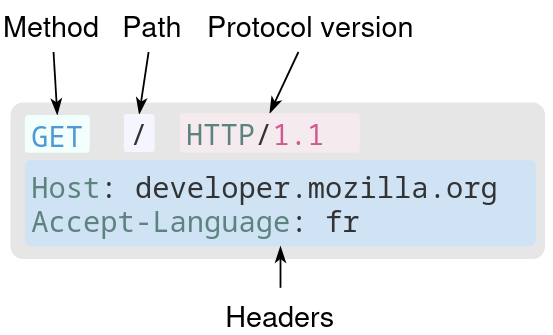

<!-- footer: 
-->

### La richiesta HTTP

**Testa**: una riga di richiesta (contenente il **metodo**, il percorso e la versione di HTTP utilizzata) e le **intestazioni** (_headers_) contenenti varie informazioni (es. nome del dominio del server, lingua del messaggio, ecc.).

Un'eventuale **riga vuota** (nell'immagine non c'è).

Un eventuale **corpo** (nell'immagine non c'è).

---

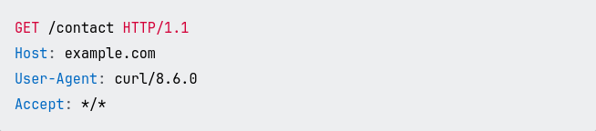

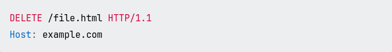

<!-- footer: ""
-->

### I metodi GET e DELETE

* Il metodo `GET` richiede una rappresentazione di una risorsa. `GET` viene usato solo per richiedere dati, e non deve contenere un corpo. Nell'esempio, la richiesta richiede la risorsa al percorso `example.com/contact`.

* Il metodo `DELETE` chiede al server di rimuovere una risorsa. `DELETE` viene usato solo per eliminare dati, e non deve contenere un corpo. Nell'esempio, la richiesta chiede l'eliminazione della risorsa `file.html`.

---

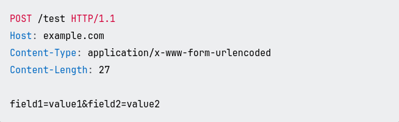

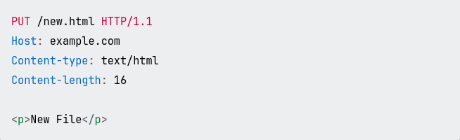

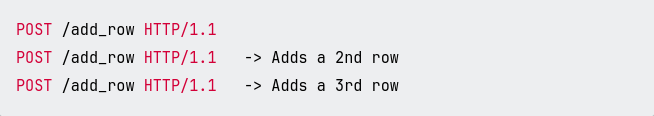

<!-- footer:  -->

### I metodi POST e PUT

* Il metodo `POST` manda dati al server per _creare_ una nuova risorsa. Nell'esempio, la richiesta manda dati in coppie `chiave=valore`, con ogni coppia separata dal `&`.

* Il metodo `PUT` manda dati al server per _creare o modificare_ una risorsa. Nell'esempio, la richiesta manda dati a `example.com/new.html` col contenuto `
New File
`.

La differenza tra i due è che `PUT` è **idempotente**: l'effetto chi chiamarlo una volta è uguale all'effetto di chiamarlo più volte. `POST` **non** è idempotente.

---

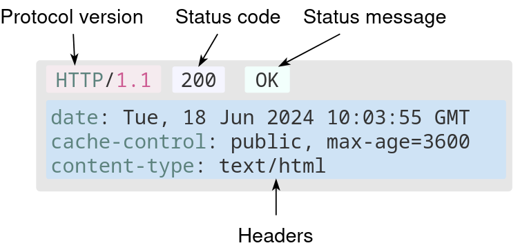

<!-- footer:  -->
<!-- paginate: True -->

### La risposta HTTP

**Testa**: una riga di risposta (contenente la versione del protocollo usato, il **codice di stato** che specifica la classe di risposta, e il messaggio di stato associato al codice) e le **intestazioni** contenenti varie informazioni (es. data, tipo di contenuto, ecc.).

Un'eventuale **riga vuota** (nell'immagine non c'è).

Un eventuale **corpo** (nell'immagine non c'è).

---

<!-- footer:  -->
<!-- paginate: True -->

### I codici di stato: 1XX

Risposte informative preliminari o di diagnostica (molto rare, di solito non usate).

Esempi:

* `100 Continue`: il server dice al client che può continuare la richiesta.

* `101 Switching Protocols`: il server dice al client il protocollo su cui si sta spostando.

* `102 Processing`: il server dice al client che ha ricevuto la richiesta ma non sa ancora lo stato.

---

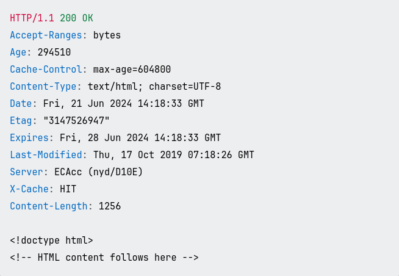

<!-- footer:  -->
<!-- paginate: True -->

### I codici di stato: 2XX

La richiesta è stata ricevuta, compresa, accettata e elaborata con successo dal server.

Esempi:

* `200 OK`: la richiesta ha avuto successo, con diversi significati a seconda del metodo HTTP della richiesta:
  * `GET`: la risorsa è stata presa e mandata al client;
  * `PUT` o `POST`: la risorsa è stata creata o modificata nel server.

---

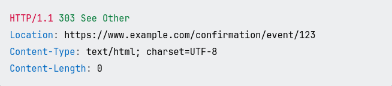

<!-- footer:  -->

<!-- paginate: True -->

### I codici di stato: 3XX

Il client deve effettuare ulteriori azioni per completare la richiesta.

Esempi:

* `301 Moved Permanently`: l'URL della risorsa richiesta è stato cambiato. La risposta contiene il nuovo URL della risorsa.

* `303 See Other`: il server dice al client di prendere la risorsa ad un altro URI con un `GET`.

---

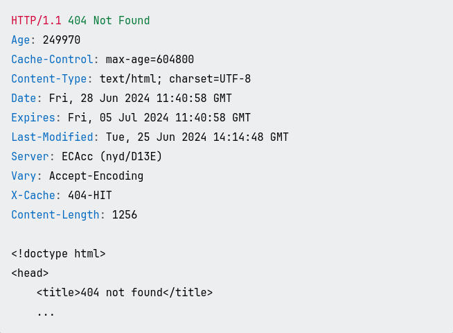

<!-- footer: "" -->

### I codici di stato: 4XX

C'è stato un errore che dipende dalla richiesta del client (spesso derivante da errori nell'URL della richiesta).

Esempi:

* `400 Bad Request`: il server non processa la richiesta per qualcosa che percepisce come un errore del client.

* `403 Forbidden`: il client non ha i diritti di accesso alla risorsa.

* `404 Not Found`: il server non riesce a trovare la risorsa richiesta.

---

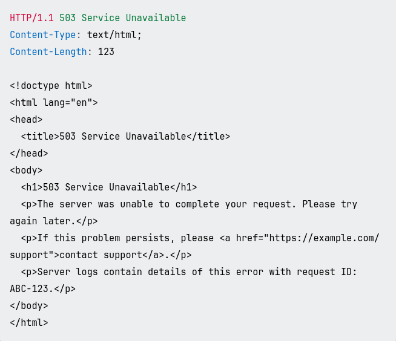

<!-- footer:  -->

### I codici di stato: 5XX

C'è stato un errore che dipende dal server durante il tentativo di elaborazione della richiesta del client.

Esempi:

* `500 Internal Server Error`: il server ha incontrato una situazione che non sa come gestire.

* `503 Service Unavailable`: il server non è pronto a gestire la richiesta, spesso perché il server è _down_ o sovraccarico.

---

<!-- footer:  -->

---

<!-- footer: Introduction to HTML. In MDN Web Docs. <a href="https://developer.mozilla.org/en-US/docs/Learn/HTML/Introduction_to_HTML">https://developer.mozilla.org/en-US/docs/Learn/HTML/Introduction_to_HTML</a> -->

### Pagine e siti Web

Una **pagina Web** è _un documento ipertestuale pubblicato sul World Wide Web_ e visualizzato dall’utente tramite un client (browser, app, ecc.).

Quindi, un **sito Web** consiste in _un insieme di pagine Web (più altri file correlati) che il client richiede ad uno o più server_ per elaborarli e generarne la visualizzazione sullo schermo del dispositivo.

Le pagine Web sono strutturate tramite la **marcatura**.

---

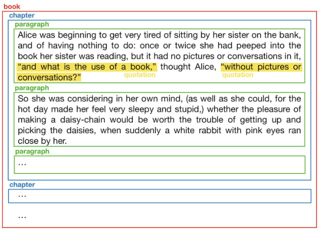

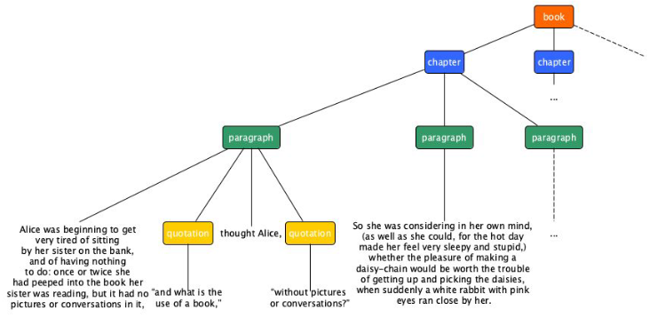

<!-- footer: Introduction to HTML. In MDN Web Docs. <a href="https://developer.mozilla.org/en-US/docs/Learn/HTML/Introduction_to_HTML">https://developer.mozilla.org/en-US/docs/Learn/HTML/Introduction_to_HTML</a> -->
<!-- paginate: True -->

### La marcatura del testo

La **marcatura** (_markup_) è _l'annotazione del testo per definire esplicitamente i ruoli strutturali e semantici delle parti di cui è costituito_.

La marcatura trasforma il testo in una struttura ad albero.

Esistono diversi _linguaggi di marcatura_, ovvero linguaggi formali che definiscono le regole sintattiche (es., SGML, XML) e/o il vocabolario necessari per la marcatura di un testo.

---

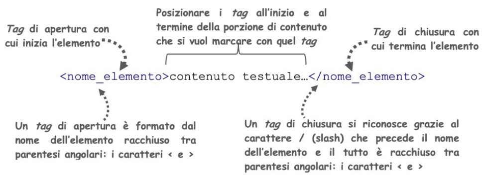

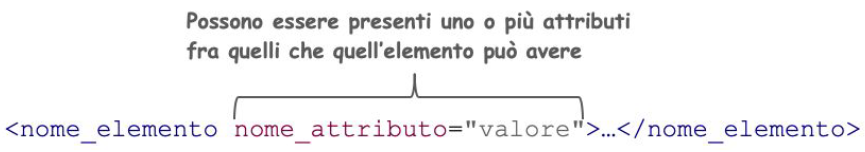

<!-- footer: Introduction to HTML. In MDN Web Docs. <a href="https://developer.mozilla.org/en-US/docs/Learn/HTML/Introduction_to_HTML">https://developer.mozilla.org/en-US/docs/Learn/HTML/Introduction_to_HTML</a> -->

### La marcatura: elementi e attributi

Un **elemento** è _un termine informativo che esprime la semantica della porzione di testo a cui si riferisce_. 

In genere, è costituito da un **tag** di apertura (`<` + `elemento` + `>`), un **tag** di chiusura (`</` + `elemento` + `>`) e un contenuto testuale tra i due.

Un **attributo** è _un'informazione aggiuntiva che si riferisce all’elemento a cui viene assegnata_, sotto forma di coppia chiave-valore inserita nel tag di apertura.

---

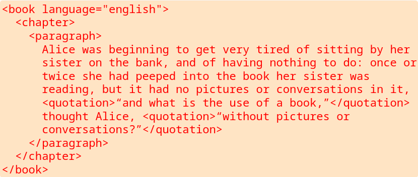

<!-- footer: "" -->
<!-- paginate: False -->

---

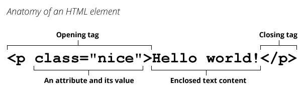

<!-- footer: Introduction to HTML. In MDN Web Docs. <a href="https://developer.mozilla.org/en-US/docs/Learn/HTML/Introduction_to_HTML">https://developer.mozilla.org/en-US/docs/Learn/HTML/Introduction_to_HTML</a> -->
<!-- paginate:  -->

### Introduzione a HTML

L'_**HyperText Markup Language**_ (HTML) è _un linguaggio di marcatura che specifica la struttura di una pagina Web_.

Una pagina HTML è quindi un documento di testo strutturato secondo determinati elementi e attributi. Ogni cosa, in una pagina HTML, è espressa tramite combinazioni di elementi HTML.

Di fatto è un file, salvato nei formati `.htm` e `.html`, servito da un server, e visualizzato da un browser.

---

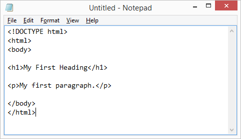

<!-- footer: What is a URL? In MDN Web Docs. <a href="https://developer.mozilla.org/en-US/docs/Learn/Common_questions/Web_mechanics/What_is_a_URL">https://developer.mozilla.org/en-US/docs/Learn/Common_questions/Web_mechanics/What_is_a_URL</a> -->

### Struttura base di un documento HTML

* `!DOCTYPE`: il tipo di documento che il client si deve aspettare.
* `html`: inizio e fine del documento HTML.
* `head`: l'intestazione del documento, contenente metadati e altre informazioni tecniche invisibili all'utente.
* `body`: il contenuto del documento, contenente tutto ciò che è visibile all'utente.

---

<!-- footer: Introduction to HTML. In MDN Web Docs. <a href="https://developer.mozilla.org/en-US/docs/Learn/HTML/Introduction_to_HTML">https://developer.mozilla.org/en-US/docs/Learn/HTML/Introduction_to_HTML</a> -->

### Cascading Style Sheets e JavaScript

**_Cascading Style Sheets_** è _un linguaggio per definire lo stile delle pagine Web_. Permette la separazione tra contenuto e la sua rappresentazione. 

Esempio: https://csszengarden.com/.

**JavaScript** è _un linguaggio di programmazione usato per aggiungere interattività alle pagine Web_. Permette l'esecuzione di determinate azioni in seguito allo scatenarsi di specifici eventi.

---

<!-- footer: "" -->

---

<!-- footer: IP Address. In MDN Web Docs. <a href="https://developer.mozilla.org/en-US/docs/Glossary/IP_Address">https://developer.mozilla.org/en-US/docs/Glossary/IP_Address</a> -->

### Trovare il server

URL e HTTP ci permettono ottenere una rappresentazione della risorsa cercata. Ma come fa il client a trovare il server?

Dato questo URL: `http://<dominio>/<percorso>?<parametri>#<ancora>`

* Il client richiede al server `/<percorso>?<parametri>#<ancora>`;
* Il server restituisce un messaggio con la copia della risorsa richiesta.

---

<!-- footer: IP Address. In MDN Web Docs. <a href="https://developer.mozilla.org/en-US/docs/Glossary/IP_Address">https://developer.mozilla.org/en-US/docs/Glossary/IP_Address</a> -->

### L'indirizzo IP

Pur usando l’URL per accedere ad una risorsa, il server che la ospita non è direttamente raggiungibile usando il dominio, ma solo attraverso un indirizzo specifico.

Un **indirizzo IP** è _un identificativo numerico assegnato ad un dispositivo connesso a Internet_.

L'indirizzo IP è essenziale per la comunicazione su Internet, poiché consente ai dispositivi di identificarsi e di scambiarsi informazioni tra di loro.

---

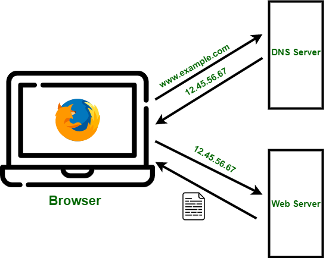

<!-- footer: DNS. In MDN Web Docs. <a href="https://developer.mozilla.org/en-US/docs/Glossary/DNS">https://developer.mozilla.org/en-US/docs/Glossary/DNS</a> -->

### Il Domain Name System

Quando un client fa una richesta, deve scoprire l'indirizzo IP associato al dominio che ospita la risorsa richiesta.

Il _**Domain Name System**_ (DNS) è _un sistema di nomenclatura utilizzato per tradurre i nomi di dominio degli indirizzi Web in indirizzi IP numerici_.

In pratica, è come un elenco telefonico per Internet che permette agli utenti di trovare i siti web desiderati utilizzando nomi di dominio, invece di usare gli indirizzi IP numerici.

---

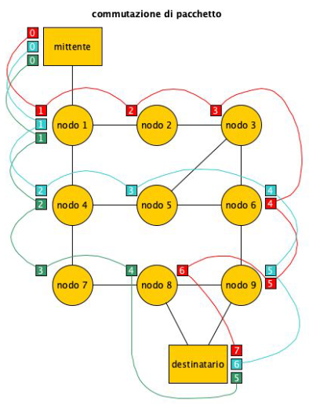

<!-- footer: TCP. In MDN Web Docs. <a href="https://developer.mozilla.org/en-US/docs/Glossary/TCP">https://developer.mozilla.org/en-US/docs/Glossary/TCP</a> -->

### Il Transmission Control Protocol

Il _**Transmission Control Protocol**_ è _un protocollo che garantisce una trasmissione affidabile dei dati attraverso una rete_.

TCP è basato sull'idea della **commutazione di pacchetto**: i dati mandati e ricevuti sono divisi in pacchetti, con la garanzia che questi vengano consegnati correttamente, grazie anche agli indirizzi IP.

Insieme, TCP e IP costituiscono il protocollo TCP/IP.

---

<!-- footer: "" -->

---

<!-- footer: How the web works. In MDN Web Docs. <a href="https://developer.mozilla.org/en-US/docs/Learn/Getting_started_with_the_web/How_the_Web_works">https://developer.mozilla.org/en-US/docs/Learn/Getting_started_with_the_web/How_the_Web_works</a> -->

### Il Web è una strada, e noi dobbiamo andare ad un negozio

Ad un’estremità c’è il client (casa), all’altra il server (un negozio).

Durante la navigazione tramite browser, digitare un URL o cliccare su un link equivale a camminare dalla casa verso il negozio.

---

<!-- footer: How the web works. In MDN Web Docs. <a href="https://developer.mozilla.org/en-US/docs/Learn/Getting_started_with_the_web/How_the_Web_works">https://developer.mozilla.org/en-US/docs/Learn/Getting_started_with_the_web/How_the_Web_works</a> -->

### Chiediamo l'indirizzo

Il browser si collega al server DNS e trova l'indirizzo reale del server su cui risiede il sito Web.

In pratica, cerchiamo e troviamo l'indirizzo del negozio.

---

<!-- footer: How the web works. In MDN Web Docs. <a href="https://developer.mozilla.org/en-US/docs/Learn/Getting_started_with_the_web/How_the_Web_works">https://developer.mozilla.org/en-US/docs/Learn/Getting_started_with_the_web/How_the_Web_works</a> -->

### Troviamo l'indirizzo

Il browser si collega al server DNS e trova l'indirizzo reale del server su cui risiede il sito Web.

In pratica, cerchiamo e troviamo l'indirizzo del negozio.

---

<!-- footer: How the web works. In MDN Web Docs. <a href="https://developer.mozilla.org/en-US/docs/Learn/Getting_started_with_the_web/How_the_Web_works">https://developer.mozilla.org/en-US/docs/Learn/Getting_started_with_the_web/How_the_Web_works</a> -->

### Trovato il negozio, facciamo il nostro ordine

Il browser invia un messaggio di richiesta HTTP al server, chiedendogli di inviare una copia del sito Web al client.

In pratica, una volta arrivati al negozio, ordiniamo quello che ci serve.

---

<!-- footer: How the web works. In MDN Web Docs. <a href="https://developer.mozilla.org/en-US/docs/Learn/Getting_started_with_the_web/How_the_Web_works">https://developer.mozilla.org/en-US/docs/Learn/Getting_started_with_the_web/How_the_Web_works</a> -->

### Il nostro ordine va a buon fine e ci vengono consegnati i prodotti

Se il server approva la richiesta del client, invia al client un messaggio "200 OK", che significa "Certo, puoi guardare quel sito web! Eccolo qui", e inizia quindi a inviare i file del sito Web al browser sotto forma di pacchetti di dati.

In pratica, il negozio ci consegna i prodotti che abbiamo ordinato, e noi li riportiamo a casa.

---

<!-- footer: How the web works. In MDN Web Docs. <a href="https://developer.mozilla.org/en-US/docs/Learn/Getting_started_with_the_web/How_the_Web_works">https://developer.mozilla.org/en-US/docs/Learn/Getting_started_with_the_web/How_the_Web_works</a> -->

### Durante tutto questo

Il messaggio e tutti i dati in esso contenuti, inviati tra il client e il server, vengono trasmessi attraverso la connessione Internet utilizzando il protocollo TCP/IP.

---

<!-- footer: How the web works. In MDN Web Docs. <a href="https://developer.mozilla.org/en-US/docs/Learn/Getting_started_with_the_web/How_the_Web_works">https://developer.mozilla.org/en-US/docs/Learn/Getting_started_with_the_web/How_the_Web_works</a> -->

### Infine, ritorniamo a casa

Il browser assembla i pacchetti in una pagina Web completa e la visualizza a schermo.

In pratica, ritorni a casa con i prodotti in mano, pronti per essere usati.

---

<!-- footer: "" -->

# Abilità Informatiche (2025/2026)

## 05. Internet e World Wide Web

➡️ Mail: [sebastian.barzaghi2@unibo.it](mailto:sebastian.barzaghi2@unibo.it)
➡️ ORCID: [0000-0002-0799-1527](https://orcid.org/0000-0002-0799-1527)
➡️ Sito: [sebastian.barzaghi2](https://www.unibo.it/sitoweb/sebastian.barzaghi2/)

