<!-- footer: "" -->
<!-- paginate: False -->

# Abilità Informatiche (2025/2026)

## 06. Data Literacy

➡️ Mail: [sebastian.barzaghi2@unibo.it](mailto:sebastian.barzaghi2@unibo.it)
➡️ ORCID: [0000-0002-0799-1527](https://orcid.org/0000-0002-0799-1527)
➡️ Sito: [sebastian.barzaghi2](https://www.unibo.it/sitoweb/sebastian.barzaghi2/)

---

<!-- paginate: True -->

### C'era una volta un rapimento...

Aprile 2014.

276 ragazze di una scuola a **Chibok**, nell'est della Nigeria, vengono rapite dal gruppo terroristico Boko Haram.

Poco dopo, _FiveThirtyEight_ esamina la situazione in un articolo, che verrà fortemente criticato per l'utilizzo dei dati nel grafico e per l'analisi del contenuto.

I numeri provengono dal _Global Database of Events, Language and Tone_ (GDELT), un database che raccoglie dati su eventi e località da migliaia di fonti di notizie, tra cui televisione, stampa e pagine web.

---

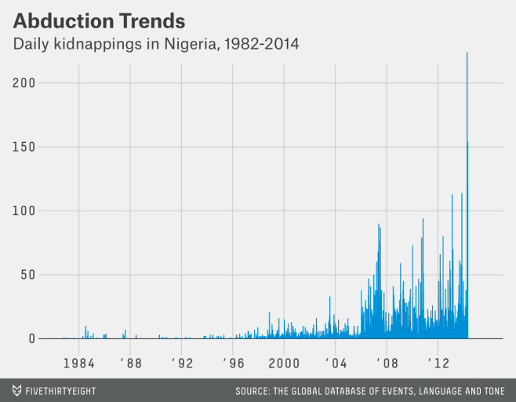

### Rapimenti o notizie sui rapimenti?

Invece di mostrare i rapimenti giornalieri in Nigeria, il grafico mostra i _rapporti giornalieri_ di notizie sui rapimenti in Nigeria.

Una tendenza in aumento potrebbe essere dovuta a un numero maggiore di rapimenti, ma anche a un numero maggiore di notizie in generale o a una maggiore attenzione dei media verso il fenomeno.

Il problema maggiore è l’assunzione che un singolo evento nel database corrisponda a un singolo rapimento.

---

### Di nuovo, un'interpretazione sbagliata

In seguito, l’articolo è stato aggiornato, precisando: “Questo post dovrebbe fare riferimento ai rapporti dei media sui rapimenti, non ai rapimenti stessi”.

FiveThirtyEight ha preso i dati nel database GDELT per ciò che erano, senza considerare come i dati venissero raccolti e cosa rappresentasse ogni record nel database.

Di conseguenza, tutto questo ha avuto un impatto anche sulla visualizzazione dei dati, rendendola fuorviante.

---

<!-- footer: Koltay, T. (2017). Data literacy for researchers and data librarians. Journal of Librarianship and Information Science, 49(1), 3-14. https://doi.org/10.1177/0961000615616450 -->

### Cosa intendiamo per _data literacy_?

La _data literacy_ è la capacità di leggere, creare, usare, comunicare criticamente i dati.

Dipende dai dati, ma anche dal contesto in cui questi vengono creati ed utilizzati.

Nell’ambito umanistico, consiste nel riconoscimento delle potenzialità della ricerca che si sta portando avanti, essere coscienti dei metodi di ricerca utilizzati, e comprendere il contesto e la provenienza dei dati.

---

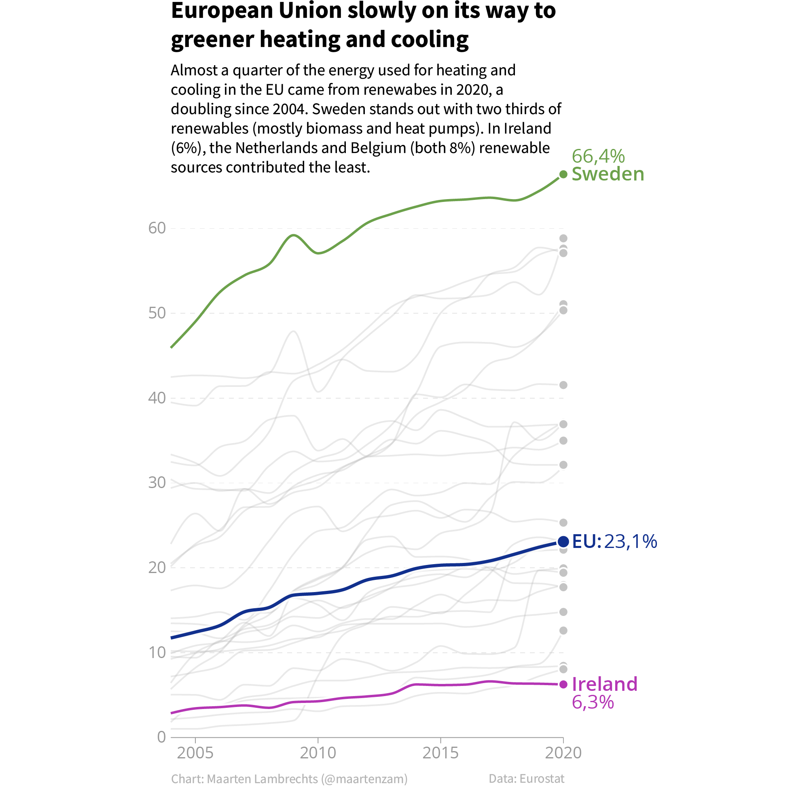

<!-- footer: "" -->
<!-- paginate: False -->

---

<!-- paginate: True -->

<!-- footer: Sint, R., Schaffert, S., Stroka, S., & Ferstl, R. (2009, June). Combining unstructured, fully structured and semi-structured information in semantic wikis. In CEUR workshop proceedings (Vol. 464, No. 12, pp. 73-87). Crete, Greece: Heraklion. https://ceur-ws.org/Vol-464/paper-14.pdf. -->

### Gli stessi dati possono essere organizzati in maniera diversa

1️⃣ I dati **non-strutturati** mancano formalmente di una struttura organizzata (es. testo libero, immagini, video).

2️⃣ I dati **semi-strutturati** hanno una struttura parziale e flessibile (es. XML).

3️⃣ I dati **strutturati** sono organizzati in uno schema rigido e predefinito (es. database).

(Ma [non è proprio vero](https://www.techtarget.com/searchdatamanagement/blog/The-Wondrous-World-of-Data/Unstructured-data-is-a-misnomer)...)

---

<!-- footer: Prescott, A. (2013, October). Bibliographic records as humanities big data. In 2013 IEEE International Conference on Big Data (pp. 55-58). IEEE. https://doi.org/10.1109/BigData.2013.6691670 -->

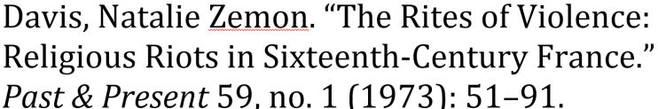

### Esempio interessante: i dati bibliografici

I dati bibliografici (come i **riferimenti** o le **citazioni**) sono ampiamente analizzati e utilizzati in tutti gli ambiti di ricerca, dalla biologia all'informatica, fino ad arrivare ovviamente alla biblioteconomia e alle DH.

💡 Sono dati caratterizzati da un volume gigantesco, un'applicabilità trasversale, una molteplicità di strutture più o meno coerenti, e una natura variegata e stratificata.

---

### I dati hanno strutture nascoste

A tutti gli effetti, questo riferimento bibliografico è una **stringa** (in informatica, è il termine utilizzato per riferirsi al testo), quindi un dato _non-strutturato_.

⚠️ Ma sappiamo che in realtà un riferimento bibliografico (come anche altre tipologie di testo "semplice") ha una struttura _implicita_, determinata dallo stile citazionale scelto, che ci permette di dire una serie di _cose_ su questo dato...

Cosa sono queste _cose_?

---

<!-- paginate: True -->
<!-- footer: Andersson, L., Huvila, I., & Sköld, O. (2024). An Introduction to Paradata. In "Perspectives on Paradata: Research and Practice of Documenting Process Knowledge" (pp. 1-14). Cham: Springer International Publishing. https://doi.org/10.1007/978-3-031-53946-6_1 -->

### Spesso il contesto è più importante

Nelle discipline umanistiche tendiamo ad avere _dati descrittivi e interpretativi di altri dati_: per descrivere opere culturali, eventi, collezioni bibliografiche lavoriamo più che altro sulle relazioni e i contesti (sociali, geografici, storici, umani).

In questa prospettiva, un ruolo fondamentale è svolto dai **metadati** che documentano _in maniera strutturata_ i _chi_, i _cosa_, i _come_, i _quando_, i _dove_, i _perché_ dei dati.

---

<!-- footer: "" -->

### I metadati di un oggetto

Ogni volta che viene scattata una foto con un dispositivo digitale, dei _metadati_ vengono creati automaticamente, come:
* Data di creazione;
* Nome del file;
* Impostazioni del dispositivo;
* Geolocalizzazione.

Anche un libro è ricco di metadati visibili sulla copertina e nel frontespizio, come:
* Titolo;
* Autore;
* Editore.

---

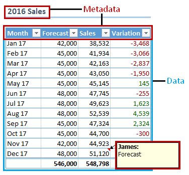

<!-- footer: Baca, M. (Ed.). (2016). Introduction to metadata. Getty Publications. <a href="https://www.getty.edu/publications/intrometadata/">https://www.getty.edu/publications/intrometadata/</a> -->

### Dati su dati

➡️ I **metadati** sono _dati che descrivono un oggetto informativo e ne documentano alcune caratteristiche_.

Esempi di metadati includono l'autore di un libro, il contenuto testuale, la data di pubblicazione, e così via.

💡 I metadati possono essere visti come _l'insieme di tutto ciò che si può dire su un dato (oggetto informativo) in un determinato momento, a qualsiasi livello di aggregazione_.

---

<!-- footer: Australian Research Data Commons (ARDC). (2020). ARDC Metadata Guide. Zenodo. <a href="https://doi.org/10.5281/zenodo.6459832">https://doi.org/10.5281/zenodo.6459832</a> -->

### I metadati possono _riferirsi a_ tante cose

💡 I metadati costituiscono _una forma di **documentazione**_ (di solito strutturata) che descrive o rappresenta le caratteristiche di un oggetto.

🔎 Quindi, possono essere usati per descrivere tanto gli oggetti _fisici_ (per esempio, frammenti di vasi, reperti archeologici, quadri, libri, persone, ecc.), quanto gli oggetti _digitali_ (per esempio, software, foto, dataset, videogiochi, modelli 3D, ecc.).

---

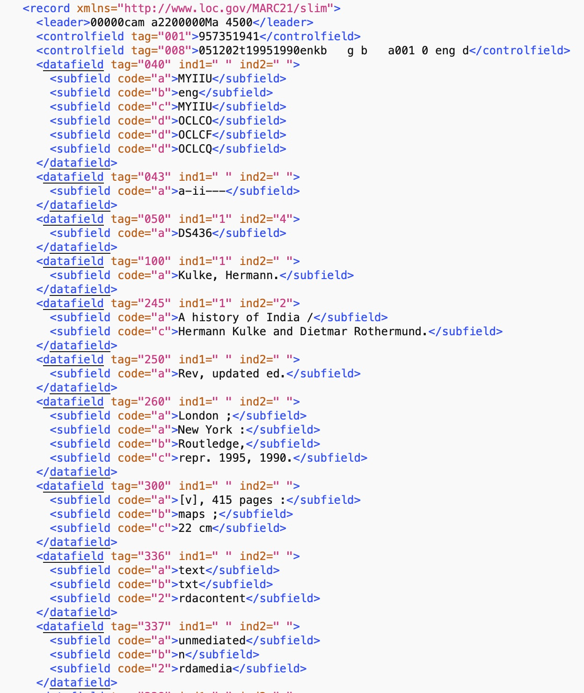

<!-- footer: Australian Research Data Commons (ARDC). (2020). ARDC Metadata Guide. Zenodo. <a href="https://doi.org/10.5281/zenodo.6459832">https://doi.org/10.5281/zenodo.6459832</a> -->

### I metadati possono _essere_ tante cose

💡 I metadati possono assumere molte _forme_ diverse.

🔎 A partire da semplice _testo libero_ (per esempio, l'etichetta di un'opera d'arte esposta in un museo), pensato per un utilizzatore umano, i metadati possono esistere anche sotto forma di contenuto codificato in _un formato altamente strutturato, standardizzato e comprensibile dalle macchine_ (per esempio, un file [MARC](https://it.wikipedia.org/wiki/ISO_2709)).

---

<!-- footer: Australian Research Data Commons (ARDC). (2020). ARDC Metadata Guide. Zenodo. <a href="https://doi.org/10.5281/zenodo.6459832">https://doi.org/10.5281/zenodo.6459832</a> -->

### I metadati sono sempre associati ai dati che descrivono

💡 I metadati _accompagnano ciò che descrivono_ in vari modi.

🔎 Possono essere presenti direttamente _nei dati stessi_ (per esempio, un file PDF o un'immagine digitale), oppure possono essere registrati _in oggetti separati collegati_ in qualche maniera ai dati che descrivono (per esempio, file di testo, fogli di calcolo, ma anche una scheda di catalogo o l'etichetta di un'opera esposta in un museo).

---

### Esistono diversi tipi di metadati

* **Descrittivi**: descrivono dati usando dettagli sul contenuto che permettono a questi dati di essere rintracciabili, identificabili e selezionabili (es. `titolo`);
* **Strutturali**: forniscono informazioni sulla costruzione e sull'organizzazione dei dati all'interno della loro collezione (es. `indice`);
* **Amministrativi**: permettono la gestione dei dati nel tempo, fornendo informazioni sulle loro origini e le loro modalità di utilizzo (es. `licenza`).

---

<!-- footer: Ram, Sudha & Liu, Jun. (2008). A Semiotics Framework for Analyzing Data Provenance Research. JCSE. 2. 221-248. http://dx.doi.org/10.5626/JCSE.2008.2.3.221 -->

### Con i metadati, la situazione può sfuggire di mano velocemente

🔎 Questo esemplare fisico d’erbario di _Cenchrus ciliaris_ è composto sia dai campioni sia dai metadati che li descrivono. Il codice a barre rimanda a un record digitale contenente metadati relativi al reperto fisico.

⚠️ La metadatazione è una questione complessa: possiamo descrivere tutto, come vogliamo, e pure su diversi livelli... A quel punto, a cosa serve?

Come ci regoliamo?

---

<!-- footer: Ulrich, H., Kock-Schoppenhauer, A. K., Deppenwiese, N., Gött, R., Kern, J., Lablans, M., ... & Ingenerf, J. (2022). Understanding the nature of metadata: systematic review. "Journal of medical Internet research", 24(1), e25440. https://doi.org/10.2196/25440 -->

### I metadati seguono schemi

➡️ Gli **schemi di metadati** sono _strutture concettuali che specificano quali metadati utilizzare e secondo quali regole_.

Stabiliscono termini, definizioni, regole comuni per facilitare l'interpretazione, la comunicazione, la coerenza, la prevedibilità dei dati.

💡 Uno schema è composto da **elementi**, accompagnati dalle relative definizioni e regole di utilizzo (per esempio, se va utilizzata una stringa o un numero).

---

<!-- footer: Ulrich, H., Kock-Schoppenhauer, A. K., Deppenwiese, N., Gött, R., Kern, J., Lablans, M., ... & Ingenerf, J. (2022). Understanding the nature of metadata: systematic review. "Journal of medical Internet research", 24(1), e25440. https://doi.org/10.2196/25440 -->

### Esempio: Dublin Core

➡️ _**Dublin Core**_ (DC) è uno degli standard di metadati più semplici e utilizzati, una sorta di minimo comune denominatore.

Viene pensato per descrivere risorse Web (ma è applicabile anche a risorse fisiche), ed è composto da 15 elementi _core_: **Titolo**, **Autore**, **Soggetto**, **Descrizione**, **Editore**, **Autore secondario**, **Data**, **Tipo**, **Formato**, **Identificatore**, **Fonte**, **Lingua**, **Relazione**, **Copertura**, **Diritti**.

Viene poi esteso in [DC Terms](https://www.dublincore.org/specifications/dublin-core/dcmi-terms/).

---

<!-- footer: Ulrich, H., Kock-Schoppenhauer, A. K., Deppenwiese, N., Gött, R., Kern, J., Lablans, M., ... & Ingenerf, J. (2022). Understanding the nature of metadata: systematic review. "Journal of medical Internet research", 24(1), e25440. https://doi.org/10.2196/25440 -->

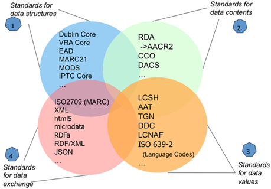

### Altre tipologie di standard rilevanti per noi ora

➡️ Standard per i **contenuti** dei dati: definiscono come rappresentare uno specifico tipo di dati a partire dal formato (es. ISO 8601 per le date, o ISO 639-1 per le lingue);

➡️ Standard per i **valori** dei dati: definiscono come rappresentare uno specifico tipo di dati a partire da un insieme finito e controllato di opzioni (es. AAT).

---

<!-- footer: Ulrich, H., Kock-Schoppenhauer, A. K., Deppenwiese, N., Gött, R., Kern, J., Lablans, M., ... & Ingenerf, J. (2022). Understanding the nature of metadata: systematic review. "Journal of medical Internet research", 24(1), e25440. https://doi.org/10.2196/25440 -->

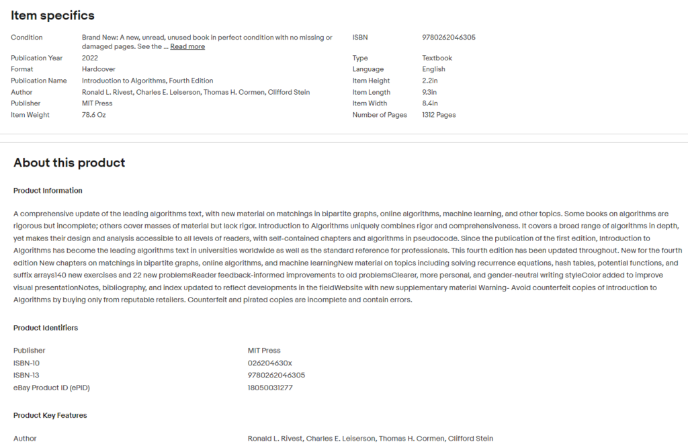

### Come usare in maniera efficace i metadati?

* Consistenza con **standard già esistenti** dove possibile;
* Fornire tutte le informazioni necessarie a **identificare** i dati;
* Fornire tutte le informazioni necessarie a **descrivere** i dati;
* Fornire tutte le informazioni necessarie a **ricostruire la storia** dei dati;
* Fornire tutte le informazioni necessarie ad **accedere** e **utilizzare** i dati.

---

<!-- footer: "" -->
<!-- paginate: False -->

---

<!-- footer: "" -->

### Dati per contenuto (cosa misuriamo)

| Tipo | Definizione | Obiettivo nell'analisi |
| :--- | :--- | :--- |
| **Testuali** | Stringhe di testo, sequenze di caratteri (es. descrizioni di opere d’arte) | Analisi linguistica (frequenze, *sentiment*), identificazione di *pattern* lessicali, ecc. |
| **Spaziali** | Posizioni geografiche, coordinate (es. localizzazione di beni culturali) | Analisi di distribuzione geografica e mappatura. |
| **Temporali** | Espressioni di temporalità (es. date, periodi storici) | Analisi di tendenze, cambiamenti nel tempo e cronologie |
| **Numerici** | Quantità fisiche senza contesto spaziale/temporale (es. altezza, larghezza, misure) | Calcoli statistici, correlazioni. |

---

### Dati per misurabilità (come li trattiamo)

| Tipo | Definizione | Obiettivo nell'analisi |
| :--- | :--- | :--- |
| **Categorici** | Descrivono caratteristiche non misurabili numericamente e non hanno un ordine intrinseco (es. titoli, tipologie, generi di opere d'arte, ecc.) | Classificare gli oggetti e determinare la distribuzione (conteggio) tra le categorie. |
| **Quantitativi** | Hanno un significato quantitativo diretto (es. misure, età, ecc.) | Calcolare medie e correlazioni. |
| **Ordinali** | Simili ai categorici, ma con un ordine implicito e definito (spesso temporale o di scala) (es. anni, livelli di soddisfazione, ecc.) | Analizzare progressioni, tendenze e ordinamento. |

---

### Alcuni tipi di analisi

| Tipo | Oggetto di analisi |
| :--- | :--- |
| **Statistica** | Caratteristiche dei dati a livello micro (es. singola opera), meso (es. un gruppo di opere) e macro (es. evoluzione delle tendenze artistiche nel corso dei secoli) |
| **Temporale** | Cambiamenti delle variabili nel tempo (es. numero di visitatori di un museo nell’arco di cinque anni) |
| **Geospaziale** | Distribuzione spaziale e geografica dei dati (es. mappatura della posizione di beni culturali sul terriorio) |
| **Tematica** | Variabili categoriche, cioè quelle che appartengono a gruppi distinti senza un ordine intrinseco (es. analisi di categorie, classificazione dei beni in base al periodo storico o alla regione geografica di origine) |

---

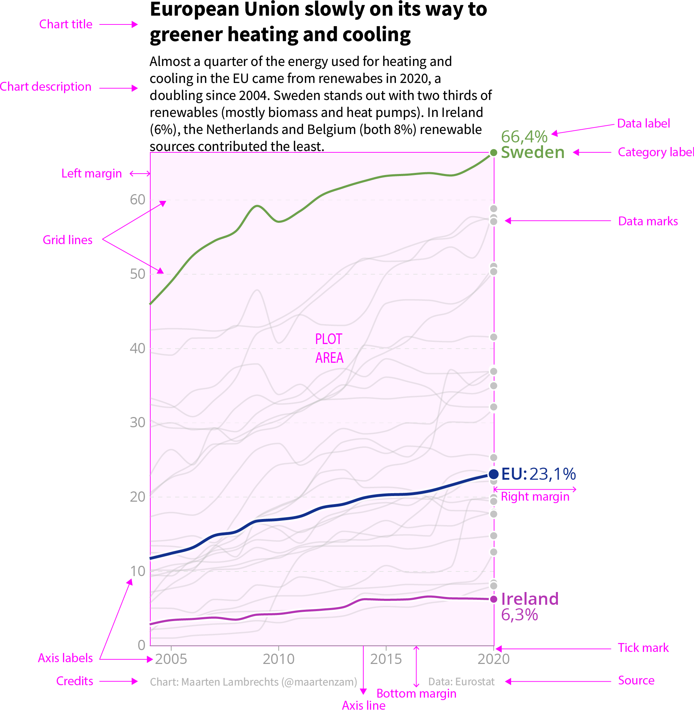

<!-- footer: Midway, S. R. (2020). Principles of effective data visualization. Patterns, 1(9). https://doi.org/10.1016/j.patter.2020.100141 -->
<!-- paginate: True -->

### Cos’è la _data visualization_?

La _visualizzazione dei dati_ è il processo di rappresentazione visiva dei dati per facilitare la comprensione e la comunicazione dei risultati della loro analisi.

Chi si occupa di progettare e realizzare visualizzazioni dei dati lo fa per comprendere meglio i dati con cui sta lavorando, oppure per trasmettere informazioni, usando elementi del _graphic design_ come il colore, la tipografia, il _layout_, la composizione, ecc.

---

<!-- paginate: True -->

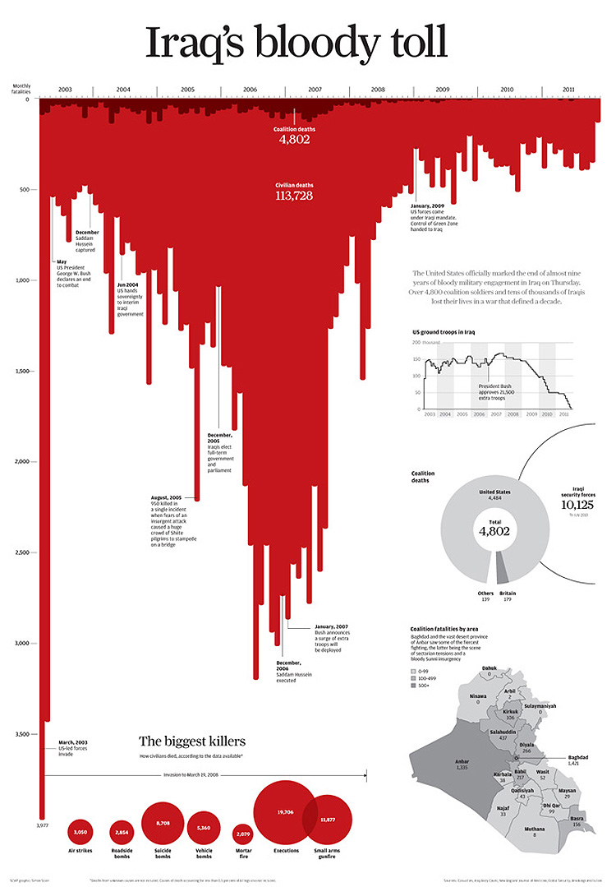

<!-- footer: -->

### _Explanatory Data Analysis_

L'_**Explanatory Data Analysis**_ è _un processo di analisi dei dati usato per mostrare e spiegare pattern nei dati ad altre persone_. 

Chi analizza i dati progetta l'analisi attorno ad una **narrativa**, con l'intenzione di comunicare qualcosa. 

Una volta che hanno esplorato i dati e hanno scoperto qualcosa di interessante, vogliono comunicare quel qualcosa ad un pubblico, possibilmente raccontando una **storia**.

---

<!-- footer: "" -->
<!-- paginate: False -->

---

---

---

---

<!-- footer: Anderson, K. E. (2010). Storytelling. https://doi.org/10.7282/T35T3HSK  -->

### Cosa rende una storia una buona storia?

Da sempre, le storie vengono raccontate per trasmettere conoscenza.

Una buona storia **ci coinvolge**: innesca la nostra curiosità, ci aggancia, ci emoziona.

Ancora più importante, una storia **ci arricchisce**: ci può insegnare qualcosa sul mondo in cui viviamo, può avere una morale che potrebbe mettere in dubbio le nostre convinzioni, può collegare punti e insegnarci l'esistenza di relazioni inaspettate.

---

<!-- footer: Tong, C., Roberts, R., Borgo, R., Walton, S., Laramee, R. S., Wegba, K., ... & Ma, X. (2018). Storytelling and visualization: An extended survey. Information, 9(3), 65. https://doi.org/10.3390/info9030065 -->

### Visualizzare i dati e/è raccontare storie

La _data visualization_ insegna qualcosa all'utente finale sui dati e sulla parte di mondo che questi rappresentano, rendendogli il processo di apprendimento il più facile possibile.

Tutti gli elementi di un grafico (tipo, titolo, colori, ecc.) lavorano insieme per rendere la narrativa che vogliamo comunicare chiara, accessibile, richiedendo un minor carico cognitivo da parte dell'utente finale.

---

<!-- footer: "" -->

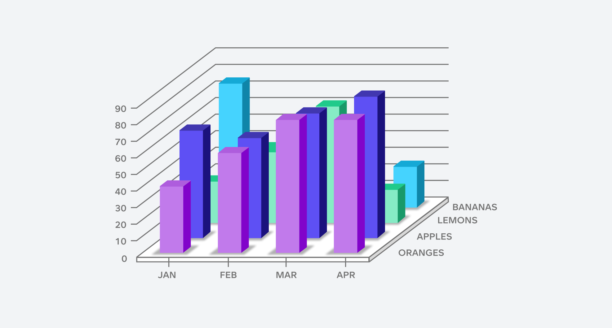

---

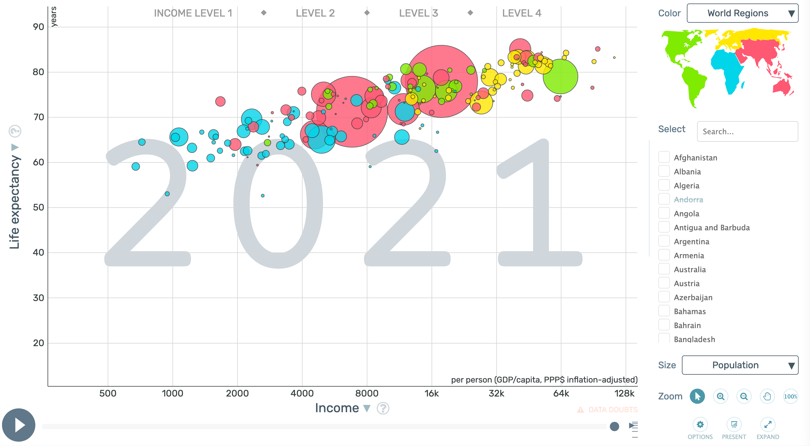
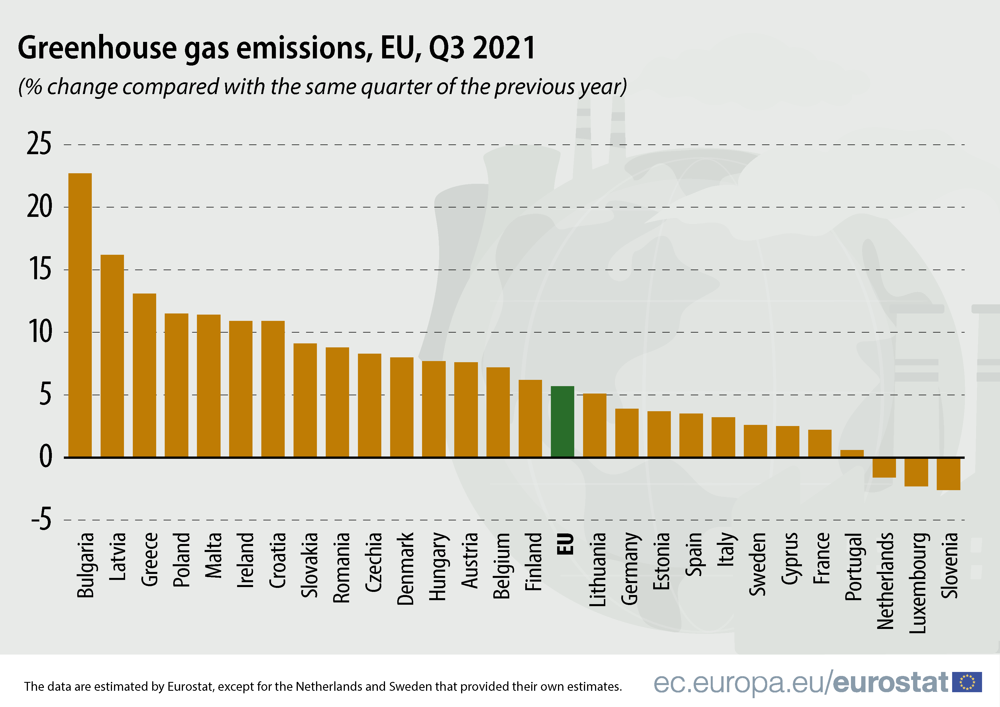

<!-- footer: Sweller, J. (2011). Cognitive load theory. In Psychology of learning and motivation (Vol. 55, pp. 37-76). Academic Press. https://doi.org/10.1016/B978-0-12-387691-1.00002-8 -->

### Attenzione al _cognitive load_

Il concetto di _carico cognitivo_ ci aiuta a capire quanto sia facile o difficile per qualcuno comprendere nuove informazioni.

Per esempio: un numero minore di variabili è più facile da capire rispetto ad un numero maggiore di variabili.

Altro esempio: un numero minore di elementi in un grafico, disposti in maniera prevedibile, rendono un grafico più facile da capire.

---

<!-- footer: "" -->

---

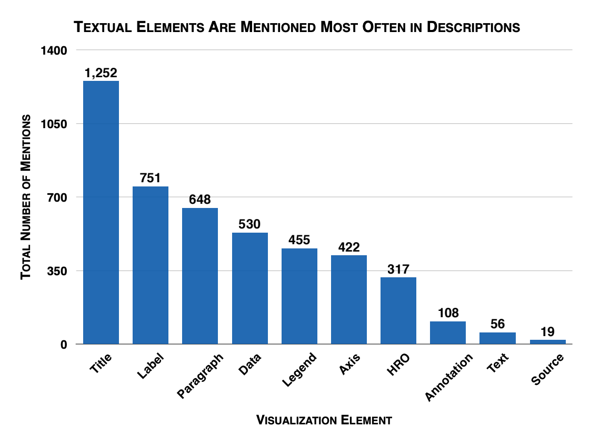

### Attenzione al titolo

Guidare il lettore nell'interpretazione di un grafico è molto importante.

Il titolo di un grafico è la prima cosa che le persone guardano quando iniziano a leggere un grafico.

Idealmente, il titolo dovrebbe contenere il messaggio principale del grafico in **10 parole o meno**.

Il titolo dovrebbe essere posizionato sopra il grafico, in grandi dimensioni, e non contraddire quanto espresso dal grafico.

---

---

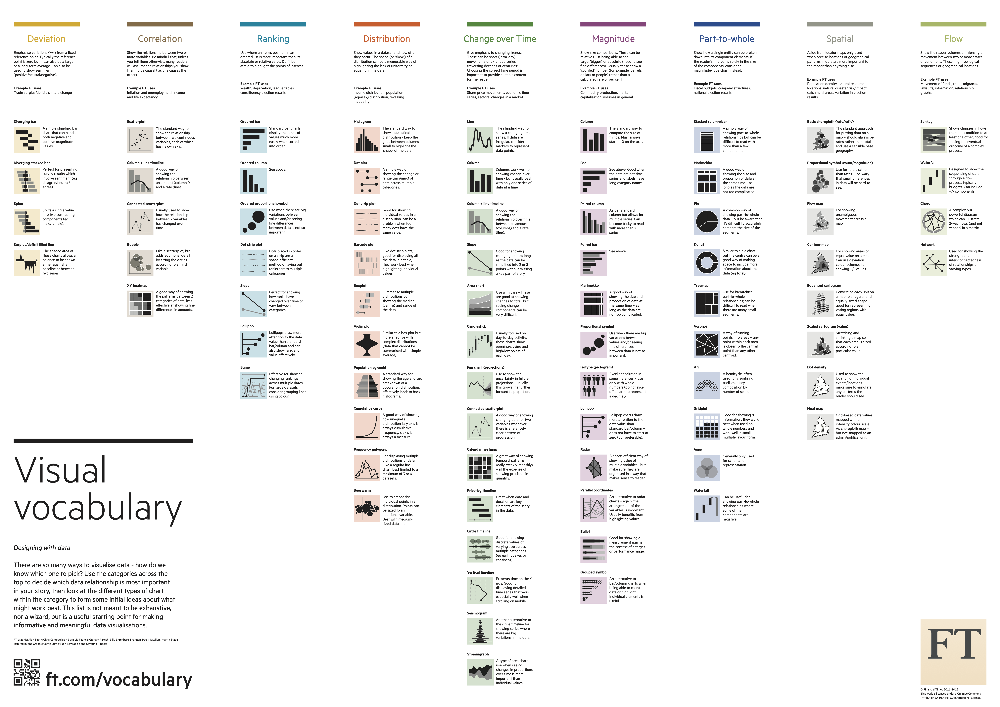

<!-- footer: "" -->

### La scelta del grafico dipende da vari fattori

* **Tipo di dato** (per esempio, i grafici a barre e a torta sono ideali per rappresentare dati categorici);

* **Messaggio** (vogliamo parlare di una deviazione, o una correlazione? Vogliamo parlare di una parte del tutto?)

* **Pubblico** (quanto è _data literate_? Sto parlando con esperti di dominio? Considero anche eventuali disabilità?)

http://ft-interactive.github.io/visual-vocabulary/

---

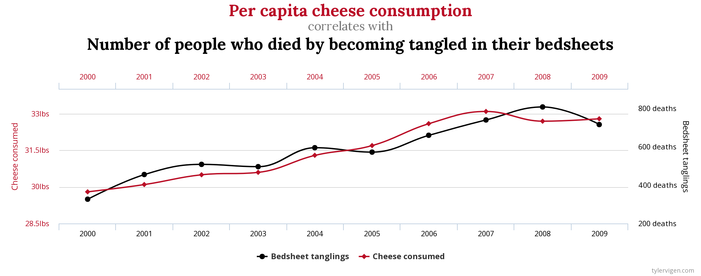

---

<!-- footer: -->

### Correlazione != Causazione

Esiste una forte correlazione tra il consumo di cioccolato e il numero di premi Nobel vinti da un Paese: i Paesi in cui le persone mangiano più cioccolato vincono più premi Nobel.

Questo significa forse che, per vincere più Premi Nobel, i governi dovrebbero iniziare a implementare campagne di promozione del cioccolato?

Si potrebbe anche concludere da questo grafico che vincere Premi Nobel spinge gli abitanti del Paese vincitore a consumare più cioccolato (conclusione insensata quanto la prima).

---

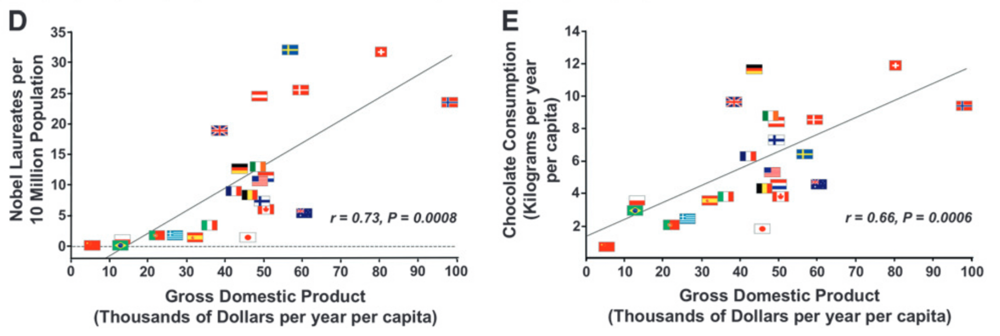

<!-- footer: -->

### Correlazione != Causazione

**Quando due variabili sono correlate, ciò non significa necessariamente che un cambiamento in una variabile causi il cambiamento nell'altra**. Nel caso del cioccolato e dei Premi Nobel, è in gioco una terza variabile che guida entrambe le variabili mostrate nel grafico: lo sviluppo economico.

Questo ha senso: quando i Paesi diventano più ricchi, i loro abitanti hanno più mezzi finanziari per acquistare beni di lusso (come il cioccolato), e i loro governi hanno più risorse da investire nell'istruzione, il che a lungo termine può portare a vincere più Premi Nobel.

---

<!-- footer: Piantadosi, S., Byar, D. P., & Green, S. B. (1988). The ecological fallacy. American journal of epidemiology, 127(5), 893-904. https://scientificintegrityinstitute.com/wp-content/uploads/2023/03/AJE050188.pdf -->

### La fallacia ecologica

Abbiamo anche ignorato il fatto che i dati mostrati sul grafico sono valori medi. 

Può darsi che le persone che vincono i Premi Nobel mangino pochissimo cioccolato, e che il maggiore consumo di cioccolato delle altre persone nel Paese compensi il basso consumo dei vincitori del Nobel.

Fare un'affermazione a livello individuale basandosi sulle medie di un intero gruppo di persone è chiamata _fallacia ecologica_.

---

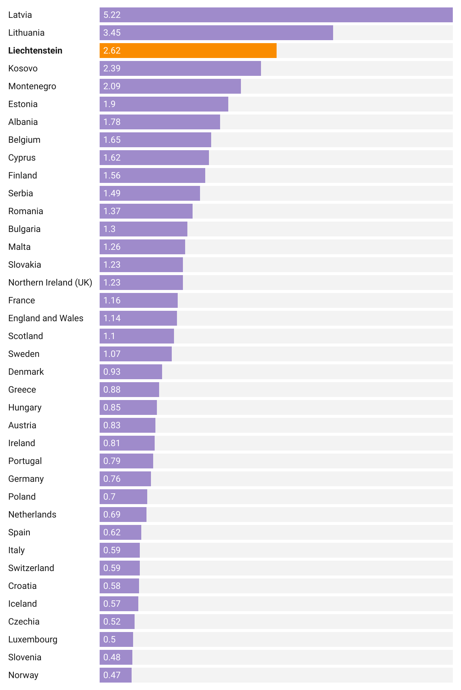

<!-- footer: "" -->

### Effetto di un campione troppo piccolo

Sulla base di questo grafico, possiamo concludere che il Liechtenstein è un posto pericoloso in cui vivere, dato che nel 2018 occupava il terzo posto nella classifica dei Paesi europei con il tasso di omicidi più alto.

Ma, per interpretare questi dati correttamente, dobbiamo considerare il campione: qui il tasso di omicidi è calcolato come numero di omicidi per 100.000 abitanti, ma nel 2018 il  Liechtenstein era abitato da sole 38.378 persone. Un tasso del 2,62 rappresenta solo un omicidio.

---

---

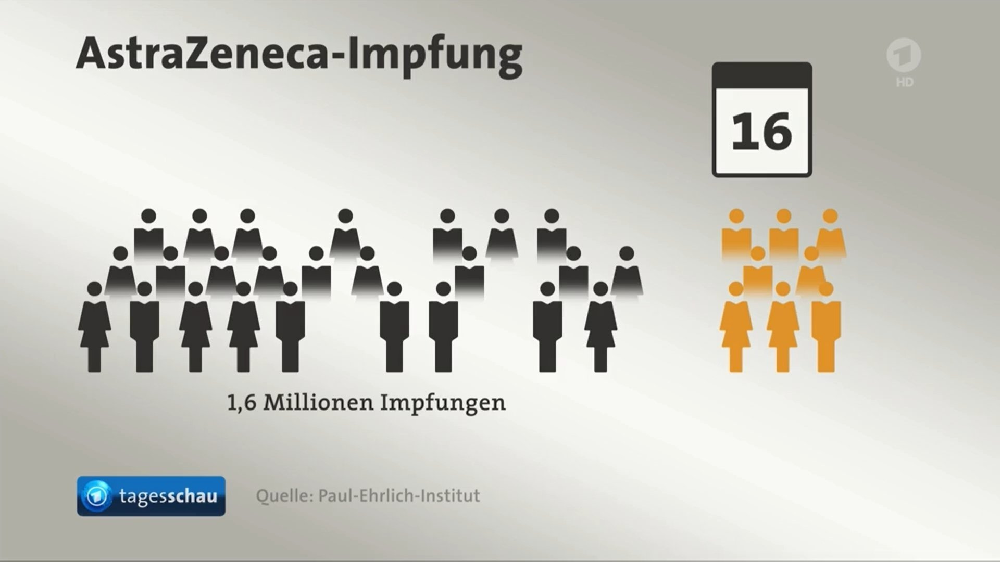
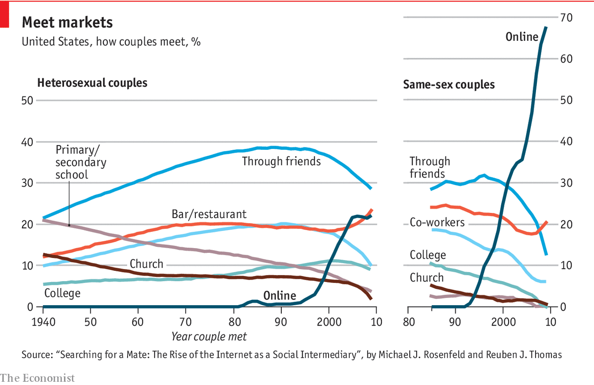

<!-- footer: -->

### Attenzione alle proporzioni

Nel primo grafico, le proporzioni sono completamente sfasate: vengono mostrate  33 persone, di cui 8 che hanno sviluppato dei trombi dopo aver assunto il vaccino di AstraZeneca. Il grafico suggerisce che sia successo a quasi un quarto delle persone vaccinate, quando in realtà è solo lo 0,00005%.

Nel secondo, le proporzioni sono distorte dal layout. Un layout troppo ampio tenderà ad appiattire i trend nelle serie temporali. Un layout alto, con un rapporto larghezza-altezza basso, farà l'opposto e tenderà a sottolineare o persino drammatizzare i trend nei dati.

---

---

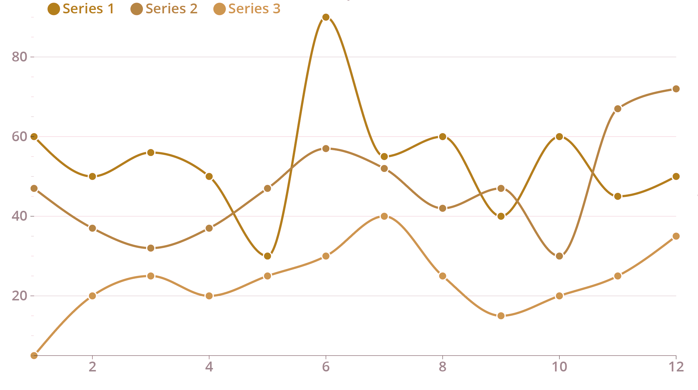

<!-- footer: -->

### Attenzione ai colori

Il primo e più semplice errore in cui cadere quando si parla di colori è quello di usare semplicemente i colori predefiniti dello strumento  utilizzato per creare la visualizzazione.

Lo strumento utilizzatoo non conosce il messaggio che si sta cercando di comunicare con la visualizzazione, né capisce i dati.

Il secondo grafico non è altro che il primo (composto da linee rosse, verdi e marroni) visto attraverso gli occhi di una persona con daltonismo: tutto diventa indistinguibile.

---

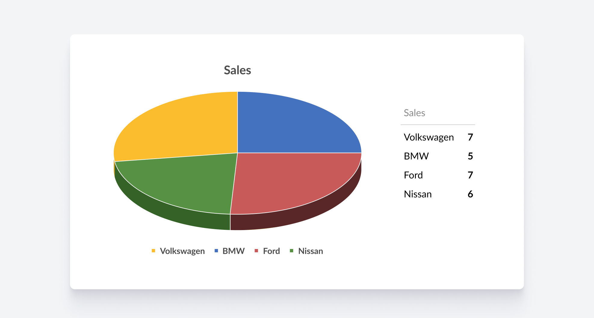

---

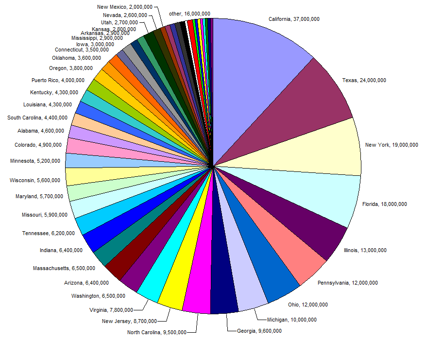

<!-- footer: -->

### Attenzione alle caratteristiche dei grafici

La cattiva fama dei grafici a torta è in parte dovuta alla facilità con cui è possibile progettarli male.

I grafici a torta sono usati per mostrare come un totale è composto dalle sue parti. Quindi, le parti della torta dovrebbero sempre ammontare al 100%.

Questo, in generale, non è un problema, ma inizia a diventare complesso leggere un grafico a torta con molteplici fette. In particolare, i grafici a torta con più di **5 fette** diventano più difficili da leggere.

---

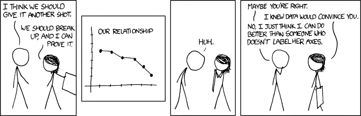

<!-- footer: "" -->
<!-- paginate: False -->

---

<!-- footer: "" -->
<!-- paginate: False -->

# Abilità Informatiche (2025/2026)

## 06. Data Literacy

➡️ Mail: [sebastian.barzaghi2@unibo.it](mailto:sebastian.barzaghi2@unibo.it)
➡️ ORCID: [0000-0002-0799-1527](https://orcid.org/0000-0002-0799-1527)
➡️ Sito: [sebastian.barzaghi2](https://www.unibo.it/sitoweb/sebastian.barzaghi2/)

