<!-- footer: "" -->
<!-- paginate: False -->

# Abilità Informatiche (2025/2026)

## 07. Design Persuasivo

➡️ Mail: [sebastian.barzaghi2@unibo.it](mailto:sebastian.barzaghi2@unibo.it)
➡️ ORCID: [0000-0002-0799-1527](https://orcid.org/0000-0002-0799-1527)
➡️ Sito: [sebastian.barzaghi2](https://www.unibo.it/sitoweb/sebastian.barzaghi2/)

---

<!-- paginate: False -->

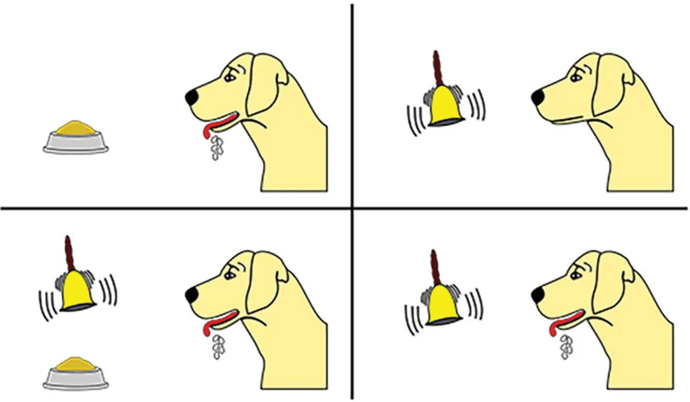

---

<!-- footer: "" -->

### Il riflesso condizionato

Come già ci insegnano svariati studiosi di neuroscienze e psicologia comportamentale, il comportamento (umano e non) è condizionabile: uno stimolo esterno può provocare una determinata reazione involontaria. 

Inoltre, uno stimolo può venire associato ad un altro: per esempio, associando per molte volte la presentazione di carne ad un cane con il suono di un campanello, il solo suono del campanello determinerà la salivazione del cane.

Questa condizionabilità può essere facilitata enormemente dalla tecnologia.

---

<!-- footer: Gibson, J. J. (1977). The theory of affordances. Hilldale, USA, 1(2), 67-82. https://web.eecs.umich.edu/~stellayu/teach/2023action/papers/1979gibsonAffordance.pdf -->

### Gibson e _affordance_

Alla fine degli anni Settanta, lo psicologo statunitense James Jerome Gibson coniò il termine _**affordance**_ per indicare delle qualità degli oggetti che “invitano” le persone a farne un certo utilizzo.

Per esempio, un pulsante o una maniglia hanno certe caratteristiche perché devono distinguersi dal resto della superficie ed “invitare” a fare qualcosa: premere o aprire.

Le tecnologie possiedono affordance e quindi inducono e influenzano le azioni.

---

<!-- paginate: True -->

<!-- footer: "" -->

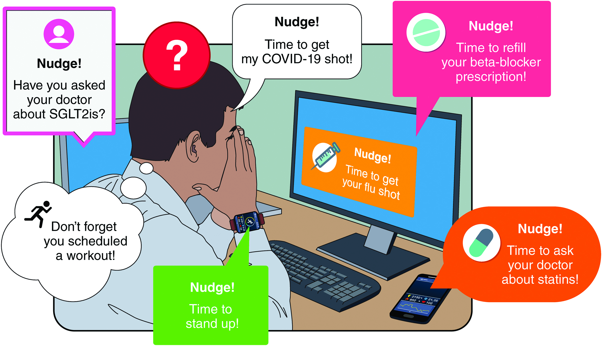

### Nel Web è tutto intenzione

Nel Web siamo soggetti a incentivi e feedback continui; tutto ciò che viene incorporato nelle interfacce tecnologiche mira a influenzare il comportamento degli utenti, richiamando l’interesse e portandolo verso azioni o risultati specifici.

Veniamo spinti in continuazione: ci vengono proposte info, scelte, rimandi, comportamenti, premi, punizioni, narrazioni.

Quando stiamo sul Web, pensiamo molto meno di quanto crediamo. Questo succede _by design_.

---

<!-- paginate: False -->
<!-- footer: "" -->

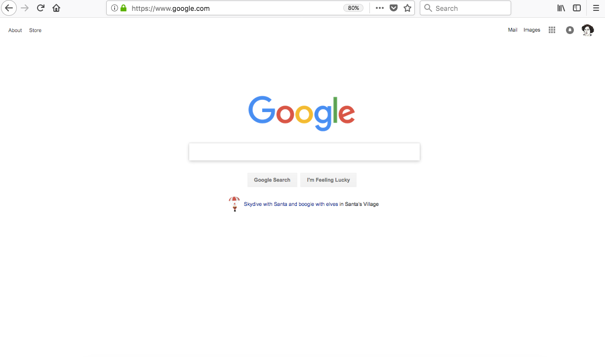

---

<!-- paginate: False -->
<!-- footer: "" -->

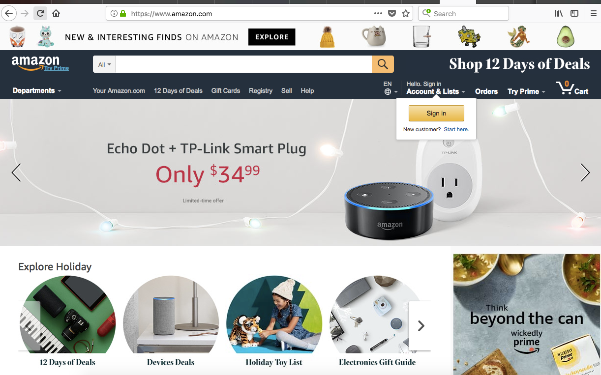

---

<!-- paginate: False -->
<!-- footer: "" -->

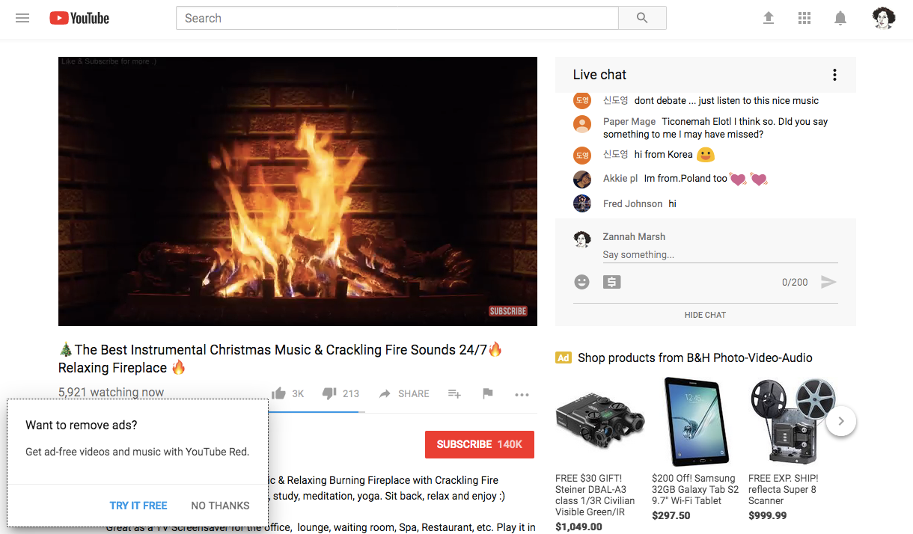

---

<!-- paginate: True -->
<!-- footer: "" -->

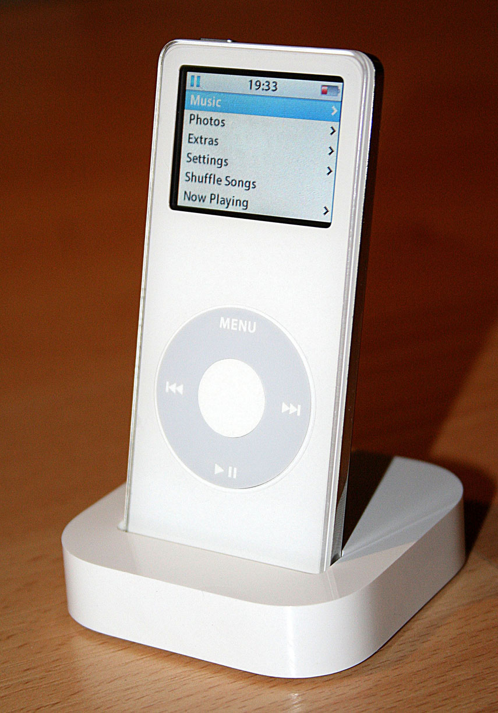

### La cura del design

Una tecnologia attraente è anche più convincente. Alcune caratteristiche, come simmetria e linearità, sono universalmente associate a ciò che è piacevole (anche se la valutazione può variare a seconda del pubblico per cui è destinata).

Ciò è dovuto al cosiddetto **effetto alone**, ovvero l’estensione di una caratteristica positiva ad altre. In pratica, una cosa bella, per estensione, ci sembra anche efficiente, affidabile e credibile. Anche il layout e la struttura contano: un sito con un layout chiaro, funzionale, semplice è preferito ad uno che, viceversa, è caotico.

---

<!-- paginate: True -->
<!-- footer: "" -->

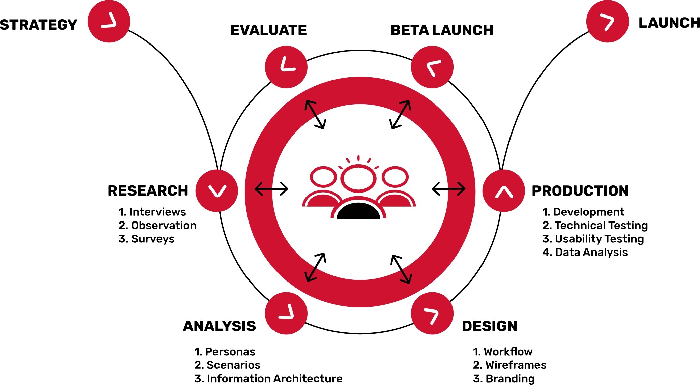

### User Experience Design

Lo _**User Experience Design**_ è il processo di progettazione di un prodotto in modo da migliorare l'esperienza del suo utilizzatore migliorandone l'usabilità, l'accessibilità e la piacevolezza fornite dal prodotto.

Creare un _design_ centrato sull'utente coinvolge una serie di principi, metodologie e approcci che includono:
* Studio degli utenti;
* Progettazione del prodotto;
* Sviluppo del prodotto.

---

<!-- paginate: True -->
<!-- footer: "" -->

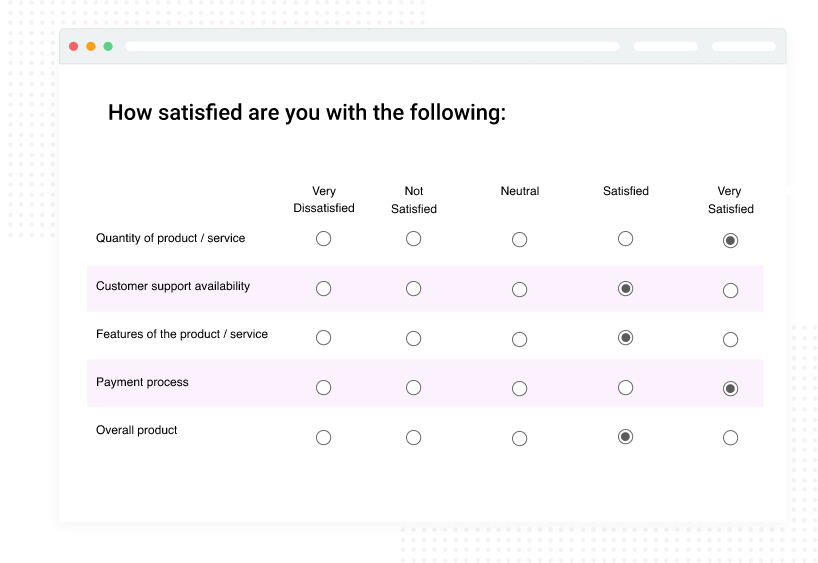

### User Research

La _**user research**_ si focalizza sulla comprensione dei comportamenti, bisogni e motivazioni degli utenti tramite tecniche di osservazione e analisi.

* _Card sorting_: attività in cui delle persone appartenenti a uno o più gruppi di utenza raggruppano determinate informazioni relative al prodotto.
* _Interviste e questionari_: un campione rappresentativo di utenza viene sottoposto a interviste focalizzate e/o questionari per capire come gli utenti ragionano;

---

<!-- paginate: True -->
<!-- footer: "" -->

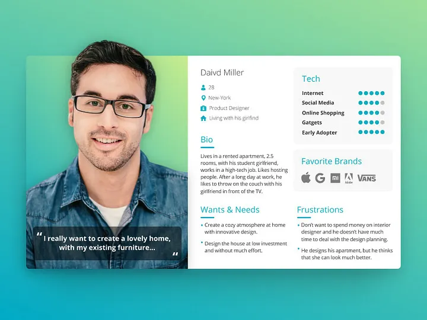

### User Research

* _Focus group_: una discussione moderata con un gruppo di utenti per capire le loro attitudini, idee e desideri;
* _Euristiche_: il prodotto viene valutato sulla base di standard e convenzioni ampiamente validate e riconosciute come autorevoli.
* _Personas_, ovvero di rappresentazioni artefatte ma realistiche di fasce di utenza, basate sui dati raccolti.
* _User flows_, ovvero i flussi di attività che gli utenti si aspettano di seguire mentre usano il prodotto.

---

<!-- paginate: True -->
<!-- footer: "" -->

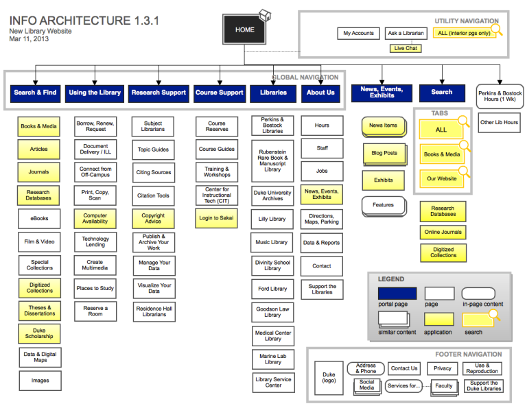

### Information Architecture

L'_**architettura dell'informazione**_ è _il processo di organizzazione, strutturazione e etichettamento dei contenuti e delle funzioni informative del prodotto in un modo efficiente e sostenibile_.

L'architettura dell'informazione dipende dalla definizione dei seguenti oggetti:
* _Inventario dei contenuti_;
* _Valutazione dei contenuti_;
* _Raggruppamento delle informazioni_;
* _Tassonomia_.

---

<!-- paginate: True -->
<!-- footer: "" -->

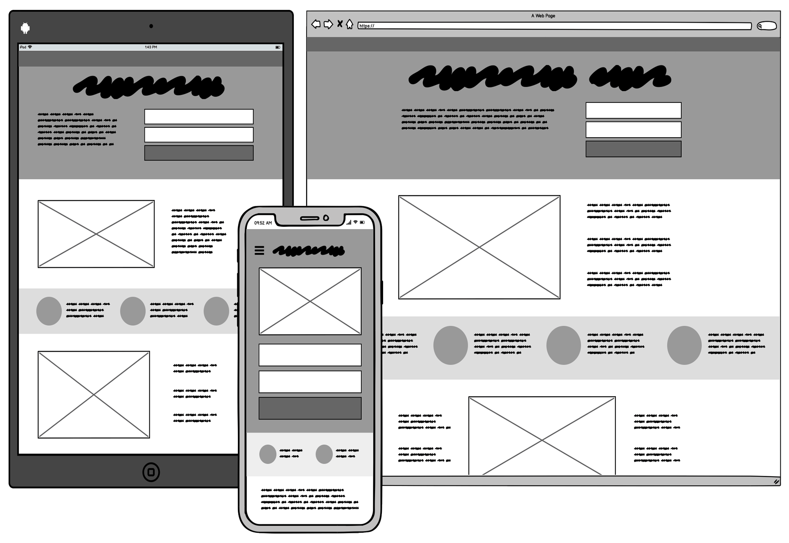

### Wireframing e prototipazione

Un _**wireframe**_ è una rappresentazione illustrativa di un prodotto, focalizzata sulla prioritizzazione e spazializzazione del contenuto, sulle funzionalità disponibili, e sui comportamenti attesi. 

Possono variare molto, da bozze su carta a immagini digitali create con software appositi:
* Un _low-fidelity wireframe_ è tendenzialmente astratto e utilizza contenuto riempitivo (il classico _Lorem ipsum_).
* Un _high-fidelity wireframe_ è più interattivo e realistico.

---

<!-- paginate: True -->
<!-- footer: "" -->

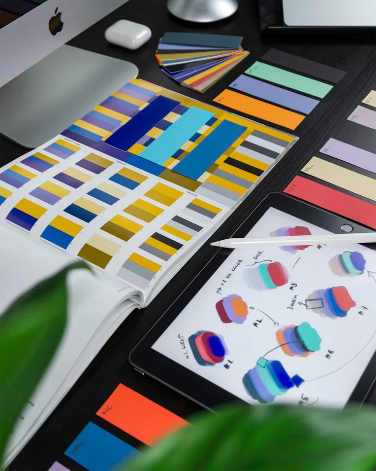

### Branding

Il _branding_ è la definizione dell'identità narrativa, estetica e comunicativa del prodotto. 

Vengono definite delle linee guida per l'utilizzo degli elementi che costituiscono la _brand identity_ del prodotto:
* Storia;
* Logo;
* Palette dei colori;
* Tipografia;
* Immagini;
* Voce.

---

<!-- paginate: True -->
<!-- footer: "" -->

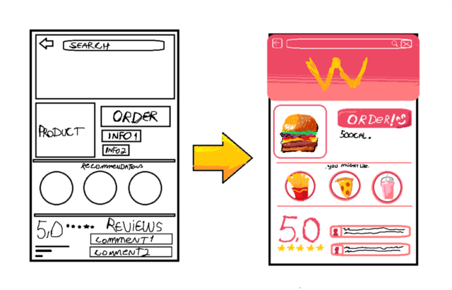

### Design dell'interfaccia utente e delle interazioni

Lo _**User Interface Design**_ è _la progettazione dell'interfaccia del prodotto in modo da renderla semplice da accedere, capire ed utilizzare da parte dell'utente_.

Si basa su ciò che viene definito in sede di _branding_ architettura dell'informazione, _wireframing_ e prototipazione.

In questo, viene considerata anche la progettazione dell'interazione tra utente e interfaccia: in che modo l'utente può interagire con il prodotto? Cosa succede se l'utente fa X piuttosto che Y?

---

<!-- paginate: True -->
<!-- footer: "" -->

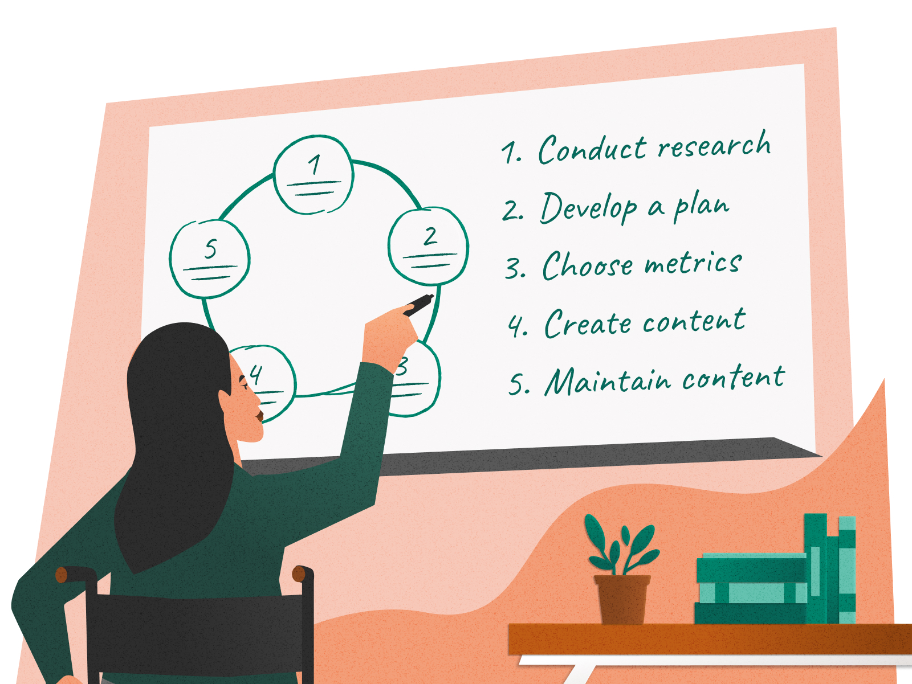

### Content Strategy

La _**Content Strategy**_ è _il processo di pianificazione, creazione, e controllo dei contenuti del prodotto_. 

Anche i contenuti hanno un loro ciclo di vita che include:
* Valutazione e analisi (interviste, analisi competitive, ...);
* Strategizzazione (allineamento al _branding_, ...);
* Pianificazione (definizione del modello dei contenuti, ...);
* Creazione (produzione degli _asset_, ...);
* Mantenimento (supporto al cliente, ...).

---

<!-- paginate: True -->
<!-- footer: "" -->

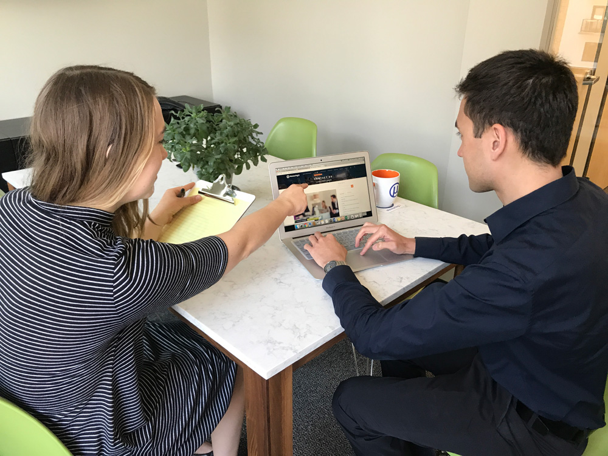

### Usability Testing

L'_**Usability Testing**_ è il _processo di valutazione del prodotto in modo da individuare problemi di usabilità_.

Durante l'_Usability Testing_, il prodotto sviluppato viene utilizzato da un campione di utenti in una maniera controllata. Ogni utente deve completare una serie di compiti mentre degli osservatori guardano, ascoltano, prendono appunti, con l'obiettivo di raccogliere dati qualitativi e quantitativi.

---

<!-- paginate: True -->
<!-- footer: "" -->

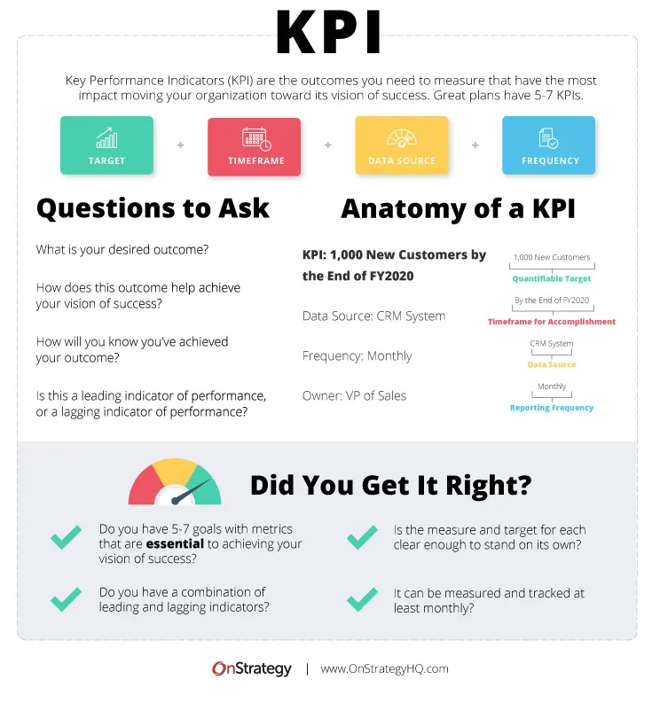

### Le intenzioni dell'altro

Il successo di un business è determinato, in sostanza, da quanto vende. Questo, a sua volta, viene quantificato, valorizzato e presentato tramite i cosiddetti _**Key Performance Indicators**_ (KPIs).

L'obiettivo finale è aumentare l'ammontare di soldi che spendete e diminuire la possibilità che ve ne andiate a mani vuote. In altre parole: raggiungere i KPI.

Parte del lavoro di UX design è quello di contribuire a raggiungere i KPI. Ciò che viene progettato dovrà catturare l'attenzione dell'utente e spingerlo a comprare.

---

<!-- paginate: False -->
<!-- footer: "" -->

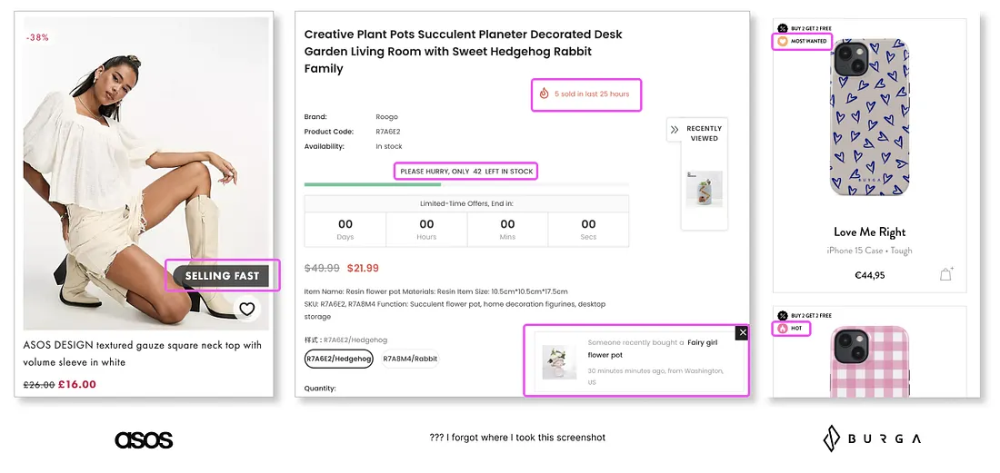

---

<!-- paginate: True -->
<!-- footer: "" -->

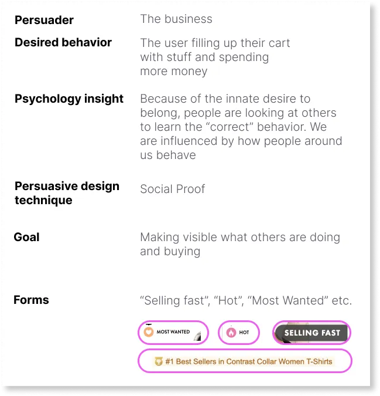

### Il design persuasivo

Il **design persuasivo** è _una metodologia adottata da chi sviluppa un prodotto per influenzare _by design_ il comportamento e l’esperienza di interazione dell’utente con il prodotto stesso_. Per esempio, principi ben noti come quelli della **scarsità**, dell’**urgenza**, della **riprova sociale** testimoniano il successo di questo approccio.

Tutte le tecnologie sono costruite non solo pensando a funzionalità e scopo, ma anche impiegando tecniche persuasive per catturare l’attenzione, personalizzare i contenuti e influenzare il comportamento degli utenti.

---

<!-- paginate: True -->
<!-- footer: "" -->

### Perché?

* **Pubblicità**: Mostrare pubblicità agli utenti è uno degli approcci più semplici e diretti. Per esempio, un sito può vendere lo spazio pubblicitario ad aziende di terze parti. 
* **Raccolta dati**: I dati personali e/o comportamentali sono preziosissimi per aziende di terze parti o per il servizio stesso.
* **Investimento**: Più un utente resta su un servizio, più diventa probabile che l'utente interagisca con il resto del servizio, includendo acquisti opzionali e servizi aggiuntivi.

---

<!-- paginate: True -->
<!-- footer: Yesilada, Y., Brajnik, G., Vigo, M., & Harper, S. (2012). Understanding web accessibility and its drivers. In Proceedings of the international cross-disciplinary conference on web accessibility (pp. 1-9). <a href="https://doi.org/10.1145/2207016.22070">https://doi.org/10.1145/2207016.22070</a> -->

### Intenzioni coincidenti: l'accessibilità

L'accessibilità è un aspetto della progettazione focalizzato sull'adattamento delle interfacce con cui interagiamo al maggior numero di persone possibile.

Se prima la disabilità era solo un attributo personale, ora viene considerato l'intero contesto in cui gli esseri umani interagiscono con il mondo circostante.

Vengono considerate anche le disabilità temporanee e le circostanze del caso.

---

<!-- paginate: True -->
<!-- footer: Yesilada, Y., Brajnik, G., Vigo, M., & Harper, S. (2012). Understanding web accessibility and its drivers. In Proceedings of the international cross-disciplinary conference on web accessibility (pp. 1-9). <a href="https://doi.org/10.1145/2207016.22070">https://doi.org/10.1145/2207016.22070</a> -->

### Intenzioni coincidenti: l'accessibilità

Ne beneficiano anziani e persone con difficoltà visive, uditive, intellettive, linguistiche, motorie; ma anche persone con disabilità temporanee, persone in mobilità, persone con connessione lenta.

Parliamo di numeri ingenti:
* Circa 15% della popolazione mondiale;
* Circa 80 milioni in Europa;
* Circa 13% della popolazione in Italia.

---

<!-- paginate: True -->
<!-- footer: Yesilada, Y., Brajnik, G., Vigo, M., & Harper, S. (2012). Understanding web accessibility and its drivers. In Proceedings of the international cross-disciplinary conference on web accessibility (pp. 1-9). <a href="https://doi.org/10.1145/2207016.22070">https://doi.org/10.1145/2207016.22070</a> -->

### L'_alt text_

L'alt text è il testo associato ad un'immagine presente in una pagina web che viene letto dagli screen reader e che appare visivamente quando la pagina non riesce a caricare l'immagine.

`TIPO_GRAFICO di TIPO_DATI` dove `RISULTATO_DA_COMUNICARE`

Es. _Grafico a linee dell'area bruciata a causa di incendi in Europa_ dove _l'area del 2022 è più del doppio della media 2006-2021_

---

<!-- paginate: True -->
<!-- footer: "" -->

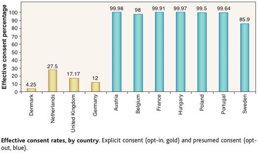

### Intenzioni coincidenti?

Questo grafico mostra la percentuale di adesione ai programmi di donazione degli organi in Europa, associato all’iscrizione per la patente di guida.

Come si spiegano differenze di adesione così radicali?

Tutte le nazioni con le barre gialle nel grafico hanno nel modulo una dicitura tipo “Barra questa casella se vuoi diventare donatore d’organi”; viceversa, tutte le nazioni con le barre azzurre hanno una dicitura tipo “Barra questa casella se NON vuoi diventare donatore d’organi”.

---

<!-- paginate: True -->
<!-- footer: "" -->

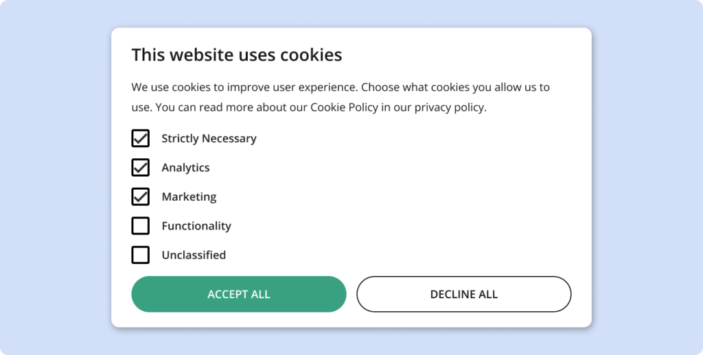

### Intenzioni coincidenti?

Gran parte degli utenti non mette mano alle impostazioni di default, perché farlo sarebbe costoso in termini di attenzione, tempo e responsabilità. 

Inoltre, tendiamo a sentirci più sicuri con scelte che ci immaginiamo appartenere alla maggioranza. 

Sarebbe ragionevole prendere in esame tutte le opzioni, soppesare ogni pro e contro, e optare per una decisione? Paradossalmente, la troppa scelta ci paralizza e ci porta a ricorrere a continue semplificazioni (es., offerte, prodotti già conosciuti, ecc.).

---

<!-- footer: Gray, C. M., Kou, Y., Battles, B., Hoggatt, J., & Toombs, A. L. (2018, April). The dark (patterns) side of UX design. In Proceedings of the 2018 CHI conference on human factors in computing systems (pp. 1-14). <a href="https://doi.org/10.1145/3173574.3174108">https://doi.org/10.1145/3173574.3174108</a> -->

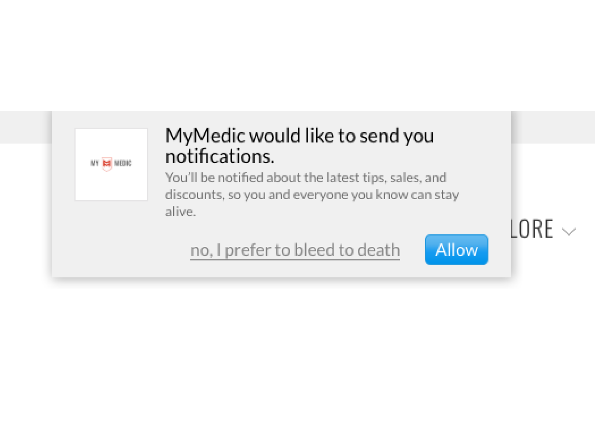

### Intenzioni contrastanti: _Dark pattern_

Quando i tentativi di persuasione non sono trasparenti, opzionali e vantaggiosi per gli utenti, parliamo di _dark pattern_

I _**dark pattern**_ sono _modelli di progettazione usati per manipolare le emozioni dell’utente ed indurlo a compiere azioni in contrasto con le sue intenzioni_.

Es. posizionamento tattico di bottoni, testi volutamente ambigui, ecc.

---

<!-- footer: "" -->

### Dark pattern

I _dark pattern_ possono essere classificati secondo il modello **FORCES**:
* **Frame**: la presentazione influenza le nostre scelte;
* **Obstruct**: veniamo ostacolati a fare ciò che vogliamo;
* **Ruse**: veniamo spinti a fare una scelta che non avremmo fatto altrimenti;
* **Compel**: veniamo forzati a fare una cosa che non vogliamo fare;
* **Entangle**: ci viene fatto perdere tempo.
* **Seduce**: veniamo ingaggiati facendo leva sulle nostre emozioni.

---

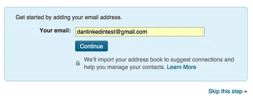

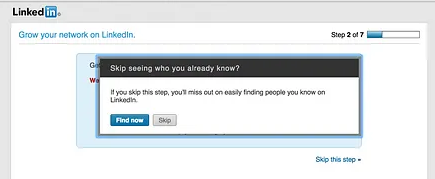

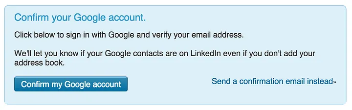

<!-- footer: "" -->

### Esempio: LinkedIn

Al momento della creazione dell’account, il sistema tenta più volte di farti importare la rubrica, usando una combinazione di testo ingannevole, colori poco contrastanti e posizionamento strategico degli elementi.

Se l’utente tenta di saltare questo step (e solo in quel caso), una finestra aggiuntiva appare per chiedere all’utente di confermare la scelta, utilizzando un linguaggio totalmente fuorviante.

Nonostante i ripetuti rifiuti da parte dell’utente, il sistema ci riprova, cambiando di nuovo la terminologia.

---

<!-- footer: "" -->

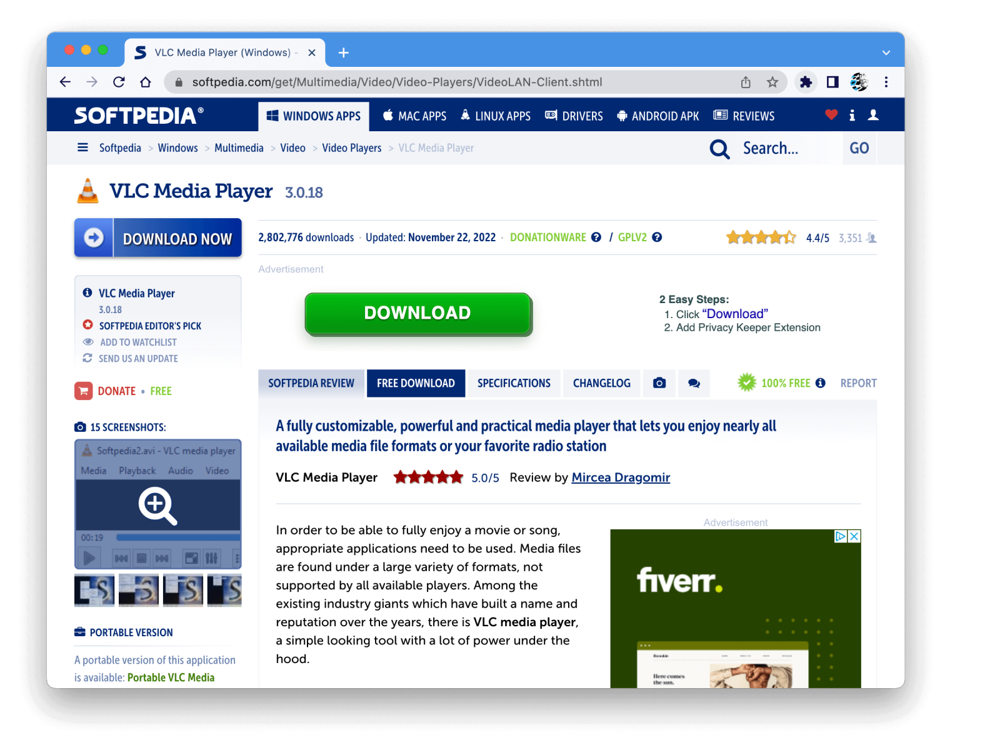

### Alcuni _dark pattern_

#### Conferma imbarazzante

**Tattica**: _Frame_, _Seduce_
**Descrizione**: L’utente viene manipolato emotivamente al fine di fargli compiere azioni che altrimenti non avrebbe fatto.

#### Annuncio mascherato

**Tattica**: _Ruse_
**Descrizione**: L’utente viene indotto a interagire con annuncio pubblicitario spacciato come un elemento dell’interfaccia.

---

<!-- footer: "" -->

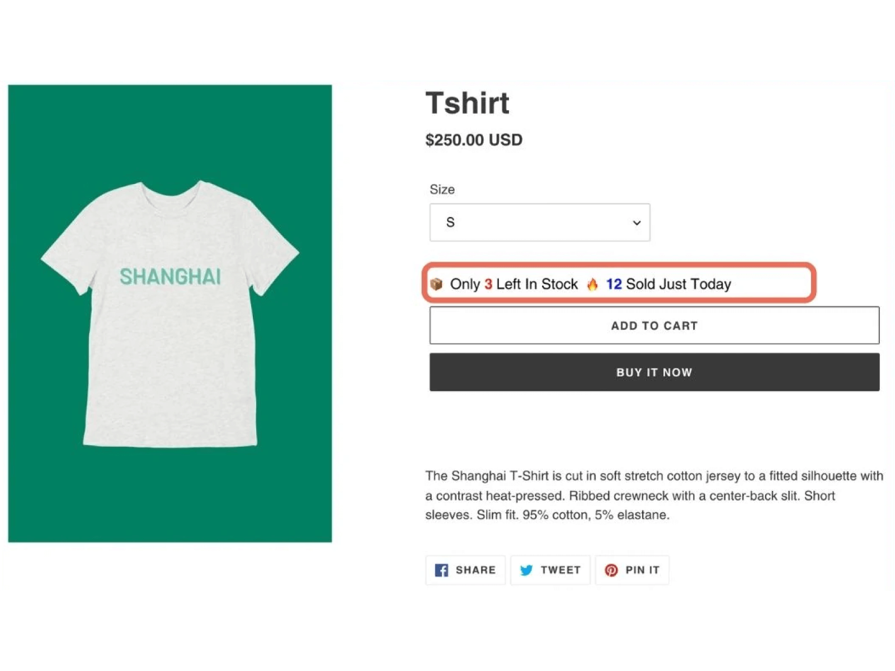

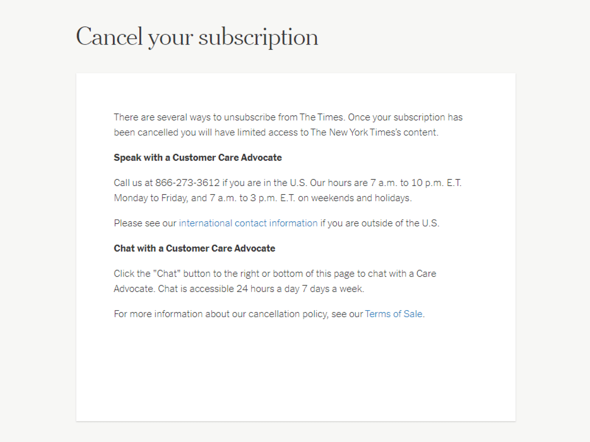

### Alcuni _dark pattern_

#### Urgenza fasulla

**Tattica**: _Frame_
**Descrizione**: L’utente viene indotto a completare un’azione tramite un’indicazione fasulla di scarsità del prodotto o di tempo.

#### Motel di scarafaggi

**Tattica**: _Obstruct_
**Descrizione**: L’utente viene intrappolato nella sottoscrizione ad un servizio, rendendo l’iscrizione molto semplice e la cancellazione molto difficile.

---

<!-- footer: "" -->

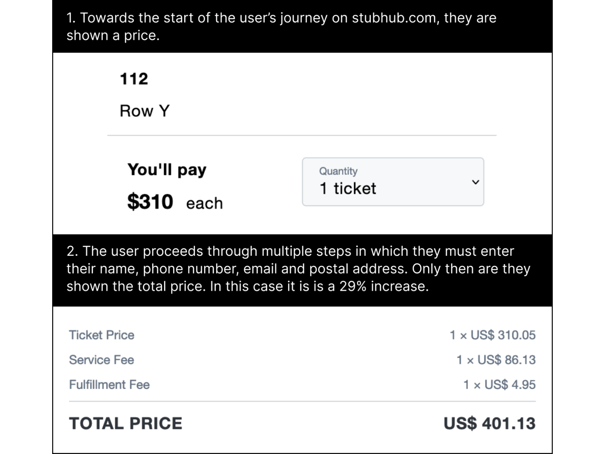

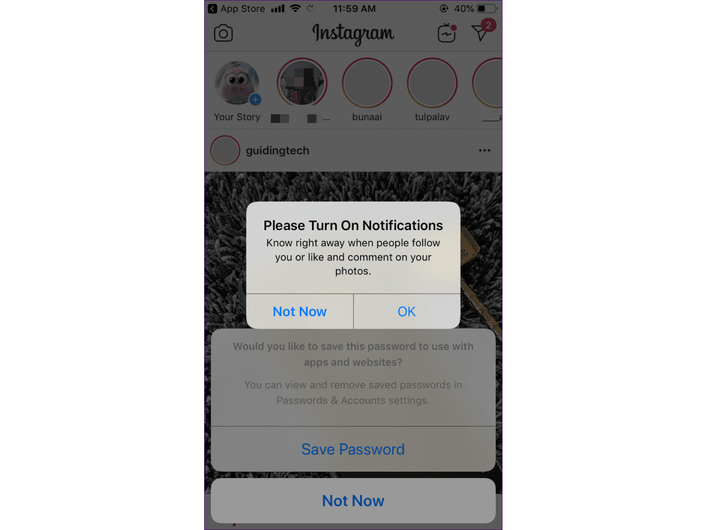

### Alcuni _dark pattern_

#### Costi nascosti

**Tattica**: _Ruse_
**Descrizione**: L’utente viene attratto da prezzi bassi, che si rivelano essere parziali e parti di un prezzo più alto al momento del checkout.

#### Nagging

**Tattica**: _Compel_
**Descrizione**: L’utente prova a fare qualcosa, ma viene sistematicamente interrotto da richieste di fare qualcos’altro.

---

<!-- footer: "" -->

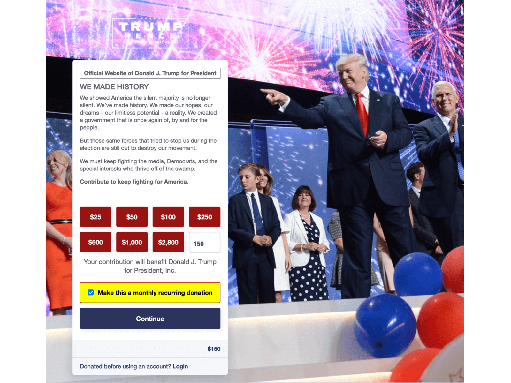

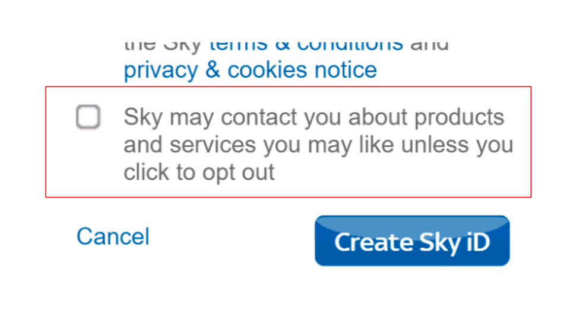

### Alcuni _dark pattern_

#### Preselezione

**Tattica**: _Ruse_
**Descrizione**: All’utente viene presentata un’opzione già selezionata.

#### Formulazione a trabocchetto

**Tattica**: _Ruse_
**Descrizione**: L’utente è spinto con l’inganno ad effettuare un’azione sulla base di un testo scritto in maniera volutamente ambigua.

---

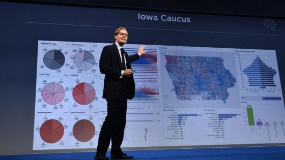

<!-- footer: Fagan, P. (2024). Clicks and tricks: The dark art of online persuasion. Current Opinion in Psychology, 58, 101844. https://doi.org/10.1016/j.copsyc.2024.101844 -->

### Persuasione personalizzata

L'utilità di determinati approcci di persuasione può variare a seconda del profilo psicologico del loro pubblico. 

La persuasione può essere personalizzata, per cui differenze individuali possono essere utilizzate per rendere più precise le operazioni di manipolazione del comportamento su larga scala (es., campagne politiche).

Diventa possibile l'inferenza automatica di attributi psicologici su larga scala a partire da campioni di interazioni online.

---

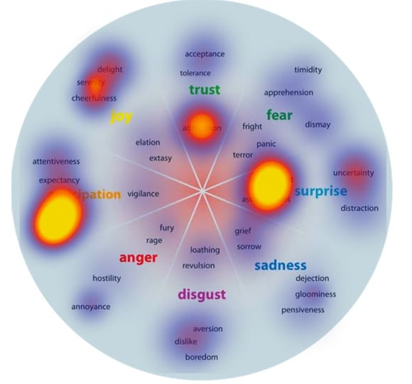

<!-- footer: Fagan, P. (2024). Clicks and tricks: The dark art of online persuasion. Current Opinion in Psychology, 58, 101844. https://doi.org/10.1016/j.copsyc.2024.101844 -->

### Viralità

La psicologia viene utilizzata per stimolare la viralità dei contenuti, specialmente tramite l'eccitazione emotiva.

Noi siamo fortemente condizionati dal _**negativity bias**_, per cui la viralità mediatica è in sostanza influenzata da emozioni negative.

Altri elementi virulenti sono il _**curiosity gap**_ (es., titoli _clickbait_), l'_**astroturfing**_ (la fabbricazione di consenso), la polarizzazione del discorso tramite _**echo chamber**_, e molti altri.

---

<!-- footer: "" -->
<!-- paginate: False -->

# Abilità Informatiche (2025/2026)

## 07. Design Persuasivo

➡️ Mail: [sebastian.barzaghi2@unibo.it](mailto:sebastian.barzaghi2@unibo.it)
➡️ ORCID: [0000-0002-0799-1527](https://orcid.org/0000-0002-0799-1527)
➡️ Sito: [sebastian.barzaghi2](https://www.unibo.it/sitoweb/sebastian.barzaghi2/)

