<!-- footer: "" -->
<!-- paginate: False -->

# Abilità Informatiche (2025/2026)

## 08. Privacy digitale

➡️ Mail: [sebastian.barzaghi2@unibo.it](mailto:sebastian.barzaghi2@unibo.it)
➡️ ORCID: [0000-0002-0799-1527](https://orcid.org/0000-0002-0799-1527)
➡️ Sito: [sebastian.barzaghi2](https://www.unibo.it/sitoweb/sebastian.barzaghi2/)

---

<!-- paginate: False -->

---

<!-- paginate: True -->
<!-- footer: Micheli, M., Lutz, C., & Büchi, M. (2018). Digital footprints: an emerging dimension of digital inequality. Journal of Information, Communication and Ethics in Society, 16(3), 242-251. https://doi.org/10.1108/JICES-02-2018-0014 -->

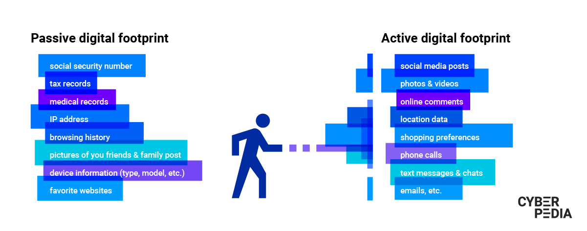

### L'ombra digitale

Quando è stata l'ultima volta che avete cercato il vostro nome online?

Questo è il primo passo da fare se volete scoprire di più sulla vostra ombra digitale, che è molto probabilmente più estesa di quanto immaginate.

Non potete usare  dispositivi connessi a Internet senza lasciare traccia.

C'è però sempre qualcosa che potete fare per gestire, limitare e proteggere la vostra presenza online.

---

<!-- footer: Micheli, M., Lutz, C., & Büchi, M. (2018). Digital footprints: an emerging dimension of digital inequality. Journal of Information, Communication and Ethics in Society, 16(3), 242-251. https://doi.org/10.1108/JICES-02-2018-0014 -->

### L'ombra digitale

L'**ombra digitale** è _l'insieme tracciabile di dati generati da attività ed eventi manifestati da un utente in rete attraverso l'utilizzo di tecnologie digitali_.

Un'ombra digitale consiste quindi in tutto ciò che create mentre siete sul Web per qualsiasi tipo di attività che può essere ricondotta alla vostra identità. 

Questo concetto include anche tutto ciò che concerne la percezione che le vostre azioni creano sul Web. 

---

<!-- footer: Micheli, M., Lutz, C., & Büchi, M. (2018). Digital footprints: an emerging dimension of digital inequality. Journal of Information, Communication and Ethics in Society, 16(3), 242-251. https://doi.org/10.1108/JICES-02-2018-0014 -->

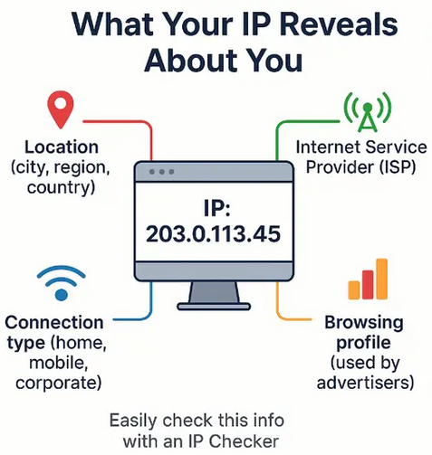

### L'ombra digitale passiva

Tutto ciò che tocchiamo sul Web fa parte della nostra **ombra digitale passiva**, ovvero _i (meta)dati che disseminiamo non intenzionalmente sul Web_.

Si tratta di una combinazione di dati riguardanti i dispositivi che utilizziamo sul Web e le azioni che conduciamo.

* Indirizzo IP;
* Informazioni sul dispositivo che stiamo utilizzando;
* La cronologia dei siti.

---

<!-- footer: Micheli, M., Lutz, C., & Büchi, M. (2018). Digital footprints: an emerging dimension of digital inequality. Journal of Information, Communication and Ethics in Society, 16(3), 242-251. https://doi.org/10.1108/JICES-02-2018-0014 -->

### L'ombra digitale passiva

* Le azioni condotte su questi siti (quante volte abbiamo visitato un sito, le pagine su cui abbiamo speso più tempo, link e bottoni cu sui abbiamo cliccato);
* Il browser che stiamo utilizzando;
* Le nostre ricerche;
* I nostri acquisti.

Per esempio, è possibile utilizzare il nostro indirizzo IP per mostrare automaticamente contenuti nella nostra lingua.

---

<!-- footer: Micheli, M., Lutz, C., & Büchi, M. (2018). Digital footprints: an emerging dimension of digital inequality. Journal of Information, Communication and Ethics in Society, 16(3), 242-251. https://doi.org/10.1108/JICES-02-2018-0014 -->

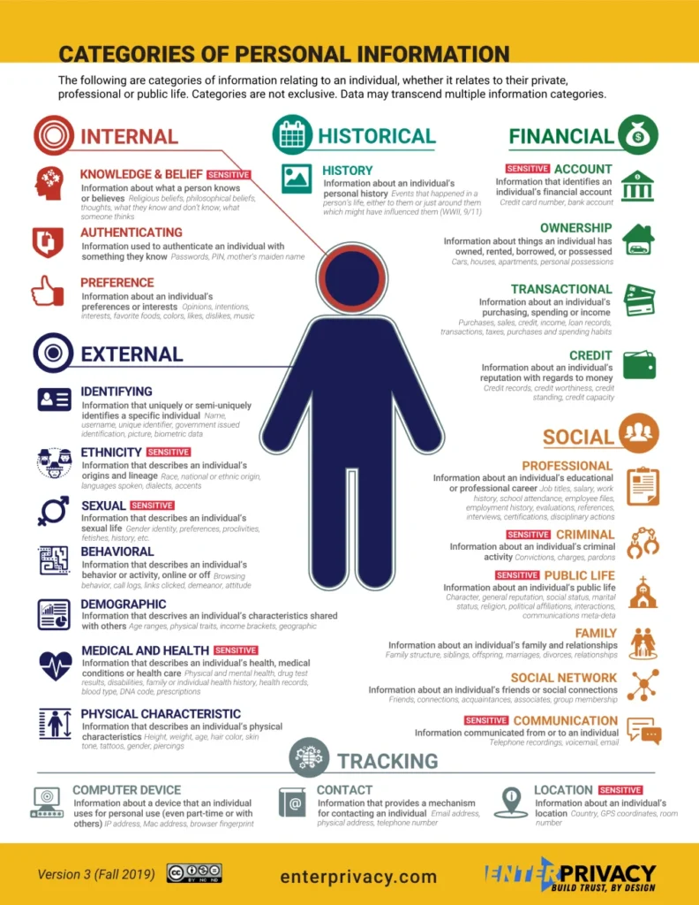

### L'ombra digitale attiva

Oltre ai (meta)dati prodotti passivamente, c'è anche l'**ombra digitale attiva**, ovvero _l'insieme di (meta)dati che decidiamo di condividere volutamente sul Web_. 

Ogni email che mandiamo, ogni form che compiliamo, ogni media che carichiamo entra a far parte dei dati personali che esponiamo volutamente sul Web.

Questi dati si accumulano nel tempo, permettendo la ricosruzione accurata della nostra identità.

---

<!-- footer: Micheli, M., Lutz, C., & Büchi, M. (2018). Digital footprints: an emerging dimension of digital inequality. Journal of Information, Communication and Ethics in Society, 16(3), 242-251. https://doi.org/10.1108/JICES-02-2018-0014 -->

### L'ombra digitale attiva

* Indirizzo email, indirizzo, numero di telefono, dettagli della carta di credito, cronologia di ricerca di prodotti, ...
* Post, foto, video, messaggi, file, contatti telefonici, contenuti preferiti, ...
* Codice fiscale, cartella medica, dati bancari, fedina penale, dati fiscali, dati previdenziali, impronte digitali, età, etnia, ...
* Dati di geolocalizzazione, app utilizzate, chiamate, password, note...
* Tutti questi dati, ma dei contatti...

---

<!-- footer: Micheli, M., Lutz, C., & Büchi, M. (2018). Digital footprints: an emerging dimension of digital inequality. Journal of Information, Communication and Ethics in Society, 16(3), 242-251. https://doi.org/10.1108/JICES-02-2018-0014 -->

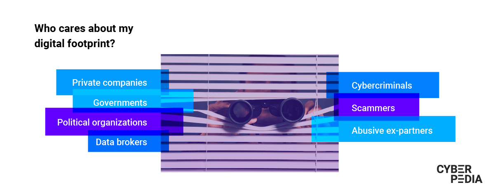

### Perché ci deve interessare?

Incrociando questi dati, la profilazione diventa un'attività triviale. L'ombra digitale, dopotutto, è un riflesso piuttosto accurato delle nostre caratteristiche e pensieri.

La profilazione permette una serie di azioni progettate per influenzare la nostra vita in un'infinità di modi diversi (es., cyber-criminali, _ad_ personalizzati, ...).

Una volta che un dato è online, diventa estremamente difficile - se non impossibile - rimuoverlo definitivamente. 

---

<!-- footer: Micheli, M., Lutz, C., & Büchi, M. (2018). Digital footprints: an emerging dimension of digital inequality. Journal of Information, Communication and Ethics in Society, 16(3), 242-251. https://doi.org/10.1108/JICES-02-2018-0014 -->

### Quali sono i rischi?

I potenziali datori di lavoro esaminano la nostra impronta digitale per individuare segnali negativi che potrebbero renderci inadatti al lavoro.
* Foto e video compromettenti;
* Contenuti sensibili o inopportuni;
* Lamentele verso i precedenti datori di lavoro;
* Uso di volgarità nei post;
* Segnali di pregiudizio o comportamenti aggressivi.

---

<!-- footer: Micheli, M., Lutz, C., & Büchi, M. (2018). Digital footprints: an emerging dimension of digital inequality. Journal of Information, Communication and Ethics in Society, 16(3), 242-251. https://doi.org/10.1108/JICES-02-2018-0014 -->

### Quali sono gli impatti?

Le ombre digitali delle categorie vulnerabili come bambini e anziani sono particolarmente esposte.

Prima di acquistare un nuovo dispositivo o servizio, valuta come contribuisca alla tua e alla loro impronta digitale. 

Ad esempio, i dispositivi IoT aumentano esponenzialmente il volume di dati associati alla tua identità online (es. temperatura corporea, battito cardiaco, ritmi del sonno, abitudini di igiene orale).

---

<!-- footer: Micheli, M., Lutz, C., & Büchi, M. (2018). Digital footprints: an emerging dimension of digital inequality. Journal of Information, Communication and Ethics in Society, 16(3), 242-251. https://doi.org/10.1108/JICES-02-2018-0014 -->

### Quali sono gli impatti?

È molto difficile cogliere il collegamento tra la tua traccia digitale e il modo in cui altri la usano per i propri interessi, come i suggerimenti di articoli o la pubblicità personalizzata basata sulle tue ricerche precedenti.

* Aziende private;
* Governi;
* Organizzazioni politiche;
* Data broker;
* Criminali informatici.

---

<!-- footer: Micheli, M., Lutz, C., & Büchi, M. (2018). Digital footprints: an emerging dimension of digital inequality. Journal of Information, Communication and Ethics in Society, 16(3), 242-251. https://doi.org/10.1108/JICES-02-2018-0014 -->

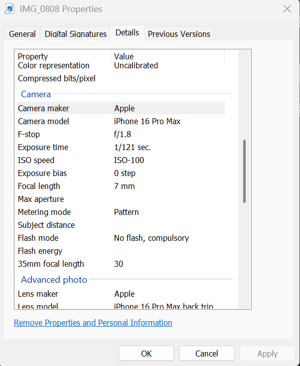

### Quanto ci dobbiamo preoccupare?

Quanto ci sentiamo a nostro agio con ciò che le nostre ombre digitali dicono di noi?

Prendiamo come esempio una foto. 

Abbiamo già detto che quando creiamo un'immagine digitale, creiamo anche una serie di metadati interni a quell'immagine che la descrivono, come il luogo in cui l'immagine è stata creata, il dispositivo, la data.

---

<!-- footer: Micheli, M., Lutz, C., & Büchi, M. (2018). Digital footprints: an emerging dimension of digital inequality. Journal of Information, Communication and Ethics in Society, 16(3), 242-251. https://doi.org/10.1108/JICES-02-2018-0014 -->

### Quanto ci dobbiamo preoccupare?

Questi metadati esistono per validi motivi (es., organizzazione, post-produzione, ecc.). Tuttavia, quando questi iniziano ad esistere sul Web, diventano un rischio per la privacy.

Esistono casi documentati di giornalisti localizzati tramite i metadati delle foto, di persone perseguitate tramite le coordinate GPS incorporate nelle immagini, e così via.

---

<!-- footer: Micheli, M., Lutz, C., & Büchi, M. (2018). Digital footprints: an emerging dimension of digital inequality. Journal of Information, Communication and Ethics in Society, 16(3), 242-251. https://doi.org/10.1108/JICES-02-2018-0014 -->

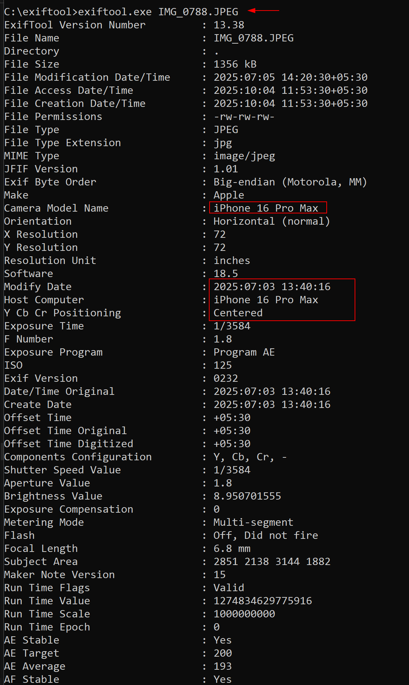

### Quanto ci dobbiamo preoccupare?

L'**_Exchangeable Image File Format_** (EXIF) è uno dei principali schemi di metadati per le immagini. 

I metadati EXIF vengono creati da fotocamere e smartphone al momento dello scatto, e includono le impostazioni della fotocamera, il modello del dispositivo, le coordinate GPS, la data e l'ora, l'orientamento e altro ancora.

Esempio: https://jimpl.com/.

---

<!-- footer: Micheli, M., Lutz, C., & Büchi, M. (2018). Digital footprints: an emerging dimension of digital inequality. Journal of Information, Communication and Ethics in Society, 16(3), 242-251. https://doi.org/10.1108/JICES-02-2018-0014 -->

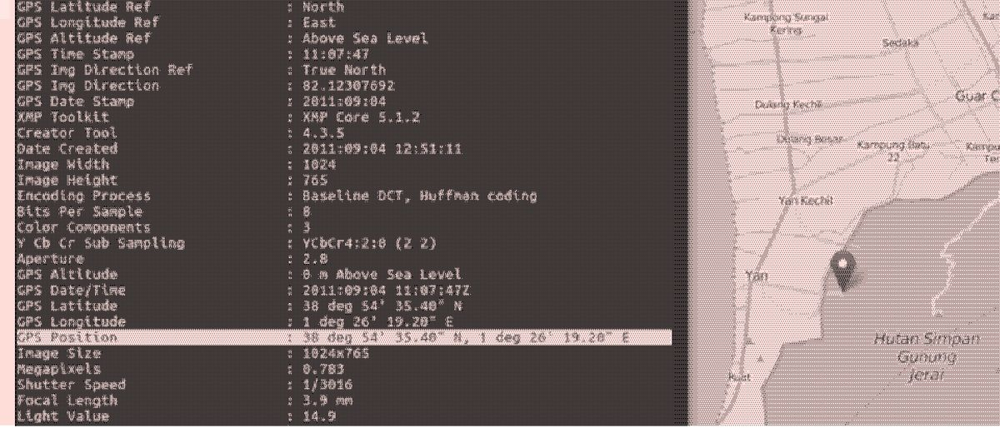

### Quanto ci dobbiamo preoccupare?

**Tracciamento tramite coordinate GPS**: quando i servizi di localizzazione dello smartphone sono attivi (di default su quasi tutti i dispositivi), ogni foto viene contrassegnata con precise coordinate GPS. In pratica, una foto scattata a casa nostra rivela il nostro indirizzo.

Le coordinate GPS sono salvate come semplici valori numerici, facilmente estraibili con strumenti gratuiti e incollabili su Google Maps.

---

<!-- footer: Micheli, M., Lutz, C., & Büchi, M. (2018). Digital footprints: an emerging dimension of digital inequality. Journal of Information, Communication and Ethics in Society, 16(3), 242-251. https://doi.org/10.1108/JICES-02-2018-0014 -->

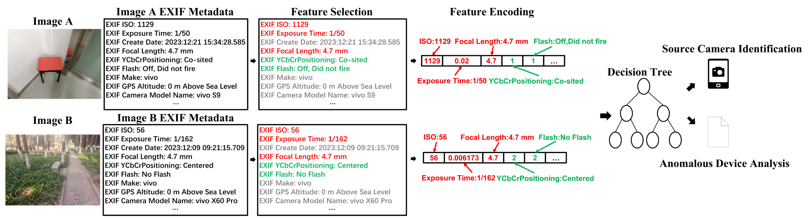

### Quanto ci dobbiamo preoccupare?

**_Fingerprinting_ del dispositivo**: ogni fotocamera e smartphone produce metadati su se stesso in ogni immagine prodotta (es., produttore, modello, obiettivo, versione, ecc.).

Di per sé il _fingerprinting_ può sembrare innocuo, ma in combinazione con altri dati diventa un potente strumento di identificazione (es., collegamento di account anonimi, identificazione forense, spionaggio aziendale, ecc.).

---

<!-- footer: Micheli, M., Lutz, C., & Büchi, M. (2018). Digital footprints: an emerging dimension of digital inequality. Journal of Information, Communication and Ethics in Society, 16(3), 242-251. https://doi.org/10.1108/JICES-02-2018-0014 -->

### Il caso Strava

Nel 2017, l'app di _fitness tracking_ Strava ha pubblicato una [visualizzazione dei dati](https://labs.strava.com/heatmap/#5.86/-6.65559/54.16622/hot/all) raccolti tra il 2015 e il 2017, inclusi i percorsi di allenamento di personale militare americano all'interno di basi in giro per il mondo, come Siria e Afghanistan.

Strava usa il GPS del cellulare per tenere traccia dell'attività fisica, raccogliere dati e compararli con quelli di altri utenti. Parliamo di circa un miliardo di attività: circa tremila miliardi di punti dati che coprono 27 miliardi di km.

---

<!-- footer: Barth, S., & De Jong, M. D. (2017). The privacy paradox–Investigating discrepancies between expressed privacy concerns and actual online behavior–A systematic literature review. Telematics and informatics, 34(7), 1038-1058. https://doi.org/10.1016/j.tele.2017.04.013 -->

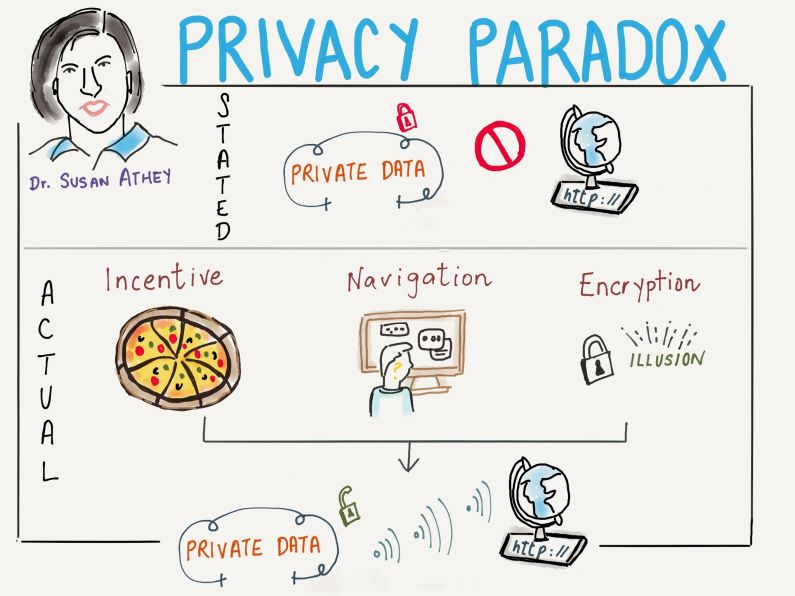

### Il _Privacy paradox_

Il **paradosso della privacy** è _un'incoerenza tra gli atteggiamenti dichiarati verso la privacy e il comportamento delle persone_.

Sebbene gli studi indicano che le persone desiderano proteggere i propri dati personali, esse tendono a ignorare sistematicamente i termini di servizio o le informative sulla privacy.

La possibilità di NON essere tracciati o osservati è quasi un'illusione. Sistemi di sorveglianza esistenti a parte, molte tecnologie nascono per fornire un servizio, ma contemporaneamente riducono la privacy attraverso meccanismi di tracciamento (es. dispositivi indossabili).

---

<!-- footer: Barth, S., & De Jong, M. D. (2017). The privacy paradox–Investigating discrepancies between expressed privacy concerns and actual online behavior–A systematic literature review. Telematics and informatics, 34(7), 1038-1058. https://doi.org/10.1016/j.tele.2017.04.013 -->

### Il _Privacy paradox_

Un contributo alla generale erosione della privacy è dato da tendenze come il significativo aumento del networking professionale e sociale online. 

Sebbene le tecnologie digitali offrano più _affordance_ che mai, uno dei rischi connessi a tali opportunità riguarda proprio la privacy.

Solo l'1% dei dati globali era digitalizzato nel 1986. Nel 2000: 25%. Entro il 2007: 97%. Oggi la maggior parte delle informazioni è digitale.

---

<!-- footer: Solove, D. J. (2021). The myth of the privacy paradox. Geo. Wash. L. Rev., 89, 1. https://scholarship.law.gwu.edu/cgi/viewcontent.cgi?article=2738&context=faculty_publications -->

### Il _Privacy paradox_

Secondo alcuni, il paradosso non esiste, poiché il concetto di autogestione della propria privacy è un'attività non scalabile, e di fatto impossibile da fare in modo esaustivo. Le persone non possono imparare abbastanza sui rischi per prendere decisioni informate in merito.

La tecnologia ha avuto un ruolo fondamentale nel progettare il consenso: il Web e Internet hanno facilitato la condivisione di informazioni _senza la percezione delle normali conseguenze di tale condivisione_.

---

<!-- footer: Solove, D. J. (2021). The myth of the privacy paradox. Geo. Wash. L. Rev., 89, 1. https://scholarship.law.gwu.edu/cgi/viewcontent.cgi?article=2738&context=faculty_publications -->

### Il _Privacy paradox_

Se il paradosso esiste, come lo affrontiamo?

Alcuni potrebbero cercare approcci dall'alto (top-down) per proteggere la privacy digitale, sotto forma di politiche più forti o specifiche (leggi e normative); altri potrebbero cercare soluzioni dal basso (bottom-up) per educare il consumatore e incoraggiarlo a prestare attenzione per proteggere la propria privacy.

---

<!-- footer: Obar, J. A., & Oeldorf-Hirsch, A. (2020). The biggest lie on the internet: Ignoring the privacy policies and terms of service policies of social networking services. Information, communication & society, 23(1), 128-147.  https://doi.org/10.1080/1369118X.2018.1486870 -->

### Il _Privacy paradox_

In uno studio, degli adulti si sono iscritti a un social fittizio, e sono stati osservati nel loro approccio alle informative sulla privacy e ai Termini di Servizio. 

Il 74% ha saltato l'informativa sulla privacy cliccando direttamente su "accetta". Chi si è fermato a leggere l'informativa, vi ha dedicato in media 73 secondi. La maggior parte (97%) ha accettato l'informativa. Il 93% ha accettato i termini nonostante contenessero clausole tipo "i tuoi dati saranno condivisi con l'NSA" o "dovrai rinunciare al tuo primogenito". 

---

<!-- footer: Li, H., Yu, L., & He, W. (2019). The impact of GDPR on global technology development. Journal of Global Information Technology Management, 22(1), 1-6. https://doi.org/10.1080/1097198X.2019.1569186 -->

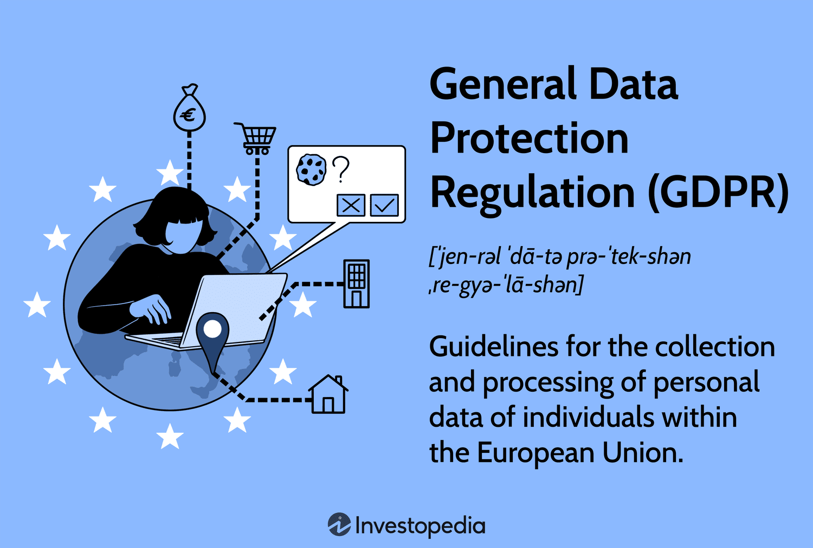

### In Europa abbiamo il General Data Protection Regulation (GDPR)

Il **GDPR** è _il Regolamento Generale Europeo sulla Protezione dei Dati Personali_, applicato a decorrere dal 25 maggio 2018 a livello europeo.

La necessità di definire una base comune per la protezione dei dati nasce dalla continua evoluzione degli stessi concetti di privacy e protezione dei dati personali, dovuta principalmente alla diffusione del progresso tecnologico.

---

<!-- footer: Li, H., Yu, L., & He, W. (2019). The impact of GDPR on global technology development. Journal of Global Information Technology Management, 22(1), 1-6. https://doi.org/10.1080/1097198X.2019.1569186 -->

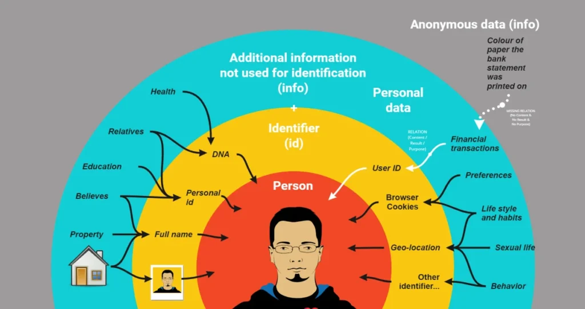

### Cosa sono i dati personali?

I **dati personali** sono _qualsiasi informazione riguardante una persona fisica identificata o identificabile, direttamente o indirettamente_. 

Con questa dicitura ci riferiamo con particolare riferimento a un identificativo come il nome, un numero di identificazione, dati relativi all’ubicazione, un identificativo online o a uno o più elementi caratteristici della sua identità fisica, fisiologica genetica, psichica, economica, culturale o sociale.

---

<!-- footer: Li, H., Yu, L., & He, W. (2019). The impact of GDPR on global technology development. Journal of Global Information Technology Management, 22(1), 1-6. https://doi.org/10.1080/1097198X.2019.1569186 -->

### Cos’è il trattamento di un dato?

Il **trattamento di un dato** è _una qualsiasi attività di gestione del dato, incluse la raccolta, conservazione, modifica, consultazione, comunicazione, cancellazione su qualsiasi supporto informatico, cartaceo o analogico, sia attraverso operatori sia con processi automatizzati_.

Ai sensi del GDPR, il trattamento dei dati deve essere **lecito**, **trasparente** e **finalizzato**.

---

<!-- footer: Li, H., Yu, L., & He, W. (2019). The impact of GDPR on global technology development. Journal of Global Information Technology Management, 22(1), 1-6. https://doi.org/10.1080/1097198X.2019.1569186 -->

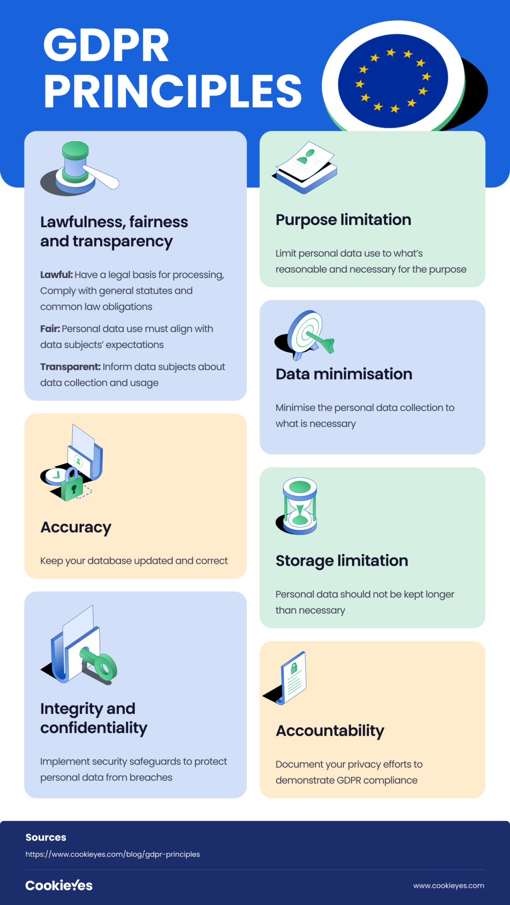

### Principi del GDPR

* **Liceità e correttezza**: necessità del consenso, protezione dell’interesse vitale, dell’interesse pubblico e dell’interesse legittimo;

* **Trasparenza**: fornire informazioni sul trattamento facilmente accessibili e comprensibili;

* **Limitazione delle finalità dei trattamenti**: identificazione necessaria delle finalità per le quali i dati saranno usati;

---

<!-- footer: Li, H., Yu, L., & He, W. (2019). The impact of GDPR on global technology development. Journal of Global Information Technology Management, 22(1), 1-6. https://doi.org/10.1080/1097198X.2019.1569186 -->

### Principi del GDPR

* **Minimizzazione**: limitazione della raccolta ai soli dati direttamente rilevanti e necessari per raggiungere uno scopo specifico;
* **Esattezza**: i dati devono essere corretti e aggiornati;
* **Limitazione della conservazione**: i dati devono essere conservati solo per il tempo necessario;
* **Integrità e riservatezza**: i dati devono essere trattati con tecniche di sicurezza per proteggerli da attacchi o danni accidentali.

---

<!-- footer: Cahn, A., Alfeld, S., Barford, P., & Muthukrishnan, S. (2016, April). An empirical study of web cookies. In Proceedings of the 25th international conference on world wide web (pp. 891-901). https://doi.org/10.1145/2872427.2882991 -->

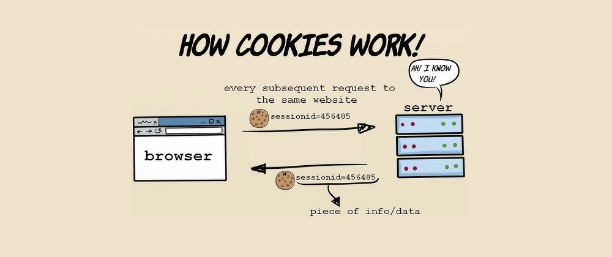

### Cosa sono i cookie?

Immaginiamo di tornare su https://www.amazon.com dopo esserci loggati settimane fa.

Una volta che la pagina si carica, siamo già automaticamente loggati.

Non abbiamo dovuto effettuare di nuovo il login, perché Amazon sapeva già che eravamo noi.

Questo è possibile grazie ai _**cookie**_. 

---

<!-- footer: Cahn, A., Alfeld, S., Barford, P., & Muthukrishnan, S. (2016, April). An empirical study of web cookies. In Proceedings of the 25th international conference on world wide web (pp. 891-901). https://doi.org/10.1145/2872427.2882991 -->

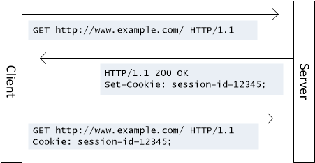

### Cosa sono i cookie?

I _**cookie**_ sono piccoli file di testo mandati da un server, trattenuti dal browser e memorizzati sul dispositivo. 

Ad ogni richiesta allo stesso server, i cookie vengono rimandati indietro dal browser sotto forma di informazioni contenute negli _header_ della richiesta.

I cookie sono progettati per tenere traccia delle informazioni riguardanti l’utente.

I siti ci “fiutano” seguendo la traccia lasciata dai cookie.

---

<!-- footer: Cahn, A., Alfeld, S., Barford, P., & Muthukrishnan, S. (2016, April). An empirical study of web cookies. In Proceedings of the 25th international conference on world wide web (pp. 891-901). https://doi.org/10.1145/2872427.2882991 -->

### Alcune tipologie di cookie

**Tecnici**: essenziali per l’interazione con un sito Web (es. cookie di sessione che mantengono l’accesso dell’utente al sito).

**Analitici**: raccolgono informazioni sull’utilizzo del sito Web da parte dell’utente (e.g. cookie di Google Analytics).

**Profilazione**: raccolgono informazioni sull’utente per profilarlo ed inviargli pubblicità mirata (e.g. cookie di Google AdSense).

---

<!-- footer: Kononenko, K. (2018). Internet Cookies Explained by Taking Your Kids To The Doctor’s Office. On CodeAnalogies Blog. https://blog.codeanalogies.com/2018/06/02/internet-cookies-explained-by-taking-your-kids-to-the-doctors-office/ -->

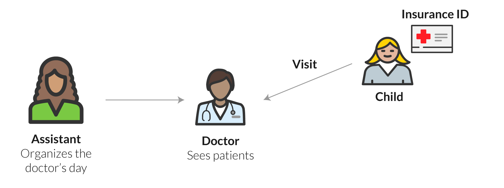

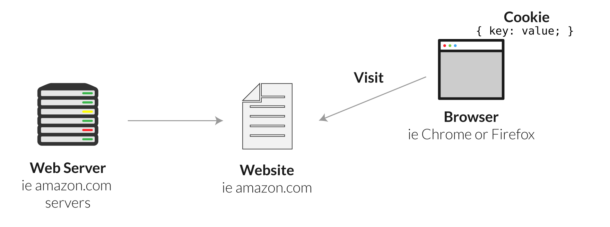

### Come funzionano i cookie?

Utilizziamo la metafora della **visita medica**. Immaginiamo di andare dal medico.

Un assistente verifica la nostra identità e ci manda in una stanza. Quando il medico arriva, ha già una copia della nostra storia clinica.

Nel nostro esempio, il medico è il sito Web, che interagisce con molti pazienti (browser) e deve essere in grado di reagire rapidamente per rispondere ad ognuno di loro.

---

<!-- footer: Kononenko, K. (2018). Internet Cookies Explained by Taking Your Kids To The Doctor’s Office. On CodeAnalogies Blog. https://blog.codeanalogies.com/2018/06/02/internet-cookies-explained-by-taking-your-kids-to-the-doctors-office/ -->

### Come funzionano i cookie?

L'assistente è come il server, in quanto "prepara il medico" dandogli informazioni sul prossimo paziente in anticipo. Noi siamo il browser.

Ora immaginiamo che quella comunicazione iniziale tra noi e l’assistente non sia mai avvenuta.

Siamo semplicemente entrati nell’ambulatorio e siamo passati direttamente a raccontare la nostra storia clinica.

---

<!-- footer: Kononenko, K. (2018). Internet Cookies Explained by Taking Your Kids To The Doctor’s Office. On CodeAnalogies Blog. https://blog.codeanalogies.com/2018/06/02/internet-cookies-explained-by-taking-your-kids-to-the-doctors-office/ -->

### Come funzionano i cookie?

Per noi sarebbe molto difficile per almeno due motivi: faremmo moltissima fatica a ricordare tutto, o comunque in una maniera che sia utile per il medico, e ci metteremmo troppo tempo.

Invece, è necessario un meccanismo che fornisca rapidamente le informazioni necessarie al medico.

Tecnicamente, è per questo che abbiamo bisogno dei cookie.

---

<!-- footer: Kononenko, K. (2018). Internet Cookies Explained by Taking Your Kids To The Doctor’s Office. On CodeAnalogies Blog. https://blog.codeanalogies.com/2018/06/02/internet-cookies-explained-by-taking-your-kids-to-the-doctors-office/ -->

### Come funzionano i cookie?

Quindi, un cookie è un breve pezzo di testo che viene memorizzato nel browser del visitatore del sito Web. Potrebbe contenere un ID utente che permetterà al sito di farci accedere immediatamente. Abbiamo ricevuto quell’ID quando abbiamo creato l’account per la prima volta.

Quell’ID viene poi inviato dal server al client al momento del login e da quest’ultimo memorizzato (fino a quando - o a meno che - non abbiamo intrapreso determinate azioni).

---

<!-- footer: Kononenko, K. (2018). Internet Cookies Explained by Taking Your Kids To The Doctor’s Office. On CodeAnalogies Blog. https://blog.codeanalogies.com/2018/06/02/internet-cookies-explained-by-taking-your-kids-to-the-doctors-office/ -->

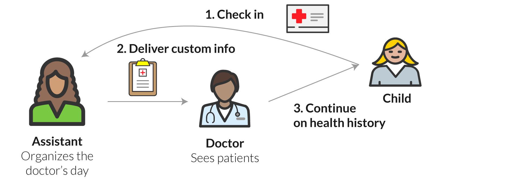

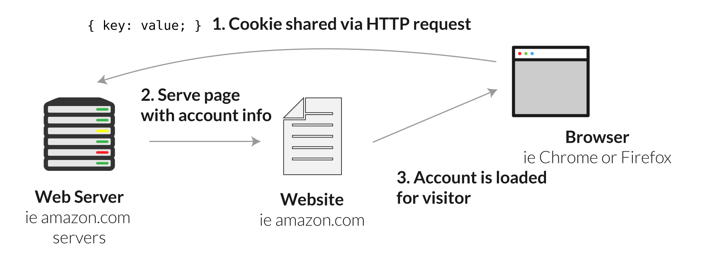

### Come funzionano i cookie?

Entriamo in ambulatorio e ci registriamo dall'assistente, che ci chiede l'ID. Il medico arriva con la nostra storia clinica. Possiamo interagire facilmente con il medico e arrivare al nostro obiettivo.

Inviamo una richiesta HTTP al server. Nella richiesta c'è un cookie che il server stesso ci ha mandato in precedenza. Il server legge il nostro cookie e risponde con un messaggio HTTP positivo. Possiamo interagire con il sito e raggiungere il nostro obiettivo.

---

<!-- footer: Kononenko, K. (2018). Internet Cookies Explained by Taking Your Kids To The Doctor’s Office. On CodeAnalogies Blog. https://blog.codeanalogies.com/2018/06/02/internet-cookies-explained-by-taking-your-kids-to-the-doctors-office/ -->

### In teoria, i cookie non sono condivisi tra i siti che visitate

In teoria, non esiste un protocollo universale per i cookie.

I cookie sono solitamente associati ai rispettivi domini; possono quindi essere letti e manipolati solo dal server che li ha prodotti.

D’altro canto, i cookie prodotti da server che fanno parte dello stesso ecosistema o che appartengono a realtà che collaborano tra loro, possono comunicare tra loro (e lo fanno).

---

<!-- footer: Kononenko, K. (2018). Internet Cookies Explained by Taking Your Kids To The Doctor’s Office. On CodeAnalogies Blog. https://blog.codeanalogies.com/2018/06/02/internet-cookies-explained-by-taking-your-kids-to-the-doctors-office/ -->

### Cookie di terze parti

Ad esempio, supponiamo che vogliamo comprare dei pattini.

Andiamo su un sito chiamato “coolrollerblades.com”, ma non acquistiamo nulla.

Poi saliamo su Instagram, e vediamo degli annunci riguardanti vari pattini molto simili a quelli che abbiamo visto sull’altro sito.

---

<!-- footer: Kononenko, K. (2018). Internet Cookies Explained by Taking Your Kids To The Doctor’s Office. On CodeAnalogies Blog. https://blog.codeanalogies.com/2018/06/02/internet-cookies-explained-by-taking-your-kids-to-the-doctors-office/ -->

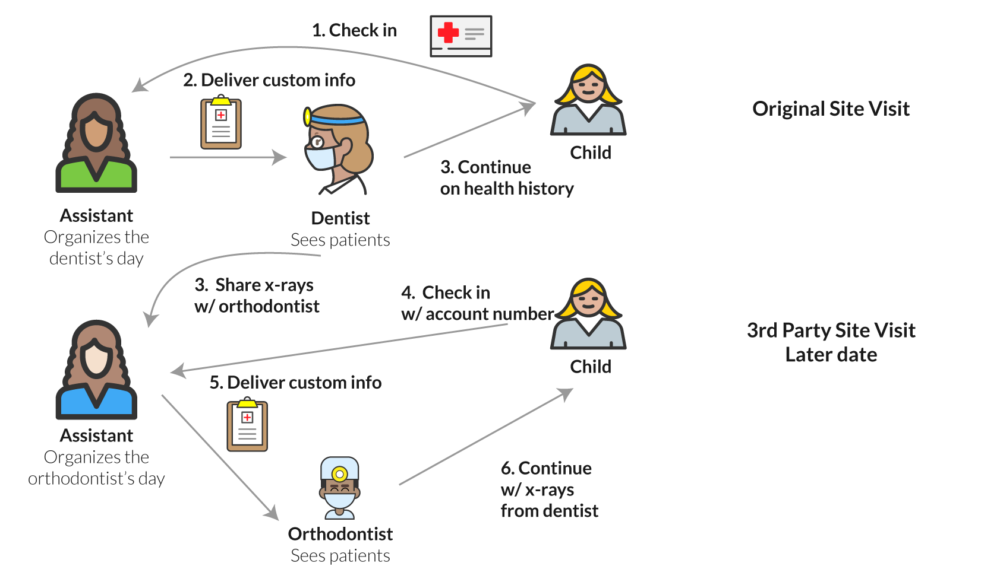

### Cookie di terze parti

Immaginiamo di andare dal dentista.

Alla fine della visita, il dentista ci comunica che dobbiamo utilizzare l’apparecchio.

Il dentista inoltra la nostra cartella contenente le scannerizzazioni a raggi X ad un ortodentista che ci aiuterà con il nostro apparecchio.

La stessa cosa avviene tra siti e servizi di aziende e istituzioni diverse, che usano cookie per scambiarsi informazioni.

---

<!-- footer: "" -->

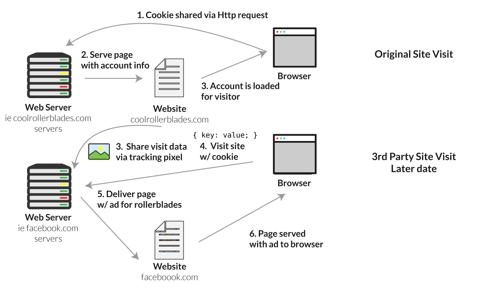

---

<!-- footer: Kyi, L., Ammanaghatta Shivakumar, S., Santos, C. T., Roesner, F., Zufall, F., & Biega, A. J. (2023, April). Investigating deceptive design in GDPR’s legitimate interest. In Proceedings of the 2023 CHI Conference on Human Factors in Computing Systems (pp. 1-16). https://doi.org/10.1145/3544548.3580637 -->

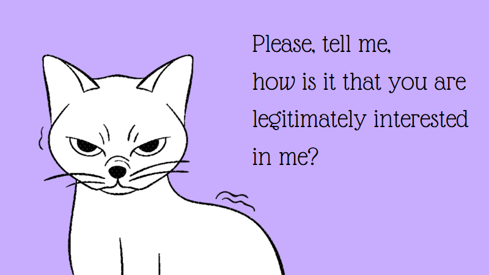

### La questione della privacy

Il punto in cui la nostra metafora viene meno. La maggior parte delle persone direbbe che una visita annuale dal medico è indiscutibilmente una cosa buona.

D’altra parte, c’è un po’ più di dibattito sulle questioni relative alla privacy che accompagnano i cookie. La maggior parte delle persone è a proprio agio con un sito che utilizza le loro informazioni per facilitare il processo di autenticazione ai propri siti.

---

<!-- footer: Kyi, L., Ammanaghatta Shivakumar, S., Santos, C. T., Roesner, F., Zufall, F., & Biega, A. J. (2023, April). Investigating deceptive design in GDPR’s legitimate interest. In Proceedings of the 2023 CHI Conference on Human Factors in Computing Systems (pp. 1-16). https://doi.org/10.1145/3544548.3580637 -->

### La questione della privacy

Ma sempre più persone si stanno rendendo conto che questa condivisione sta prendendo pieghe inquietanti.

Inoltre, la condivisione dei dati personali tra domini diversi e con terze parti implica anche rischi per la sicurezza e una seria messa in discussione dei meccanismi di consenso e controllo da parte dell’utente sui propri dati.

Esempio: [il problema del legittimo interesse](https://shop.acconsento.click/cookie-legittimo-interesse-non-basta-serve-lesplicito-consenso-dellutente/).

---

<!-- footer: Kyi, L., Ammanaghatta Shivakumar, S., Santos, C. T., Roesner, F., Zufall, F., & Biega, A. J. (2023, April). Investigating deceptive design in GDPR’s legitimate interest. In Proceedings of the 2023 CHI Conference on Human Factors in Computing Systems (pp. 1-16). https://doi.org/10.1145/3544548.3580637 -->

### Il legittimo interesse

Il **legittimo interesse** è _il trattamento necessario per il perseguimento del legittimo interesse del titolare del trattamento o di terzi_.

Il "titolare del trattamento" è un sito web o un'azienda che tratta dati personali, come fornitori di servizi o inserzionisti.

Tra tutte le basi giuridiche del GDPR, il legittimo interesse è la più ambigua, poiché consente ampie interpretazioni per diversi scopi di trattamento.

---

<!-- footer: Kyi, L., Ammanaghatta Shivakumar, S., Santos, C. T., Roesner, F., Zufall, F., & Biega, A. J. (2023, April). Investigating deceptive design in GDPR’s legitimate interest. In Proceedings of the 2023 CHI Conference on Human Factors in Computing Systems (pp. 1-16). https://doi.org/10.1145/3544548.3580637 -->

### Il legittimo interesse

Sebbene i legittimi interessi consentano ai titolari di trattare i dati senza il permesso esplicito dell'utente, quest'ultimo ha il diritto di opporsi. Di conseguenza, i legittimi interessi compaiono sempre più spesso nelle informative sulla privacy.

Il potenziale sfruttamento dei legittimi interessi per raccogliere più dati si collega al design ingannevole, onnipresente nelle informative sulla privacy e nei banner dei cookie.

---

<!-- footer: "" -->
<!-- paginate: False -->

# Abilità Informatiche (2025/2026)

## 08. Privacy digitale

➡️ Mail: [sebastian.barzaghi2@unibo.it](mailto:sebastian.barzaghi2@unibo.it)
➡️ ORCID: [0000-0002-0799-1527](https://orcid.org/0000-0002-0799-1527)
➡️ Sito: [sebastian.barzaghi2](https://www.unibo.it/sitoweb/sebastian.barzaghi2/)

