<!-- footer: "" -->
<!-- paginate: False -->

# Abilità Informatiche (2025/2026)

## 09. Intelligenza Artificiale

➡️ Mail: [sebastian.barzaghi2@unibo.it](mailto:sebastian.barzaghi2@unibo.it)
➡️ ORCID: [0000-0002-0799-1527](https://orcid.org/0000-0002-0799-1527)
➡️ Sito: [sebastian.barzaghi2](https://www.unibo.it/sitoweb/sebastian.barzaghi2/)

---

<!-- paginate: False -->

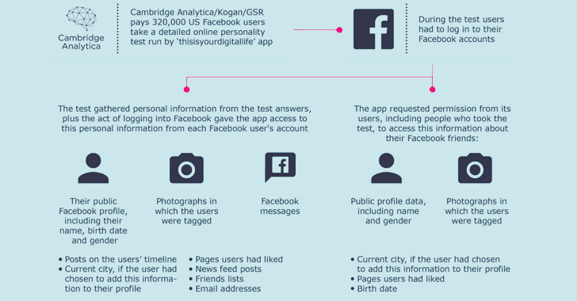

---

<!-- paginate: True -->
<!-- footer: NBC News (2015). 'Like' This: Can Facebook Assess Your Personality? https://www.nbcnews.com/health/health-news/can-facebook-assess-your-personality-n284736 -->

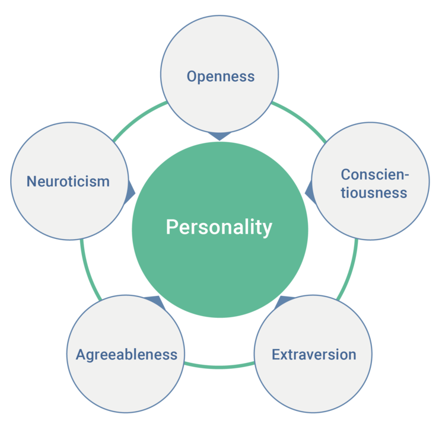

### Il caso _Cambridge Analytica_

Nel 2007 viene creata un'applicazione Facebook chiamata MyPersonality, che permette agli utenti di compilare dei brevi questionari psicometrici.

Sulla base di questo, crea un piccolo profilo psicologico (basato sui Big Five).

Nell’ecosistema di Facebook, diventa possibile confrontare i risultati di questi test con tutti i tipi di altri dati online dei soggetti (likes, pagine seguite, informazioni di profilo, ecc.).

---

<!-- paginate: True -->
<!-- footer: NBC News (2015). 'Like' This: Can Facebook Assess Your Personality? https://www.nbcnews.com/health/health-news/can-facebook-assess-your-personality-n284736 -->

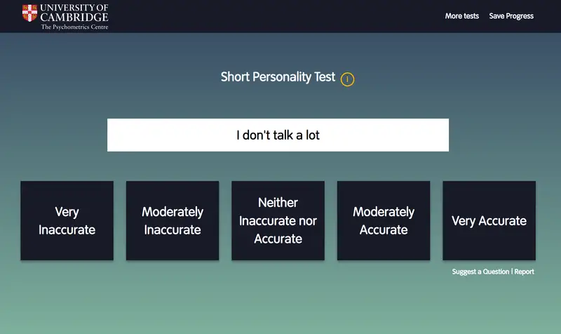

### Il caso _Cambridge Analytica_

Diventa molto semplice trovare delle correlazioni tra cose a cui hanno messo un “like”, cose che hanno condiviso o pubblicato, sesso, età, luogo di residenza, ecc. Ciò ha permesso ai ricercatori di fare correlazioni e trarre deduzioni molto affidabili.

Esempi: gli uomini a cui piace il marchio di cosmetici MAC tendono ad essere gay; gli uomini eterosessuali tendono a gradire i Wu-Tang Clan; i seguaci di Lady Gaga sono più estroversi, mentre gli amanti della filosofia sono più introversi. 

---

<!-- paginate: True -->
<!-- footer: Della Piazza, S. (2021). Lo scandalo di Cambridge Analytica, legato all’utilizzo dei dati personali ottenuti illecitamente da Facebook. https://www.dirittoconsenso.it/2021/12/21/il-caso-cambridge-analytica/ -->

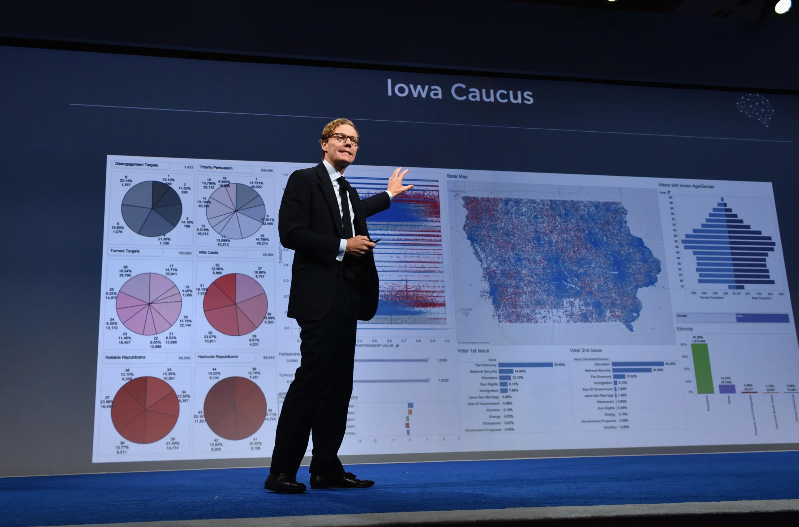

### Il caso _Cambridge Analytica_

Ogni informazione di questo tipo è troppo debole per produrre una previsione affidabile su una persona, ma quando migliaia di singoli dati vengono combinati, le previsioni diventano molto più accurate.

Questo ha permesso di comprendere il comportamento delle persone sui social, ma ha anche aperto la strada ad altre applicazioni, come il microtargeting psicografico operato da Cambridge Analytica durante le elezioni americane del 2016 e la Brexit.

---

<!-- footer: Ghosh, M., & Thirugnanam, A. (2021). Introduction to artificial intelligence. In Artificial Intelligence for Information Management: A Healthcare Perspective (pp. 23-44). Singapore: Springer Singapore. https://doi.org/10.1007/978-981-16-0415-7_2 -->

### Cos'è l'Intelligenza Artificiale?

L'**Intelligenza Artificiale** (IA) è la scienza che studia tecniche computazionali in grado di emulare l’intelligenza umana. Si tratta anche dell'’abilità di una macchina di mostrare capacità umane quali il ragionamento, l’apprendimento, la pianificazione e la creatività.

L'IA permette a sistemi informatici di comprendere il proprio ambiente, mettersi in relazione con esso e risolvere problemi, agendo verso un obiettivo specifico, adattando il proprio comportamento.

---

<!-- footer: Ghosh, M., & Thirugnanam, A. (2021). Introduction to artificial intelligence. In Artificial Intelligence for Information Management: A Healthcare Perspective (pp. 23-44). Singapore: Springer Singapore. https://doi.org/10.1007/978-981-16-0415-7_2 -->

### Cos'è l'Intelligenza Artificiale?

L’IA è già parte della trasformazione digitale del mondo contemporaneo.

Quali attività sarà possibile far svolgere alle IA, e con quali conseguenze nelle relazioni tra e con gli esseri umani?

* https://chatgpt.com/
* https://aidungeon.com/
* https://perchance.org/ai-text-to-image-generator
* https://suno.com/home
* https://text-to-cad.zoo.dev/

---

<!-- footer: Ghosh, M., & Thirugnanam, A. (2021). Introduction to artificial intelligence. In Artificial Intelligence for Information Management: A Healthcare Perspective (pp. 23-44). Singapore: Springer Singapore. https://doi.org/10.1007/978-981-16-0415-7_2 -->

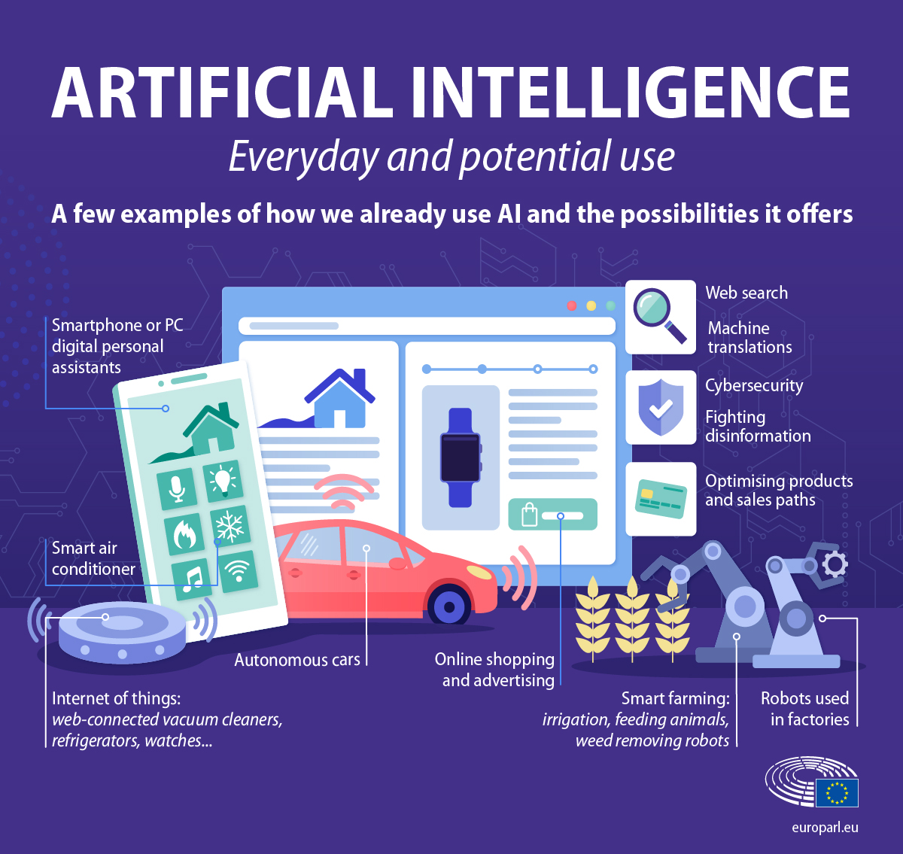

### Applicazioni dell’IA

Il campo d’applicazione dell'IA è diviso in un vastissimo insieme di aree specializzate, per ciascuna delle quali esistono sistemi molto efficienti nel compiere una azione, ma totalmente inadatti a compierne altre.

Si tratta di una delle principali differenze rispetto all’intelligenza umana, che per definizione è in grado di adattarsi a diversi tipi di problemi.

---

<!-- footer: Ghosh, M., & Thirugnanam, A. (2021). Introduction to artificial intelligence. In Artificial Intelligence for Information Management: A Healthcare Perspective (pp. 23-44). Singapore: Springer Singapore. https://doi.org/10.1007/978-981-16-0415-7_2 -->

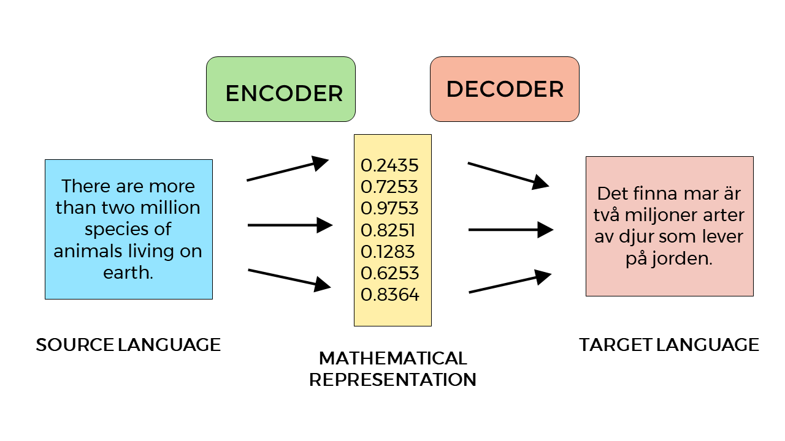

### Applicazioni dell’IA

Ad esempio, i programmi di _machine translation_ (traduzione automatica di testi) spesso raggiungono risultati pari o migliori degli umani nella traduzione di un altissimo numero di lingue.

Tuttavia, non riescono a tradurre il senso di espressioni idiomatiche o astratte (umorismo, metafore), a meno che non siano espressamente pre-programmate per affrontare quel tipo di costrutti in quel determinato linguaggio.

---

<!-- footer: Haenlein, M., & Kaplan, A. (2019). A brief history of artificial intelligence: On the past, present, and future of artificial intelligence. California management review, 61(4), 5-14. https://doi.org/10.1177/0008125619864925 -->

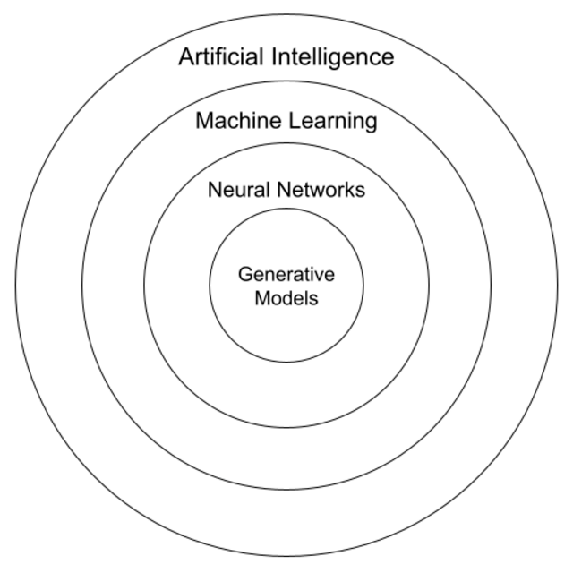

### Radici in discipline diverse

* **Filosofia** (intelligenza, conoscenza, ragionamento, apprendimento, ...);
* **Matematica** (logica, probabilità, statistica, ...);
* **Psicologia** (modelli cognitivi, ...);
* **Informatica** (software, hardware, algoritmi, ...);
* **Linguistica** (sintassi, semantica, pragmatica, ...);
* **Economia** (teoria delle decisioni, teoria dei giochi, ...);
* **Neuroscienze** (neuroni, sinapsi, ...).

---

<!-- footer: Haenlein, M., & Kaplan, A. (2019). A brief history of artificial intelligence: On the past, present, and future of artificial intelligence. California management review, 61(4), 5-14. https://doi.org/10.1177/0008125619864925 -->

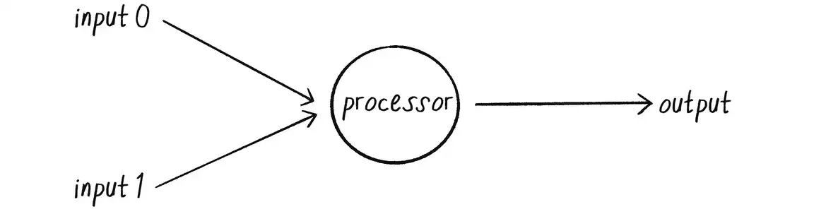

### La nascita dell’IA (1943-1955)

Il primo lavoro che ora è generalmente riconosciuto come IA fu svolto da **Warren McColluch** e **Walter Pitts** (1943).

Si basarono su tre teorie:

* La conoscenza sulla funzione dei **neuroni** nel cervello umano; 

* L'analisi formale della **logica proposizionale**; 

* La **teoria della computazione di Turing**.

---

<!-- footer: Haenlein, M., & Kaplan, A. (2019). A brief history of artificial intelligence: On the past, present, and future of artificial intelligence. California management review, 61(4), 5-14. https://doi.org/10.1177/0008125619864925 -->

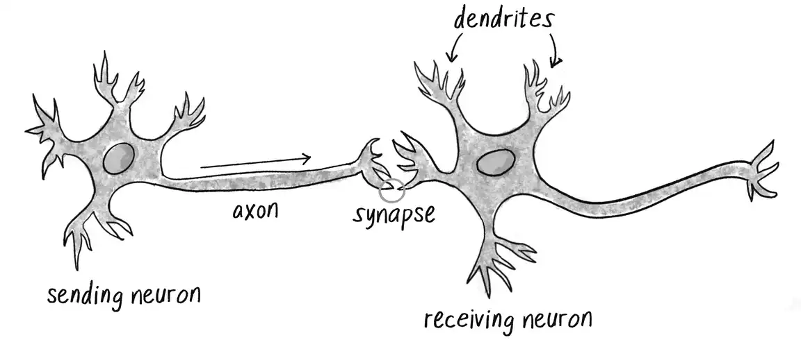

### I neuroni

Il cervello elabora le informazioni attraverso i **neuroni**, cellule specializzate interconnesse tramite sinapsi.

I neuroni comunicano scambiandosi neurotrasmettitori, ovvero segnali elettrici e chimici.

Funzionano con un meccanismo a soglia: un neurone si "attiva" (generando un potenziale d'azione) solo se la somma degli stimoli eccitatori ricevuti supera un livello critico.

---

<!-- footer: Haenlein, M., & Kaplan, A. (2019). A brief history of artificial intelligence: On the past, present, and future of artificial intelligence. California management review, 61(4), 5-14. https://doi.org/10.1177/0008125619864925 -->

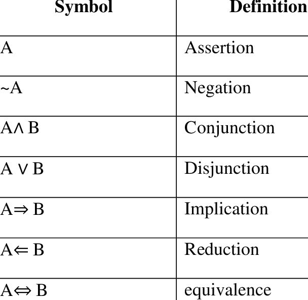

### La logica proposizionale

È una branca della logica matematica che studia le **proposizioni**, ovvero affermazioni che possono assumere solo due stati: _vero_ o _falso_.

Combina queste affermazioni utilizzando **operatori logici** (come `AND`, `OR`, `NOT`).

Permette di calcolare il valore di verità di espressioni e ragionamenti complessi in modo meccanico, rigoroso e privo di ambiguità testuali.

---

<!-- footer: Haenlein, M., & Kaplan, A. (2019). A brief history of artificial intelligence: On the past, present, and future of artificial intelligence. California management review, 61(4), 5-14. https://doi.org/10.1177/0008125619864925 -->

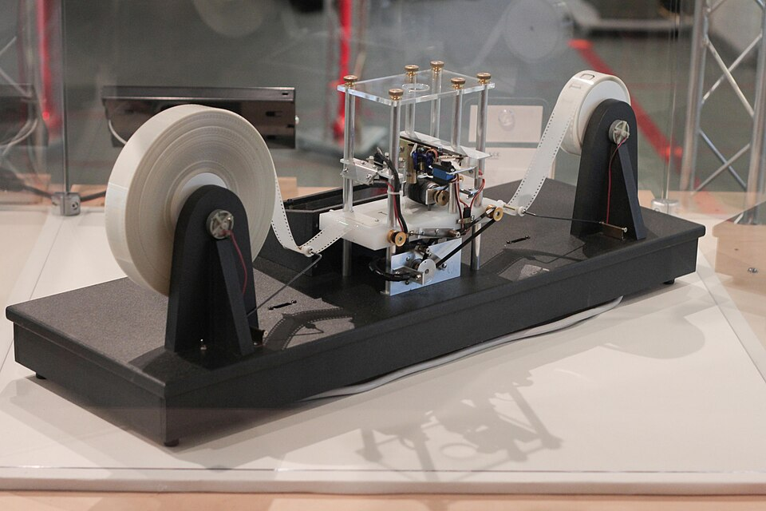

### La teoria della computazione

Definisce i fondamenti matematici del calcolo, stabilendo quali problemi sono risolvibili  algoritmicamente e quali no.

Introduce la **Macchina di Turing**, un modello teorico astratto dotato di un nastro infinito su cui vengono letti e scritti simboli in base a un set di regole finite.

Dimostra che qualsiasi calcolo o procedura logica ben definita può essere eseguita da una singola macchina universale.

---

<!-- footer: Haenlein, M., & Kaplan, A. (2019). A brief history of artificial intelligence: On the past, present, and future of artificial intelligence. California management review, 61(4), 5-14. https://doi.org/10.1177/0008125619864925 -->

### La nascita dell’IA (1943-1955)

Proposero un modello di neuroni artificiali in cui ogni neurone è caratterizzato come "acceso" o "spento", con un passaggio a "acceso" che avviene in risposta alla stimolazione di un numero sufficiente di neuroni adiacenti.

Dimostrarono così che una rete neurale poteva rappresentare e calcolare qualsiasi espressione logica.

Provarono inoltre che la loro rete di neuroni artificiali era _Turing-completa_.

---

<!-- footer: Haenlein, M., & Kaplan, A. (2019). A brief history of artificial intelligence: On the past, present, and future of artificial intelligence. California management review, 61(4), 5-14. https://doi.org/10.1177/0008125619864925 -->

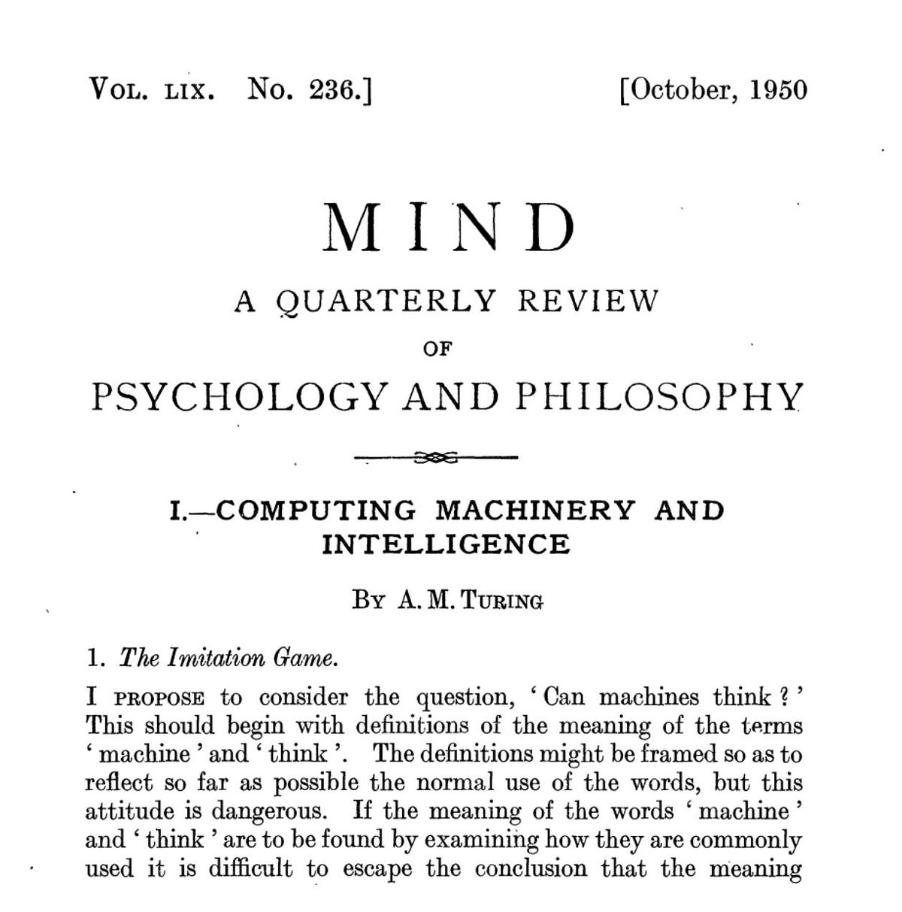

### Entusiasmo iniziale, grandi aspettative (1952-1969)

L’IA fu definita da **John McCarthy**, per la prima volta, nel 1956 come _la scienza e l’ingegneria di costruire macchine intelligenti_.

Più o meno nello stesso periodo, **Alan Turing**, nel suo articolo _Computing Machinery and Intelligence_(1950), proponeva un test per capire se un computer fosse in grado di emulare così bene il comportamento umano da diventare indistinguibile da una persona.

---

<!-- footer: Haenlein, M., & Kaplan, A. (2019). A brief history of artificial intelligence: On the past, present, and future of artificial intelligence. California management review, 61(4), 5-14. https://doi.org/10.1177/0008125619864925 -->

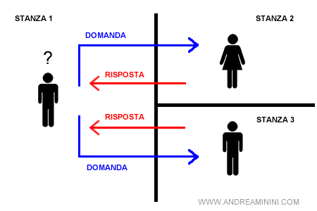

### Il test di Turing

Il test si suddivide in due fasi diverse. Nella prima fase partecipano tre persone: un uomo, una donna e un intervistatore. Le tre persone si trovano in stanze separate e comunicano tra loro tramite una telescrivente.

L'intervistatore formula delle domande scritte alle altre due persone. Non sa se si sta rivolgendo alla donna o all'uomo. Lo scopo delle domande è di capire il sesso delle altre due persone e capire quale sia l'uomo e quale sia una donna.

---

<!-- footer: Haenlein, M., & Kaplan, A. (2019). A brief history of artificial intelligence: On the past, present, and future of artificial intelligence. California management review, 61(4), 5-14. https://doi.org/10.1177/0008125619864925 -->

### Il test di Turing

* Un partecipante è sincero, e ha l'obiettivo di agevolare l'identificazione da parte dell'intervistatore.
* Un partecipante mente, e ha l'obiettivo di far sbagliare l'identificazione da parte dell'intervistatore.

L'intervistatore non sa chi mente e chi è sincero. Deve riuscire a capirlo da sé.

Ripetendo il gioco N volte, l'intervistatore sbaglia il sesso dei partecipanti per X volte. Il suo tasso di errore è pari a `X/N`.

---

<!-- footer: Haenlein, M., & Kaplan, A. (2019). A brief history of artificial intelligence: On the past, present, and future of artificial intelligence. California management review, 61(4), 5-14. https://doi.org/10.1177/0008125619864925 -->

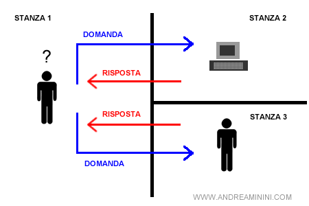

### Il test di Turing

Nella seconda fase del test  uno dei due partecipanti viene sostituito con un computer. Il processo è sempre lo stesso.

Il gioco si ripete N volte e l'intervistatore sbaglia l'identificazione dei partecipanti per Z volte, ottenendo un tasso di errore percentuale pari a `Z/N`.

Se la percentuale di errore nella seconda fase è simile o inferiore a quella della prima fase, allora il Test di Turing viene superato: la macchina è intelligente.

---

<!-- footer: Haenlein, M., & Kaplan, A. (2019). A brief history of artificial intelligence: On the past, present, and future of artificial intelligence. California management review, 61(4), 5-14. https://doi.org/10.1177/0008125619864925 -->

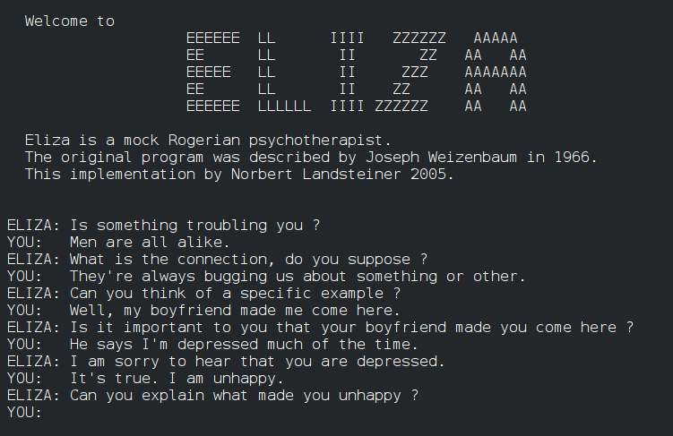

### Una dose di realtà (1966-1973)

I primi sistemi di AI si rivelarono un fallimento quando furono messi alla prova su una gamma più ampia di problemi più difficili. Il primo tipo di difficoltà emerse perché la maggior parte dei primi programmi funzionava solo seguendo un insieme di istruzioni fisse per arrivare a una conclusione.

Un esempio famoso è ELIZA, un _chatbot_ che simulava uno psicoterapeuta basandosi su un sistema di _pattern matching_.

---

<!-- footer: Haenlein, M., & Kaplan, A. (2019). A brief history of artificial intelligence: On the past, present, and future of artificial intelligence. California management review, 61(4), 5-14. https://doi.org/10.1177/0008125619864925 -->

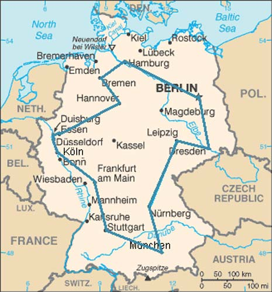

### Una dose di realtà (1966-1973)

Il secondo tipo di difficoltà fu l'irrisolvibilità di alcuni  problemi, come il **problema del commesso viaggiatore**.

_Dato un certo numero di posizioni, qual è il percorso più corto che permette di visitarle tutte una e una sola volta?_

Con l'esempio delle 15 città tedesche, esistono 43 589 145 600 soluzioni.

Problema di ottimizzazione discreta per cui potrebbe non esistere una soluzione esatta e utile.

---

<!-- footer: Haenlein, M., & Kaplan, A. (2019). A brief history of artificial intelligence: On the past, present, and future of artificial intelligence. California management review, 61(4), 5-14. https://doi.org/10.1177/0008125619864925 -->

### Una dose di realtà (1966-1973)

Quindi, questi primi metodi di risoluzione dei problemi erano meccanismi che cercavano di mettere insieme passaggi elementari di ragionamento per trovare soluzioni complete.

Tali approcci sono stati chiamati **deboli** perché, sebbene generali, non erano in grado di scalare per affrontare istanze di problemi più grandi o difficili.

Ciononostante, furono fondamentali per passare alle tecnologie successive.

---

<!-- footer: Haenlein, M., & Kaplan, A. (2019). A brief history of artificial intelligence: On the past, present, and future of artificial intelligence. California management review, 61(4), 5-14. https://doi.org/10.1177/0008125619864925 -->

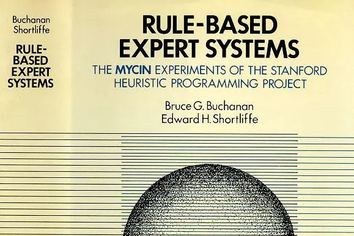

### Sistemi basati sulla conoscenza (1969-1979)

L’alternativa ai metodi deboli è stata quella di utilizzare conoscenze più potenti e specifiche per il dominio specifico relativo al problema da affrontare.

Questi metodi utilizzavano passaggi di ragionamento più ampi per gestire più facilmente i casi tipicamente ricorrenti in aree di competenza ristrette.

Questi tipi di sistemi erano anche chiamati **sistemi esperti**.

---

<!-- footer: Haenlein, M., & Kaplan, A. (2019). A brief history of artificial intelligence: On the past, present, and future of artificial intelligence. California management review, 61(4), 5-14. https://doi.org/10.1177/0008125619864925 -->

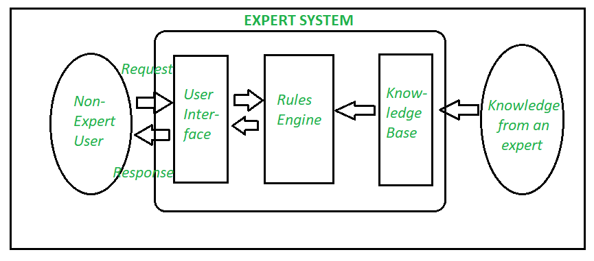

### Sistemi basati sulla conoscenza (1969-1979)

La base di un qualsiasi sistema esperto consiste in due elementi principali:

* **Base di conoscenza**: una grande raccolta di informazioni su un certo argomento (ad esempio, malattie e trattamenti per un sistema medico);

* **Motore di inferenza**: il cervello del sistema, che usa la base di conoscenza per fare ragionamenti e trovare soluzioni.

---

<!-- footer: Haenlein, M., & Kaplan, A. (2019). A brief history of artificial intelligence: On the past, present, and future of artificial intelligence. California management review, 61(4), 5-14. https://doi.org/10.1177/0008125619864925 -->

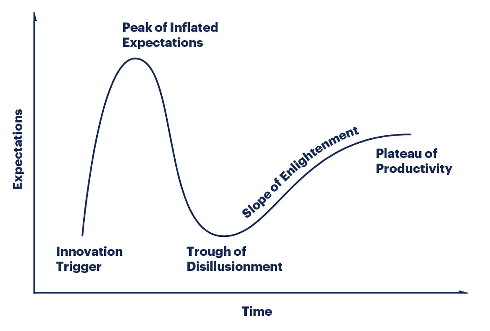

### Inverno della IA (1980-1993)

L’industria dell’IA esplose da pochi milioni di dollari nel 1980 a miliardi di dollari nel 1988, includendo centinaia di aziende che costruivano sistemi esperti, robot e software e hardware specializzati per questi scopi.

Poco dopo, arrivò un periodo di “inverno dell’IA”, in cui molte aziende fallirono, poiché non riuscirono a mantenere le promesse fatte per via della **dipendenza da regole fisse** e dell'**impossibilità di aggiornare autonomamente la conoscenza**.

---

<!-- footer: Haenlein, M., & Kaplan, A. (2019). A brief history of artificial intelligence: On the past, present, and future of artificial intelligence. California management review, 61(4), 5-14. https://doi.org/10.1177/0008125619864925 -->

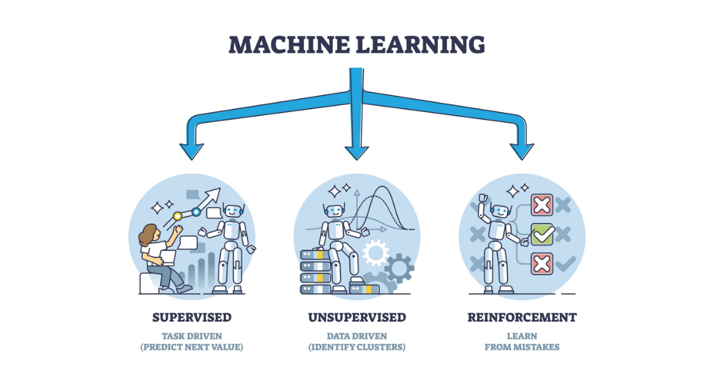

### Reti neurali e apprendimento automatico (1986-presente)

Questi metodi hanno la capacità di apprendere dall’esperienza. Possono confrontare il valore di output previsto con il valore reale rispetto ad un problema e modificare i loro parametri per ridurre la differenza (e quindi l’errore).

La fragilità dei sistemi esperti portò a un nuovo approccio che incorporava la **probabilità** anziché l’inferenza, e l’**apprendimento automatico** anziché la creazione di basi di conoscenza.

---

<!-- footer: Haenlein, M., & Kaplan, A. (2019). A brief history of artificial intelligence: On the past, present, and future of artificial intelligence. California management review, 61(4), 5-14. https://doi.org/10.1177/0008125619864925 -->

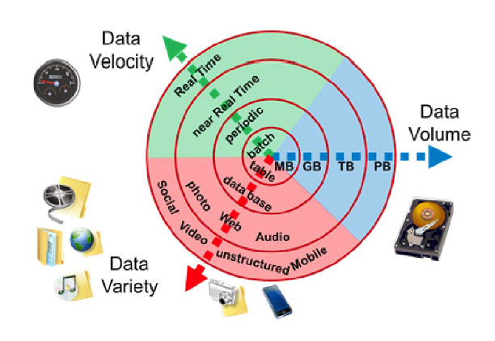

### Big data (2001-presente)

Nel corso della storia di 60 anni dell’informatica, l’enfasi è sempre stata sull’algoritmo come principale oggetto di studio. Alcuni lavori recenti nell’IA suggeriscono che, per molti problemi, ha più senso preoccuparsi dei dati e essere meno selettivi riguardo all’algoritmo da applicare.

Questo è particolarmente vero considerando l'emergenza di dataset giganteschi ed estremamente complessi, i cosiddetti _big data_.

---

<!-- footer: Haenlein, M., & Kaplan, A. (2019). A brief history of artificial intelligence: On the past, present, and future of artificial intelligence. California management review, 61(4), 5-14. https://doi.org/10.1177/0008125619864925 -->

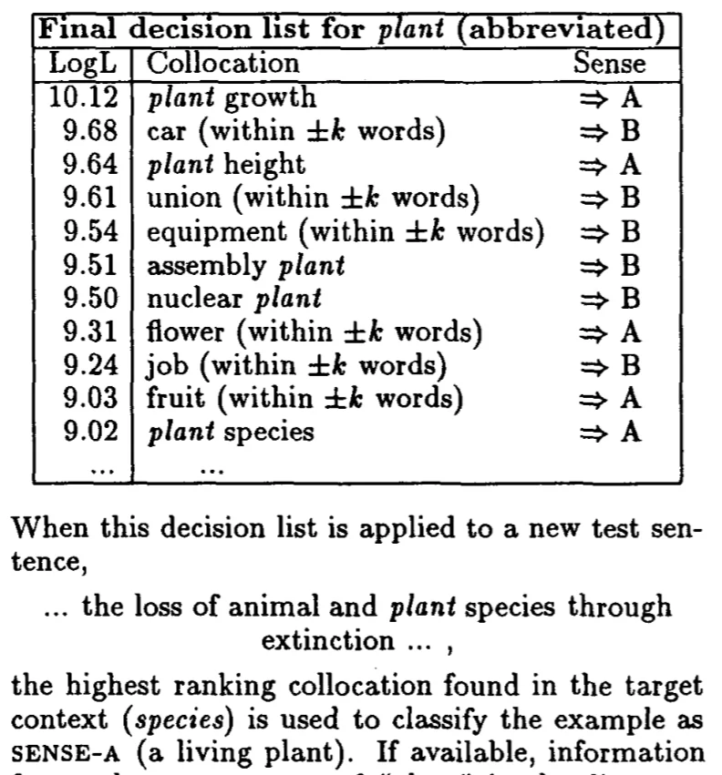

### Big data (2001-presente)

Dato l’uso della parola _plant_ in una frase, a cosa ci si riferisce?

Gli approcci fino ad ora si basavano su esempi etichettati dall’uomo combinati con algoritmi di IA. 

**Yarowsky** mostrò che questa attività poteva essere svolta senza esempi, con una precisione del 96%, analizzando un corpus di testi molto grande con le definizioni del dizionario dei due sensi (cioè _plant: pianta_ e _plant: impianto industriale_).

---

<!-- footer: Haenlein, M., & Kaplan, A. (2019). A brief history of artificial intelligence: On the past, present, and future of artificial intelligence. California management review, 61(4), 5-14. https://doi.org/10.1177/0008125619864925 -->

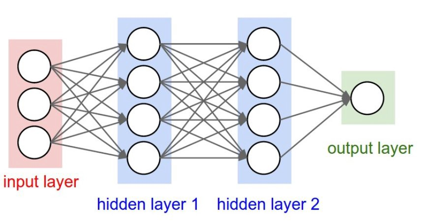

### Deep learning (2011–presente)

Il *deep learning* si riferisce all'apprendimento automatico che utilizza più livelli di elementi computazionali semplici e regolabili.

Esperimenti con tali reti furono condotti già negli anni '70 e '90. Tuttavia, fu solo nel 2011 che i metodi di _deep learning_ decollarono veramente. 

Questo avvenne inizialmente nel riconoscimento vocale e poi nel riconoscimento visivo di oggetti.

---

<!-- footer: Haenlein, M., & Kaplan, A. (2019). A brief history of artificial intelligence: On the past, present, and future of artificial intelligence. California management review, 61(4), 5-14. https://doi.org/10.1177/0008125619864925 -->

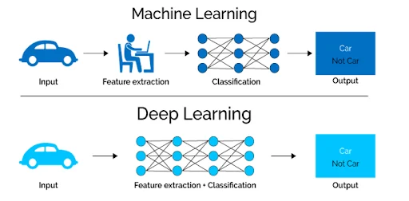

### Deep learning (2011–presente)

Nel 2012, in una competizione per classificare le immagini in una delle mille categorie (armadillo, libreria, cavatappi, ecc.), un sistema di deep learning creato da **Geoffrey Hinton** dimostrò un miglioramento drammatico rispetto ai sistemi precedenti, che si basavano in gran parte su _features_ estratte a mano.

Il deep learning dipende da **hardware molto potente** e dalla **disponibilità di grandi quantità di dati** di addestramento.

---

<!-- footer: Haenlein, M., & Kaplan, A. (2019). A brief history of artificial intelligence: On the past, present, and future of artificial intelligence. California management review, 61(4), 5-14. https://doi.org/10.1177/0008125619864925 -->

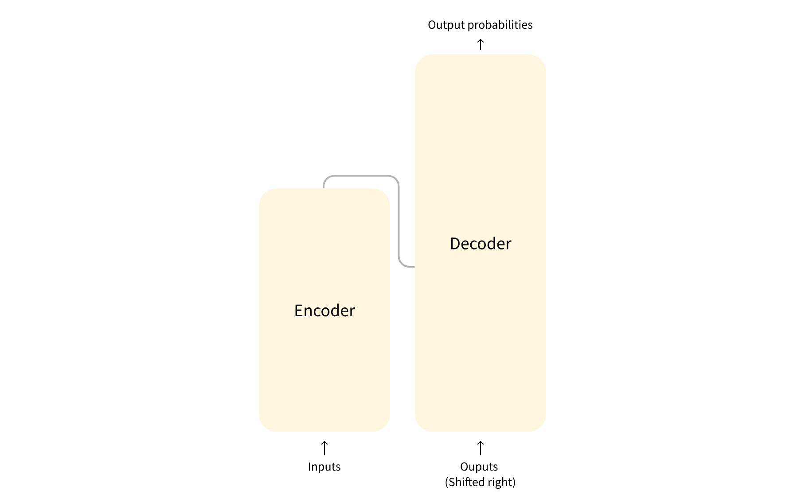

### Large Language Models (2017-presente)

L'evoluzione più recente del Deep Learning è rappresentata dall'IA **generativa** e dai _**Large Language Models**_ (LLM). 

A differenza dei modelli precedenti (addestrati per classificare dati), questi modelli sono addestrati per **creare** dati.

La svolta avviene nel 2017 con l'introduzione dell'architettura **Transformer**.

---

<!-- footer: "" -->

### Large Language Models (2017-presente)

L'architettura Transformer permette alle reti neurali di elaborare intere frasi analizzando il contesto e le relazioni tra tutte le parole contemporaneamente. L'unione tra Transformer, potenze di calcolo evolute e l'utilizzo di enormi quantità di testo ha permesso di creare modelli con centinaia di miliardi di parametri.

Il rilascio di **ChatGPT** a fine 2022 segna un punto di svolta storico: un'IA che supera ampiamente il test di Turing (l'IA generativa) diventa accessibile al grande pubblico.

---

<!-- footer: "" -->
<!-- paginate: False -->

# Abilità Informatiche (2025/2026)

## 09. Intelligenza Artificiale

➡️ Mail: [sebastian.barzaghi2@unibo.it](mailto:sebastian.barzaghi2@unibo.it)
➡️ ORCID: [0000-0002-0799-1527](https://orcid.org/0000-0002-0799-1527)
➡️ Sito: [sebastian.barzaghi2](https://www.unibo.it/sitoweb/sebastian.barzaghi2/)

