<!-- footer: "" -->
<!-- paginate: False -->

# Abilità Informatiche (2025/2026)

## 11. Intelligenza Artificiale

➡️ Mail: [sebastian.barzaghi2@unibo.it](mailto:sebastian.barzaghi2@unibo.it)
➡️ ORCID: [0000-0002-0799-1527](https://orcid.org/0000-0002-0799-1527)
➡️ Sito: [sebastian.barzaghi2](https://www.unibo.it/sitoweb/sebastian.barzaghi2/)

---

<!-- paginate: True -->
<!-- footer: Razavian, N., Knoll, F., & Geras, K. J. (2020, February). Artificial intelligence explained for nonexperts. In Seminars in musculoskeletal radiology (Vol. 24, No. 01, pp. 003-011). Thieme Medical Publishers. https://www.doi.org/10.1055/s-0039-3401041 -->

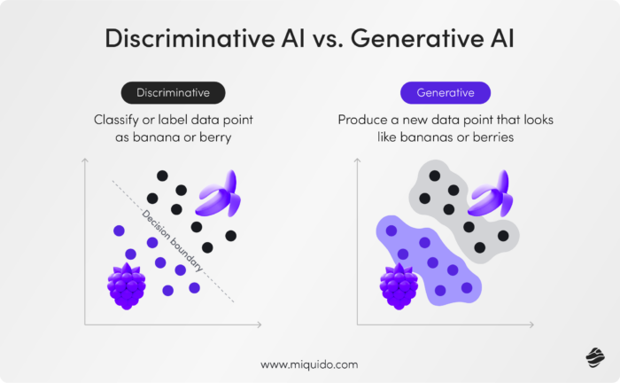

### IA discriminativa

L'**IA discriminativa** è una tipologia di IA progettata per analizzare dati, classificarli in diversi tipi, prevedendo la loro distribuzione probabilistica rispetto ad un determinato risultato. 

Queste IA sono allenate per differenziare, piuttosto che per creare. Per esempio, un'IA discriminativa può determinare se un'immagine contiene un gatto o un cane.

Imparano tramite esempi, e la qualità dei loro risultati dipende dalla diversità e dal volume dei dati di addestramento.

In questa categoria ricadono tutti gli esempi sub-simbolici che abbiamo visto fino adesso.

---

<!-- paginate: True -->
<!-- footer: Razavian, N., Knoll, F., & Geras, K. J. (2020, February). Artificial intelligence explained for nonexperts. In Seminars in musculoskeletal radiology (Vol. 24, No. 01, pp. 003-011). Thieme Medical Publishers. https://www.doi.org/10.1055/s-0039-3401041 -->

### IA generativa

L'**IA generativa** è una tipologia di IA progettata per creare nuovi contenuti (testi, immagini, musica, video, ecc.) sulla base di determinate informazioni di partenza (_**prompt**_).

I modelli di tipo generativo imparano a produrre nuovi dati con caratteristiche simili ai dati originali, utilizzando modelli di _deep learning_ per identificare i pattern e le relazioni nei dati esistenti.

In questa categoria ricadono gli LLM, ma non tutte le IA generative sono LLM.

---

<!-- paginate: True -->
<!-- footer: Razavian, N., Knoll, F., & Geras, K. J. (2020, February). Artificial intelligence explained for nonexperts. In Seminars in musculoskeletal radiology (Vol. 24, No. 01, pp. 003-011). Thieme Medical Publishers. https://www.doi.org/10.1055/s-0039-3401041 -->

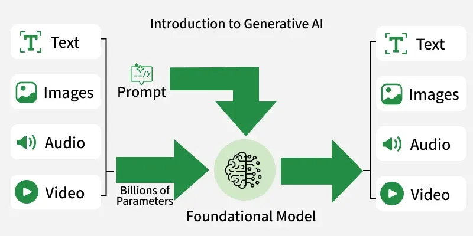

### IA generativa

In genere, l'AI generativa opera in tre fasi: 

* **Formazione**, per creare un _**foundation model**_, un modello di _deep learning_ che funge da base per diversi tipi di applicazioni di IA generativa.
* **Ottimizzazione**, per adattare il _foundation model_ a una specifica applicazione.
* **Generazione, valutazione e riottimizzazione**, per valutare i risultati dell'applicazione e migliorarla continuamente.

---

<!-- paginate: True -->
<!-- footer: Razavian, N., Knoll, F., & Geras, K. J. (2020, February). Artificial intelligence explained for nonexperts. In Seminars in musculoskeletal radiology (Vol. 24, No. 01, pp. 003-011). Thieme Medical Publishers. https://www.doi.org/10.1055/s-0039-3401041 -->

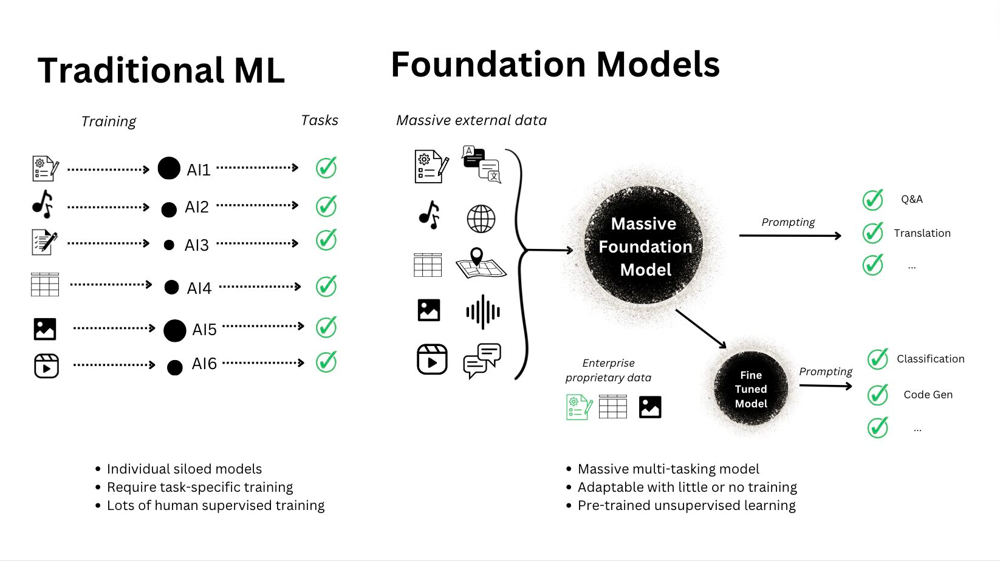

### Il _foundation model_

Per creare un _foundation model_, viene addestrato un modello di _deep learning_ su enormi quantità di dati grezzi. 

Durante l'addestramento, il modello esegue e valuta milioni di esercizi di “riempimento degli spazi vuoti”, cercando di prevedere l’elemento successivo in una sequenza (es., la parola successiva in una frase, l’elemento successivo in un’immagine, il comando successivo in una riga di codice), e regolandosi continuamente per ridurre al minimo la differenza tra le previsioni e i dati reali.

---

<!-- paginate: True -->
<!-- footer: Razavian, N., Knoll, F., & Geras, K. J. (2020, February). Artificial intelligence explained for nonexperts. In Seminars in musculoskeletal radiology (Vol. 24, No. 01, pp. 003-011). Thieme Medical Publishers. https://www.doi.org/10.1055/s-0039-3401041 -->

### Il _foundation model_

Il risultato di questo addestramento è una rete neurale di **parametri**, ovvero rappresentazioni codificate di entità e relazioni nei dati, in grado di generare contenuti in modo autonomo in risposta a input o a prompt.

Un foundation model è generalista: sa molte cose su molti tipi di contenuti, ma non è preciso.

Questo processo di addestramento è ad alta intensità di calcolo, dispendioso in termini di tempo e molto costoso.

---

<!-- paginate: True -->
<!-- footer: Razavian, N., Knoll, F., & Geras, K. J. (2020, February). Artificial intelligence explained for nonexperts. In Seminars in musculoskeletal radiology (Vol. 24, No. 01, pp. 003-011). Thieme Medical Publishers. https://www.doi.org/10.1055/s-0039-3401041 -->

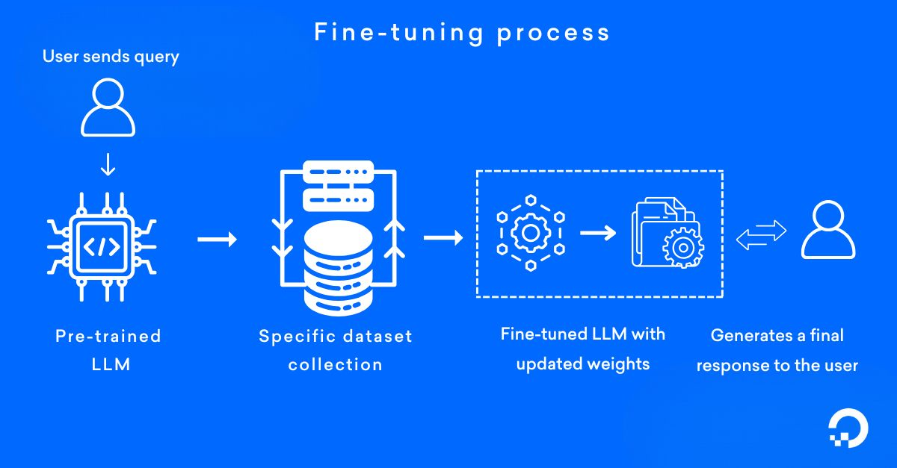

### Il _fine-tuning_

Il _**fine-tuning**_ è il processo di alimentazione del _foundation model_ con dati etichettati riferibili ad uno specifico dominio di conoscenza. 

Ad esempio, se un team di sviluppo sta tentando di creare un customer service chatbot, creerà centinaia o migliaia di documenti contenenti domande etichettate sul servizio clienti e le risposte corrette, quindi invierà tali documenti al modello.

---

<!-- paginate: True -->
<!-- footer: Razavian, N., Knoll, F., & Geras, K. J. (2020, February). Artificial intelligence explained for nonexperts. In Seminars in musculoskeletal radiology (Vol. 24, No. 01, pp. 003-011). Thieme Medical Publishers. https://www.doi.org/10.1055/s-0039-3401041 -->

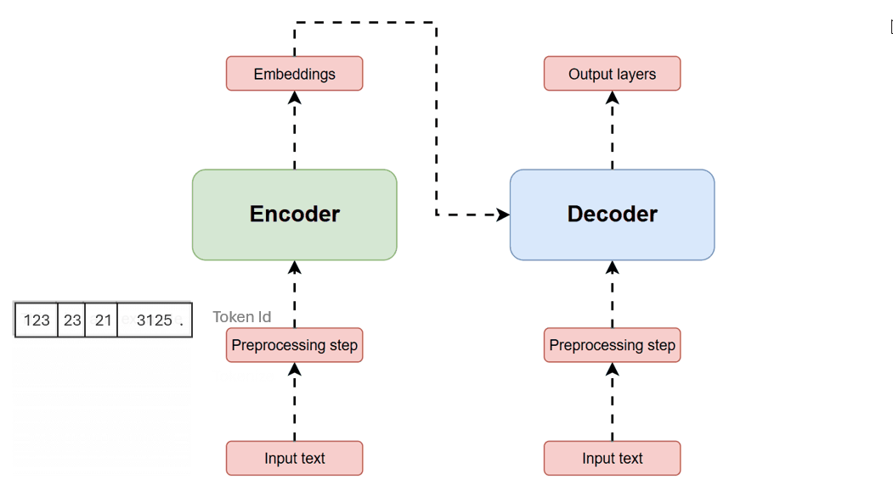

### Esempi di genAI: _Transformer_

Un _**transformer**_ è un modello basato sull'idea di _encoder_-_decoder_. 

La sua caratteristica particolare è l'utilizzo di un concetto chiamato **attenzione**, attraverso il quale determinano e si focalizzano su ciò che è più importante dei dati, al fine di acquisire il contesto dei dati e elaborarne intere sequenze contemporaneamente.

https://compute.hivenet.com/post/simplifying-transformer-architecture-a-beginners-guide-to-understanding-ai-magic

---

<!-- paginate: True -->
<!-- footer: Hong, Y., Hwang, U., Yoo, J., & Yoon, S. (2019). How generative adversarial networks and their variants work: An overview. ACM Computing Surveys (CSUR), 52(1), 1-43. https://doi.org/10.1145/3301282 -->

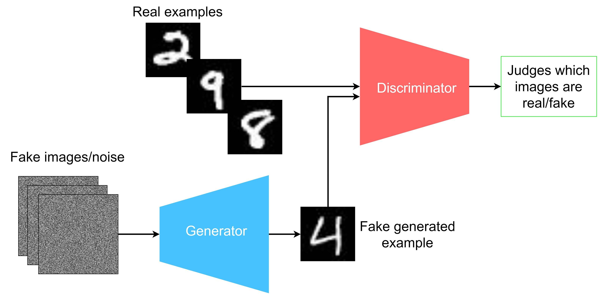

### Un esempio ibrido: Generative Adversarial Networks (1)

Immaginiamoci la Gioconda.

Ora, immaginiamoci un falsario che decide di creare un duplicato del dipinto.

Per farlo, il falsario deve capire e imparare come l’autore originario ha creato l’opera.

Immaginiamoci anche un investigatore, il cui obiettivo è quello di scovare il falsario e intuire le regole che questo sta imparando per riprodurre lo stile dell’autore originale.

---

<!-- paginate: True -->
<!-- footer: Razavian, N., Knoll, F., & Geras, K. J. (2020, February). Artificial intelligence explained for nonexperts. In Seminars in musculoskeletal radiology (Vol. 24, No. 01, pp. 003-011). Thieme Medical Publishers. https://www.doi.org/10.1055/s-0039-3401041 -->

### Un esempio ibrido: Generative Adversarial Networks (2)

Un modello di IA che usa contemporaneamente due reti neurali diverse: un discriminatore (l'investigatore) e un generatore (il falsario).

Durante l'addestramento, il discriminatore impara a discriminare i dati di input (es. riconoscere cifre numeriche nelle immagini).

---

<!-- footer: Hong, Y., Hwang, U., Yoo, J., & Yoon, S. (2019). How generative adversarial networks and their variants work: An overview. ACM Computing Surveys (CSUR), 52(1), 1-43. https://doi.org/10.1145/3301282 -->

### Un esempio ibrido: Generative Adversarial Networks (3)

Alla fine dell'apprendimento, è in grado di classificare nuovi dati di input sulla base del proprio apprendimento (es. determina se l'immagine contiene una cifra sulla base dei pattern appresi in fase di allenamento dalle altre immagini usate).

Il generatore, invece, crea immagini sulla base di dati casuali (noise): inizialmente, le immagini create saranno senza senso.

---

<!-- footer: Razavian, N., Knoll, F., & Geras, K. J. (2020, February). Artificial intelligence explained for nonexperts. In Seminars in musculoskeletal radiology (Vol. 24, No. 01, pp. 003-011). Thieme Medical Publishers. https://www.doi.org/10.1055/s-0039-3401041 -->

### Un esempio ibrido: Generative Adversarial Networks (4)

L'output del generatore viene dato in pasto al discriminatore, che verifica che i dati prodotti dal generatore siano passabili rispetto ai dati di addestramento su cui il discriminatore si è allenato.

Se i dati non sono accettabili, il generatore deve correggere i pesi; se invece i dati sono accettabili, il discriminatore è stato "ingannato", e l’immagine è presa come risultato valido.

https://thispersondoesnotexist.com/

---

<!-- footer: Bender, E. M., Gebru, T., McMillan-Major, A., & Shmitchell, S. (2021, March). On the dangers of stochastic parrots: Can language models be too big?🦜. In Proceedings of the 2021 ACM conference on fairness, accountability, and transparency (pp. 610-623). https://doi.org/10.1145/3442188.3445922 -->

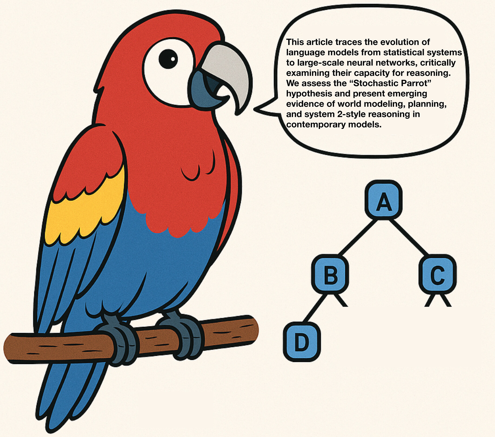

### Pappagalli stocastici

Immaginiamoci di avere un pappagallo, Lauro, che è molto bravo ad imitare il linguaggio umano e ha una memoria estremamente sviluppata.

Lauro ascolta tutte le conversazioni che avvengono in casa e le può imitare in maniera accurata.

Se Lauro ci sente dire “Ho fame, vorrei proprio un po’ di…”, probabilmente completerà la nostra frase con “… pasta”, o “riso”, o “pizza”.

---

<!-- footer: Bender, E. M., Gebru, T., McMillan-Major, A., & Shmitchell, S. (2021, March). On the dangers of stochastic parrots: Can language models be too big?🦜. In Proceedings of the 2021 ACM conference on fairness, accountability, and transparency (pp. 610-623). https://doi.org/10.1145/3442188.3445922 -->

### Pappagalli stocastici

La probabilità che generi un output di questo tipo, sulla base del nostro input, è molto più alta rispetto a “bicicletta”, “astuccio” o “filosofia postmoderna”.

Ma Lauro è pur sempre un pappagallo, e quindi non ha coscienza di cosa siano “pasta”, “riso”, “pizza”, “astuccio”.

Quello che fa è basarsi sulla distribuzione statistica del linguaggio e la probabilità che una certa parola o espressione sia seguita da un’altra.

---

<!-- footer: Bender, E. M., Gebru, T., McMillan-Major, A., & Shmitchell, S. (2021, March). On the dangers of stochastic parrots: Can language models be too big?🦜. In Proceedings of the 2021 ACM conference on fairness, accountability, and transparency (pp. 610-623). https://doi.org/10.1145/3442188.3445922 -->

### Pappagalli stocastici

Lauro è un **pappagallo stocastico**, ovvero un sistema che genera linguaggio in maniera probabilistica, ricombinando pattern estratti dai dati di addestramento.

In altre parole, è un _**Large Language Model**_ (LLM), un modello di IA generativa basato su reti neurali multistrato e addestrato su enormi quantità di testo per imparare a riconoscere schemi e associazioni propri del linguaggio naturale.

---

<!-- footer: Lee, T. B., & Trott, S. (2023). Large language models, explained with a minimum of math and jargon. Understanding AI, 27, 2023. https://www.understandingai.org/p/large-language-models-explained-with -->

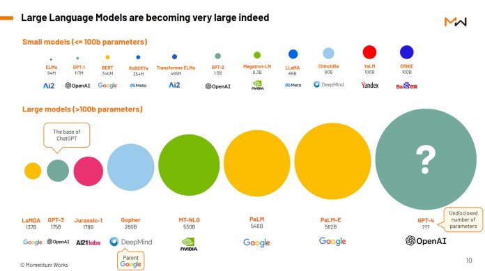

### Large Language Model

Un utente interroga il modello con un _**prompt**_ e riceve dal modello una risposta.

Ogni volta che chiediamo qualcosa a ChatGPT, l'LLM sottostante (GPT) fa una sola cosa, ripetutamente e velocemente: predire la parola successiva più probabile, sulla base del proprio addestramento.

Sia il _prompt_ che la risposta vengono aggiunti iterativamente ad una **finestra contestuale** che riproduce una forma di "memoria" tenuta dall'IA.

---

<!-- footer: Lee, T. B., & Trott, S. (2023). Large language models, explained with a minimum of math and jargon. Understanding AI, 27, 2023. https://www.understandingai.org/p/large-language-models-explained-with -->

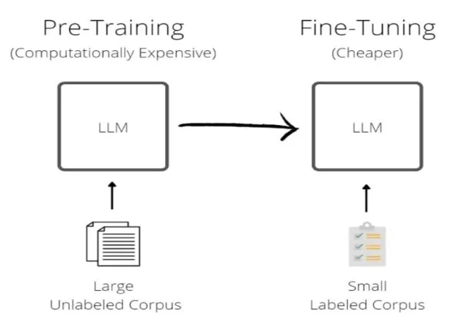

### Large Language Model

Il processo di addestramento di un LLM si divide in due fasi principali già viste:

* **Pre-training**: in questa fase, il modello viene addestrato su un grande corpus di testo per imparare a riconoscere le relazioni tra le parole e tra le frasi;

* **Fine-tuning**: in questa fase, il modello viene addestrato su un nuovo corpus di testo specifico per migliorare la sua capacità di generare testo in un contesto specifico.

---

<!-- footer: Lee, T. B., & Trott, S. (2023). Large language models, explained with a minimum of math and jargon. Understanding AI, 27, 2023. https://www.understandingai.org/p/large-language-models-explained-with -->

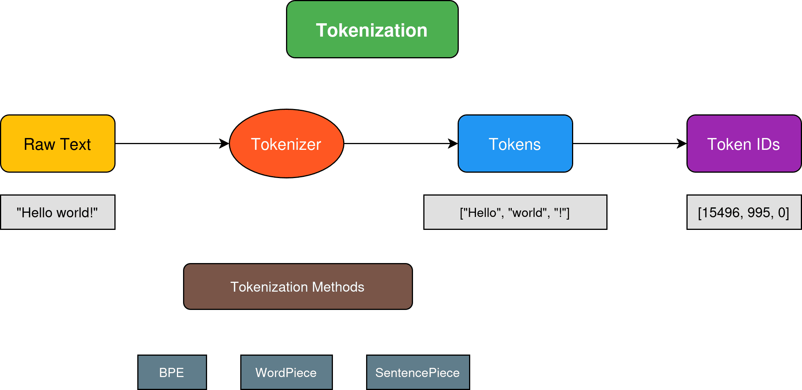

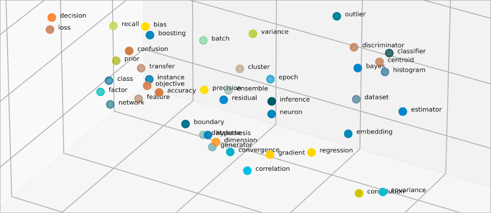

### Tokenizzazione e _embedding_

Affinché l'LLM sia in grado di lavorare col testo, questo deve essere convertito in rappresentazioni numeriche. Questo viene fatto attraverso la **tokenizzazione**, un processo che spezzetta il testo in _**token**_, ovvero unità minime di significato. 

Ogni token viene poi trasformato in una rappresentazione vettoriale (_**embedding**_) proiettata in uno spazio multidimensionale (in pratica, coordinate in uno spazio) in grado di esprimerne la semantica. 

---

<!-- footer: Lee, T. B., & Trott, S. (2023). Large language models, explained with a minimum of math and jargon. Understanding AI, 27, 2023. https://www.understandingai.org/p/large-language-models-explained-with -->

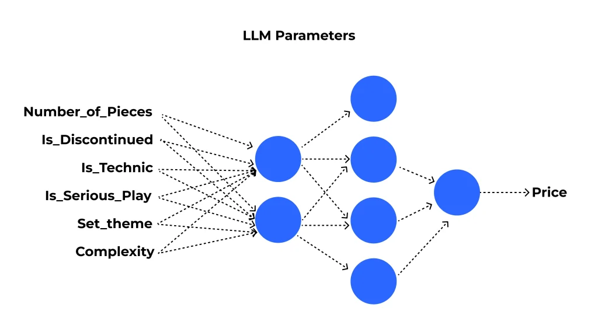

### I parametri

I bias e i pesi delle connessioni tra neuroni che il modello impara durante il processo di addestramento vengono chiamati **parametri**.

Come già visto, si tratta di valori numerici che definiscono il comportamento del modello, ottimizzati per affinarne le capacità.

I parametri vengono inizializzati (spesso in modo casuale) e successivamente ottimizzati per riconoscere le relazioni linguistiche generali presenti nei dati.

---

<!-- footer: Lee, T. B., & Trott, S. (2023). Large language models, explained with a minimum of math and jargon. Understanding AI, 27, 2023. https://www.understandingai.org/p/large-language-models-explained-with -->

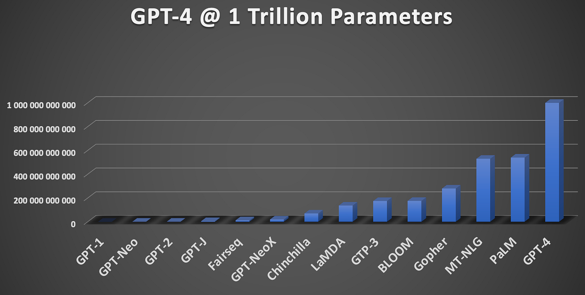

### Large Language Model

Nel fine-tuning, i parametri già ottimizzati durante il pre-training vengono adattati ulteriormente su un corpus di testo specifico e più mirato.

Man mano che i parametri aumentano, aumentano le capacità del modello, ma anche le risorse di calcolo richieste.

* GPT-1 ha 117 milioni di parametri;
* GPT-2 ne ha 1.5 miliardi;
* GPT-3 ne ha 175 miliardi;
* **GPT-4 ne ha 1.8 trilioni**.

---

<!-- footer: Lee, T. B., & Trott, S. (2023). Large language models, explained with a minimum of math and jargon. Understanding AI, 27, 2023. https://www.understandingai.org/p/large-language-models-explained-with -->

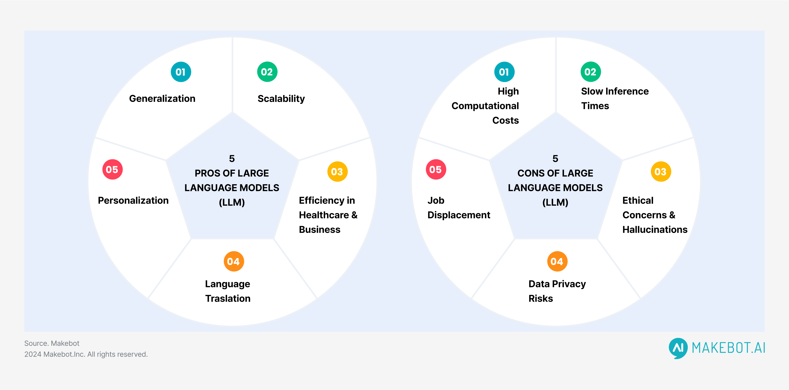

### Large Language Model

Vantaggi: elevatissima scalabilità e flessibilità; resistenza a informazioni incerte, danneggiate o lacunose.

Svantaggi: performance fortemente influenzata dai dati di addestramento, potenziale presenza di allucinazioni (palesi errori nell’output generato), costi di sviluppo e addestramento elevati (legati alle risorse hardware e alla quantità di dati richieste), mancanza di trasparenza, incertezze legate all’AI Act.

---

<!-- footer: Razavian, N., Knoll, F., & Geras, K. J. (2020, February). Artificial intelligence explained for nonexperts. In Seminars in musculoskeletal radiology (Vol. 24, No. 01, pp. 003-011). Thieme Medical Publishers. https://www.doi.org/10.1055/s-0039-3401041 -->

### Uso di dati nella IA

L’IA si basa su dati storici e, ora, anche su dati sintetici.

* I **dati storici** sono raccolti in dataset “reali”: le canzoni che ho ascoltato, le temperature raccolte negli ultimi 200 anni, i testi estratti da articoli di giornale digitalizzati dalla Library of Congress, ecc.
* I **dati sintetici** sono generati da un’altra IA e possono aiutare a rappresentare un problema, se ne danno una rappresentazione affidabile.

---

<!-- footer: Razavian, N., Knoll, F., & Geras, K. J. (2020, February). Artificial intelligence explained for nonexperts. In Seminars in musculoskeletal radiology (Vol. 24, No. 01, pp. 003-011). Thieme Medical Publishers. https://www.doi.org/10.1055/s-0039-3401041 -->

### IA e _overfitting_

L’_**overfitting**_ è un fenomeno che si verifica quando un’IA impara troppo bene i dettagli dei dati di addestramento, al punto da diventare troppo specifico per quel dataset.

Questo significa che, invece di generalizzare e fare previsioni accurate su nuovi dati, il modello diventa “troppo adattato” a quelle specifiche informazioni, e questo può comportare una bassa precisione sui nuovi dati, a causa della memorizzazione anziché della generalizzazione.

---

<!-- footer: Ferrer, X., Van Nuenen, T., Such, J. M., Coté, M., & Criado, N. (2021). Bias and discrimination in AI: a cross-disciplinary perspective. IEEE Technology and Society Magazine, 40(2), 72-80. https://doi.org/10.1109/MTS.2021.3056293 -->

### IA e allucinazioni

Un'**allucinazione** è un output di IA generativa privo di senso o del tutto impreciso ma che, il più delle volte, sembra totalmente plausibile. 

L'esempio classico è quello di un avvocato che utilizza uno strumento di IA generativa per effettuare ricerche in preparazione di un caso di alto profilo e lo strumento "produce" diversi casi di esempio, completi di citazioni e attribuzioni, che sono interamente fittizi.

---

<!-- footer: Ferrer, X., Van Nuenen, T., Such, J. M., Coté, M., & Criado, N. (2021). Bias and discrimination in AI: a cross-disciplinary perspective. IEEE Technology and Society Magazine, 40(2), 72-80. https://doi.org/10.1109/MTS.2021.3056293 -->

### IA e discriminazione

Bias presenti nei dati possono produrre distorsioni nel funzionamento delle IA allenate su questi.

Es. alcuni sistemi di riconoscimento facciale trattano alcune persone in modo più impreciso rispetto alle altre, sulla base della pigmentazione della pelle o della loro struttura facciale.

Esempio: https://www.bbc.com/news/technology-68655429.

---

<!-- footer: "Curzon, J., Kosa, T. A., Akalu, R., & El-Khatib, K. (2021). Privacy and artificial intelligence. IEEE Transactions on Artificial Intelligence, 2(2), 96-108. https://doi.org/10.1109/TAI.2021.3088084" -->

### Una minaccia per la privacy?

L’intelligence sudcoreana ha accusato DeepSeek di raccolta eccessiva dei dati personali della propria utenza, compresi i pattern di input dalla tastiera (che permettono il riconoscimento dell’individuo), e di invio di questi ad altre aziende cinesi.

Link all’articolo: https://www.reuters.com/technology/artificial-intelligence/south-korea-spy-agency-says-deepseek-excessively-collects-personal-data-2025-02-10/

---

<!-- footer: "Craig, C. J. (2022). The AI-copyright challenge: Tech-neutrality, authorship, and the public interest. In Research handbook on intellectual property and artificial intelligence (pp. 134-155). Edward Elgar Publishing. https://doi.org/10.4337/9781800881907.00013" -->

### Una minaccia per il copyright?

Anthropic viene denunciata da un gruppo di autori per aver allenato i propri LLM su dati testuali, tra cui centinaia di migliaia di libri protetti da copyright. Anthropic ha  comprato, scannerizzato e distrutto dei libri fisici comprati legalmente, ma ha anche acquisito illegalmente più di 7 milioni di manoscritti digitali. 

Link all’articolo: https://www.corrierecomunicazioni.it/digital-economy/intelligenza-artificiale-anthropic-denunciata-per-violazione-di-copyright/

---

<!-- footer: "Puaschunder, J. M. (2019, June). Artificial Intelligence market disruption. In Proceedings of the 13th International RAIS Conference on Social Sciences and Humanities (pp. 1-8). Scientia Moralitas Research Institute. https://www.ceeol.com/search/chapter-detail?id=785246" -->

### Una minaccia per il mercato?

La stragrande maggioranza di startup di IA è vincolata in esclusiva alle big tech come Amazon, Google e Microsoft, in cambio di finanziamenti ingenti e accesso a enormi risorse di calcolo e dati.

Link all’articolo: https://www.tomshw.it/hardware/ia-a-rischio-monopolizzazione-lantitrust-comincia-le-indagini-2025-01-18

---

<!-- footer: "" -->

### Una minaccia per il lavoro?

Bp pianifica di licenziare il 5% della propria forza lavoro (circa 7700 persone) sulla base di valutazioni di ridimensionamento effettuate da una IA.

Link all’articolo: https://www.wired.it/article/intelligenza-artificiale-licenziamenti-bp-tagli-rinnovabili-investimenti-lavoro/

---

<!-- footer: "" -->

### Una minaccia per l’informazione?

Grok, il chatbot della piattaforma X, permette di generare direttamente in loco testi, immagini e video non sottoposti ad alcun tipo di controllo (eccetto quelli previsti dalla piattaforma stessa).

Link all’articolo: https://www.franzrusso.it/condividere-comunicare/ia-possibili-rischi-disinformazione-il-caso-grok/

---

<!-- footer: "" -->

### Una minaccia per l’ambiente?

In media, ChatGPT consuma 519 millilitri d’acqua (circa una bottiglietta d’acqua) per generare 100 parole.

Link all’articolo: https://fortune.com/article/how-much-water-does-ai-use/

---

<!-- footer: Ferrer, X., Van Nuenen, T., Such, J. M., Coté, M., & Criado, N. (2021). Bias and discrimination in AI: a cross-disciplinary perspective. IEEE Technology and Society Magazine, 40(2), 72-80. https://doi.org/10.1109/MTS.2021.3056293 -->

### Questioni etiche

Le IA rischiano di essere:

* Imperscrutabili: non è dato sapere in base a cosa abbiano favorito una decisione;
* Fuorvianti: hanno preso una decisione in base a dati distorti da bias;
* Ingiuste: generano effetti iniqui sulle persone;
* Trasformative: portano a trasformazioni dell’output che minacciano l’autonomia, la privacy o altri diritti individuali;
* Non-tracciabili: difficoltà nel rintracciare la persona o organizzazione responsabile dell’output.

---

<!-- footer: "" -->

### AI Act

Nel 2024, il Parlamento Europeo ha approvato l’AI Act, il primo Regolamento al mondo esplicitamente e totalmente dedicato all’IA.

Il testo contiene norme che disciplinano l’attività delle IA, obbligando le aziende che le sviluppano e distribuiscono al rispetto dei diritti e dei valori fondamentali dell’Unione Europea.

Testo integrale: https://eur-lex.europa.eu/legal-content/EN/TXT/?uri=CELEX%3A32024R1689.

Sito per non esperti: https://artificialintelligenceact.eu/

---

<!-- footer: "" -->

### AI Act

Saranno vietati i sistemi di IA che determinano un rischio inaccettabile per la sicurezza, la sussistenza e i diritti delle persone.

In questa categoria rientrano i sistemi che possono manipolare il comportamento umano (es. social scoring e polizia predittiva).

Esempio di social scoring: https://scenarieconomici.it/wp-content/uploads/2021/08/scs5.png

---

<!-- footer: "" -->

### AI Act

Il regolamento considera ad alto rischio un numero limitato di sistemi di IA che possono avere ripercussioni negative sulla sicurezza delle persone o sui loro diritti fondamentali.

Es. identificazione biometrica; riconoscimento delle emozioni; valutazione dell’occupazione; determinare l’accesso a servizi e a prestazioni pubblici e privati essenziali.

Prima di immettere un sistema di IA ad alto rischio sul mercato dell’UE, o di farlo entrare in servizio, i fornitori dovranno sottoporlo, in particolare, a una valutazione.

---

<!-- footer: "" -->

### AI Act

I sistemi di IA a basso rischio (come videogiochi o filtri spam) saranno esenti da obblighi.

A prescindere dal livell odi pericolosità, gli utenti dovranno essere consapevoli del fatto che stanno interagendo con una macchina.

---

<!-- footer: "" -->

### IA e cultura

Nell’AI Act europeo, la cultura è espressamente menzionata fra gli ambiti al cui sviluppo l’IA è chiamata a concorrere.

A livello nazionale si richiamano le potenzialità dell’IA, ma si evidenzia anche come “digitalizzare beni non metadatati e/o descritti sia fortemente sconsigliato”.

Vengono ripresi e rivisti concetti fondamentali come l’originalità (con ripercussioni anche sul concetto di bene digitale come replica o copia dell’originale fisico) e il copyright.

---

<!-- footer: "" -->

### IA e cultura

I fornitori dovranno assicurarsi che gli output siano esplicitamente etichettati come prodotti di IA.

I fornitori dovranno pubblicare una descrizione sufficientemente dettagliata dei dati utilizzati per l’addestramento dei propri modelli.

I detentori dei diritti potranno espressamente riservarsi il diritto di utilizzo delle proprie opere (in teoria)… ma come si fa con i modelli già addestrati?

---

<!-- footer: "" -->
<!-- paginate: False -->

# Abilità Informatiche (2025/2026)

## 11. Intelligenza Artificiale

➡️ Mail: [sebastian.barzaghi2@unibo.it](mailto:sebastian.barzaghi2@unibo.it)
➡️ ORCID: [0000-0002-0799-1527](https://orcid.org/0000-0002-0799-1527)
➡️ Sito: [sebastian.barzaghi2](https://www.unibo.it/sitoweb/sebastian.barzaghi2/)

